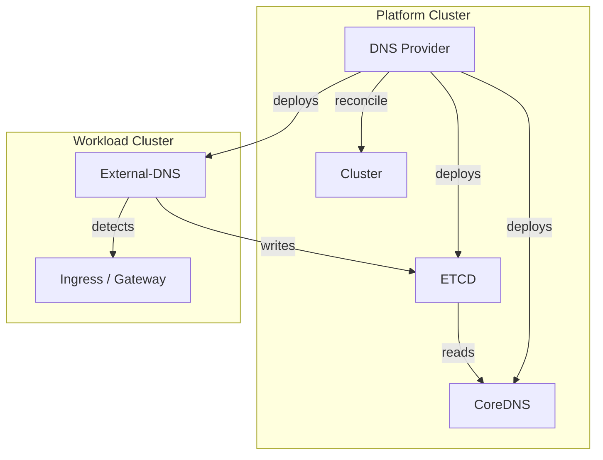
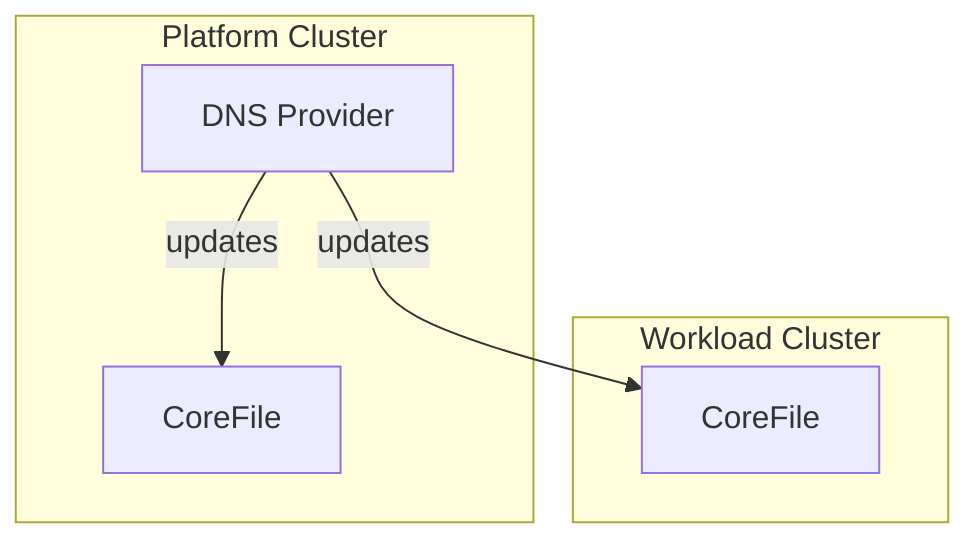

---
authors:
  - ReneSchuenemann # Change to your own handle. Add yourself to "authors.yml" if necessary.
---

# Local DNS

## Context and Problem Statement

When creating services on a Kubernetes cluster, they shall be accessible from other clusters within an openMCP landscape. To achieve this a `Gateway` and `HTTPRoute` resource is created. The Gateway controller will assign a routable IP address to the Gateway resource. The HTTPRoute resource will then be used to route traffic to the service.

```yaml
apiVersion: gateway.networking.k8s.io/v1beta1
kind: Gateway
metadata:
  name: example-gateway
  namespace: default
spec:
  gatewayClassName: openmcp
  listeners:
    - name: http
      protocol: HTTP
      port: 80
      allowedRoutes:
        namespaces:
          from: Same
status:
    addresses:
      - type: IPAddress
        value: "172.18.201.1"
---
apiVersion: gateway.networking.k8s.io/v1beta1
kind: HTTPRoute
metadata:
  name: example-route
  namespace: default
spec:
  parentRefs:
    - name: example-gateway
  hostnames:
    - svc-abc123.workload01.openmcp.cluster
  rules:
    - matches:
        - path:
            type: PathPrefix
            value: /
      backendRefs:
        - name: example-svc
          port: 80
```

The problem is that the service is only reachable via the IP address and not via the hostname. This is because the DNS server in the openMCP landscape does not know about the service and therefore cannot resolve the hostname to the IP address. The Kubernetes dns service only knows how to route to service within the same cluster. On an openMCP landscape however, services must be reachable from other clusters by stable host names.

Therefore there is a need for a openMCP DNS solution that makes these host names resolvable on all clusters that ar part of the openMCP landscape.

## openMCP DNS System Service

To solve the stated problem, a `openMCP DNS System Service` is needed. This system service will be responsible for the following tasks:

* Deploy a central openMCP DNS server in the openMCP landscape. This DNS server will be used to resolve all host names in the openMCP base domain `openmcp.cluster`.
* For each cluster in the openMCP landscape, the system service will configure the Kubernetes local DNS service to forward DNS queries for the openMCP base domain to the central openMCP DNS server. This will ensure that all clusters can resolve host names in the openMCP base domain.
* For each Gateway or Ingress resource, the system service will create a DNS entry in the central openMCP DNS server. The DNS entry will map the hostname to the IP address of the Gateway or Ingress resource.
* For each cluster in the openMCP landscape, the system service will annotate the `Cluster` resource with the openMCP base domain. This will help service providers to configure their services to use the openMCP base domain for their host names.

This shall be completely transparent to a service provider. The service provider only needs to create a Gateway or Ingress resource and the DNS entry will be created automatically.

## Example Implementation

For the example implementation, following components are used:

* [External-DNS](https://kubernetes-sigs.github.io/external-dns/latest/)
* [CoreDNS](https://coredns.io/)
* [ETCD](https://etcd.io/)

The `DNS Provider` is running on the platform cluster. The `DNS Provider` is deploying an `ETCD` and the cental `CoreDNS` instance on the platform cluster. The `ETCD` instance is used to store the DNS entries. The `CoreDNS` is reading the DNS entries from the `ETCD` instance and is used to resolve the host names.

```yaml
# CoreDNS configuration to read DNS entries from ETCD for the openMCP base domain `openmcp.cluster`
- name: etcd
    parameters: openmcp.cluster
    configBlock: |-
      stubzones
      path /skydns
      endpoint http://10.96.55.87:2379
```

The `DNS Provier` is reconciling `Cluster` resources. For each `Cluster` resource, the `DNS Provider` is deploying an `External-DNS` instance on the cluster. The `External-DNS` instance is used to detect the `Gateway` and `Ingress` resources and to automatically create the DNS entries in the `ETCD` instance running on the platform cluster.

```yaml
# external-dns configuration to detect Gateway and Ingress resources and write DNS entries to ETCD
containers:
    - name: external-dns
    image: registry.k8s.io/external-dns/external-dns:v0.16.1
    args:
    - --source=ingress
    - --source=gateway-httproute
    - --provider=coredns
    - --domain-filter=platform.openmcp.cluster # only detect hostnames in the openMCP base domain belonging to the cluster
    env:
    - name: ETCD_URLS
        value: http://172.18.200.2:2379 # external routable IP of the ETCD instance running on the platform cluster
```



The `DNS Provider` is updating the `CoreDNS` configuration on the platform cluster and on all other clusters. The `CoreDNS` configuration is updated to forward DNS queries for the openMCP base domain to the central `CoreDNS` instance running on the platform cluster. This will ensure that all clusters can resolve host names in the openMCP base domain.

```corefile
openmcp.cluster {
    forward . 172.18.200.3
    log
    errors
}
```


Then on any pod in any cluster of the openMCP landscape, the hostname can be resolved to the IP address of the Gateway or Ingress resource.
