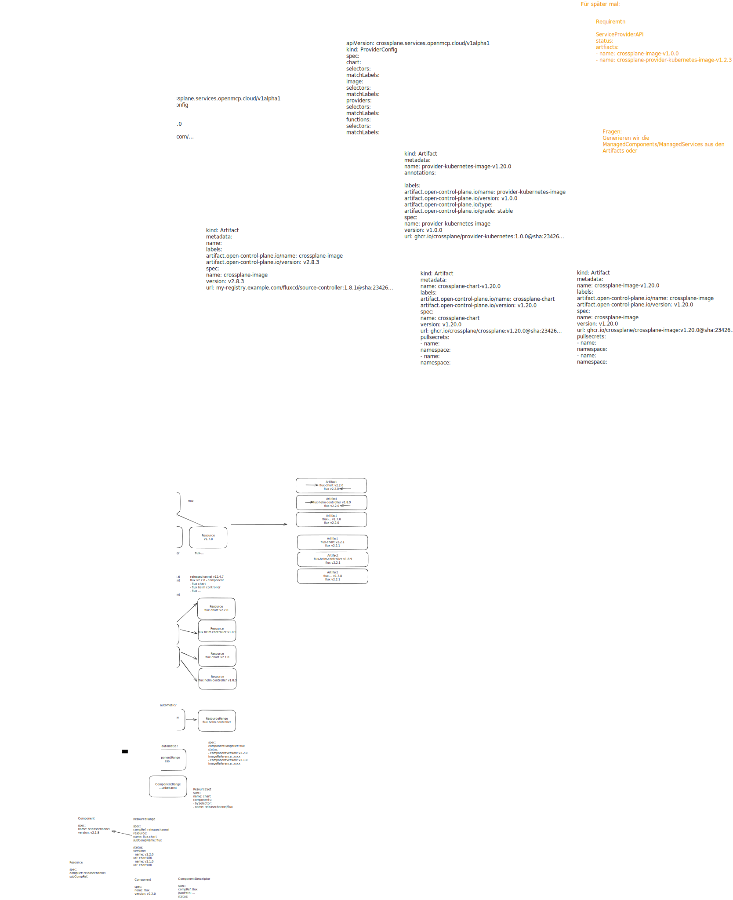

---
authors:
  - MoritzMarby
  - ValentinGerlach
  - MaximilianTechritz
---

# Discoverable Artifacts

This ADR defines how consumers discover the location of OCI artifacts for different services.

For example, a service provider such as `crossplane-service-provider`, running inside the openMCP platform, needs to know where to fetch the Crossplane Helm chart and container image from. This ADR defines the solution.

## Current state

### Service Providers

Each Service Provider is deployed by creating a `ServiceProvider` resource in which the OCI image URL of the provider is specified directly:

```yaml
# From service-provider-flux
apiVersion: openmcp.cloud/v1alpha1
kind: ServiceProvider
metadata:
  name: flux
  namespace: openmcp-system
spec:
  image: ghcr.io/openmcp-project/images/service-provider-flux:v0.1.0
```

The `ProviderConfig` resource of a Service Provider defines which versions of the managed service are available. For each version, all OCI artifact URLs (Helm chart and container image) as well as pull secrets for private registries must be specified manually:

```yaml
# From service-provider-crossplane
apiVersion: crossplane.services.open-control-plane.io/v1alpha1
kind: ProviderConfig
metadata:
  name: default
spec:
  versions:
    - version: v2.0.2
      chart:
        url: "ghcr.io/openmcp-project/openmcp/charts/crossplane:2.0.2"
        secretRef:
          name: ghcr
      image:
        url: "ghcr.io/openmcp-project/openmcp/images/crossplane:2.0.2"
        secretRef:
          name: xyz
    - version: v1.20.0
      chart:
        url: "ghcr.io/openmcp-project/openmcp/charts/crossplane:1.20.0"
        secretRef:
          name: ghcr
      image:
        url: "ghcr.io/openmcp-project/openmcp/images/crossplane:1.20.0"
        secretRef:
          name: xyz
  providers:
    availableProviders:
      - name: provider-kubernetes
        package: xpkg.upbound.io/upbound/provider-kubernetes
        versions:
          - v0.16.0
          - v0.15.0
    imagePullSecretRefs:
      - name: secretforprivateproviders
```

```yaml
# From service-provider-flux
apiVersion: flux.services.open-control-plane.io/v1alpha1
kind: ProviderConfig
metadata:
  name: flux
spec:
  versions:
    - version: "2.8.3"
      chartVersion: "2.18.2"
      chartUrl: "oci://ghcr.io/fluxcd-community/charts/flux2"
      chartPullSecret: "chart-registry-credentials"
      values:
        imagePullSecrets:
          - name: "image-registry-credentials"
        helmController:
          image: my-registry.example.com/fluxcd/helm-controller
          tag: v1.5.3
        sourceController:
          image: my-registry.example.com/fluxcd/source-controller
          tag: v1.8.1
```

### Platform Services

When installing a Platform Service, the OCI image URL of the controller is specified directly in the `PlatformService` resource:

```yaml
# From platform-service-gateway
apiVersion: openmcp.cloud/v1alpha1
kind: PlatformService
metadata:
  name: gateway
spec:
  image: ghcr.io/openmcp-project/images/platform-service-gateway:v0.1.0
```

A Platform Service may additionally expose a service-specific configuration resource in which image URLs and Helm chart locations for its dependencies must be configured manually:

```yaml
# From platform-service-gateway — GatewayServiceConfig
apiVersion: gateway.openmcp.cloud/v1alpha1
kind: GatewayServiceConfig
metadata:
  name: gateway
spec:
  envoyGateway:
    images:
      proxy: "ghcr.io/openmcp-project/components/github.com/openmcp-project/openmcp/images/envoy-proxy:distroless-v1.36.2"
      gateway: "ghcr.io/openmcp-project/components/github.com/openmcp-project/openmcp/images/envoy-gateway:v1.5.4"
      rateLimit: "ghcr.io/openmcp-project/components/github.com/openmcp-project/openmcp/images/envoy-ratelimit:99d85510"
    chart:
      url: "oci://ghcr.io/openmcp-project/components/github.com/openmcp-project/openmcp/charts/envoy-gateway"
      tag: "1.5.4"
  clusters:
    - selector:
        matchPurpose: platform
    - selector:
        matchPurpose: workload
  dns:
    baseDomain: dev.openmcp.example.com
```

### Cluster Providers

When installing a Cluster Provider, the OCI image URL is specified directly in the `ClusterProvider` resource:

```yaml
# From cluster-provider-gardener
apiVersion: openmcp.cloud/v1alpha1
kind: ClusterProvider
metadata:
  name: gardener
spec:
  image: "ghcr.io/openmcp-project/images/cluster-provider-gardener:v0.2.0"
```

## New Solution

A centrally managed, platform-provided mechanism for resolving the location of OCI images.

### Requirements

- Multiple versions of an artifact must be storable.
- The solution must support local development.
- Pull secrets for an artifact should be inherited.

### Flows That Must Be Supported

1. Retrieve all versions of an artifact, e.g. `crossplane-chart`.
2. Retrieve the pull secrets for artifact `crossplane-chart` at version `v1.10`.
3. Different versions of an artifact may originate from different registries.

## Scope

### In Scope

- OCI images and artifacts only.

### Out of Scope

## Proposal

### Artifacts

A new resource in the `platform` cluster called `Artifact`. Each `Artifact` points to exactly one OCI image.

```yaml
kind: Artifact
metadata:
  name: crossplane-chart-v1.20.0
spec:
  name: crossplane-chart
  version: v1.20.0
  url: ghcr.io/crossplane/crossplane:v1.20.0@sha:23426...
  pullsecrets:
    - name:
      namespace:
```

The `metadata.name` of an `Artifact` is arbitrary.
Artifacts are intended to be retrieved by their `spec` fields using a `fieldSelector`.
<!-- TODO: Valentin -->

The `spec.version` field is not the same as the `tag` of the underlying OCI image. The version represents the version of the parent component that a user selects.
For example, `crossplane` is a component that consists of two artifacts: the `chart` and the `image`. There will therefore be two `Artifact` resources:

```yaml
kind: Artifact
metadata:
  name: crossplane-image-v1.20.0
spec:
  name: crossplane-image
  version: v2.1.2
  url: ghcr.io/crossplane/crossplane:v2.1.2@sha:23426...
  pullsecrets:
    - name:
      namespace:
---
kind: Artifact
metadata:
  name: crossplane-chart-v1.20.0
spec:
  name: crossplane-chart
  version: v1.20.0
  url: ghcr.io/crossplane/crossplane-chart:v1.20.0@sha:23426...
  pullsecrets:
    - name:
      namespace:
```

Both artifacts carry different image tags but share the same component version. A consuming entity can therefore resolve: "for component version `v1.20.0`, use chart tag `v1.20.0` and image tag `v2.1.2`."



### ProviderConfig Example

Every `ServiceProvider` has a `ProviderConfig` resource. To inform the `ServiceProvider` how to locate the relevant `Artifact` resources, selectors are defined in the `ProviderConfig`.

Example for the `ServiceProvider` Crossplane:

```yaml
apiVersion: crossplane.services.openmcp.cloud/v1alpha1
kind: ProviderConfig
spec:
  chart:
    selectors:
      matchFields:
        - artifactName: crossplane-chart
  image:
    selectors:
      matchFields:
        - artifactName: crossplane-image
  providers:
    selectors:
      matchLabels:
        crossplane.open-control-plane.io/type: "provider"
  functions:
    selectors:
      matchLabels:
        crossplane.open-control-plane.io/type: "functions"
```


<!-- TODO: Point out difference between artifactVersion and componentVersion -->
