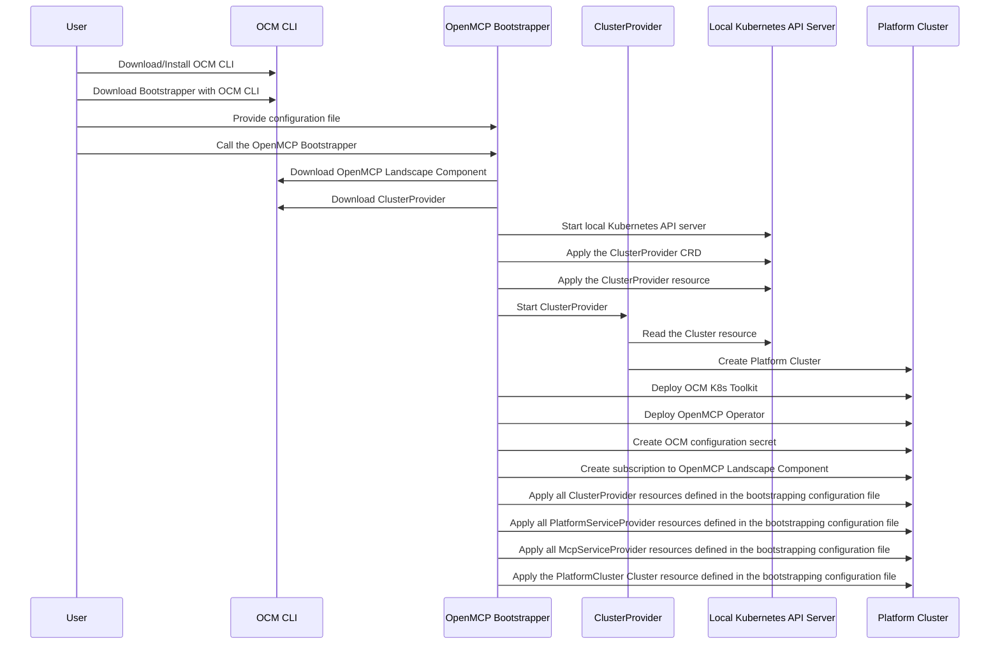

status: proposed<br>
date: 2025-03-21<br>
deciders: <br>
<hr>
<!-- we need to disable MD025, because we use the different heading "ADR Template" in the homepage (see above) than it is foreseen in the template -->
<!-- markdownlint-disable-file MD025 -->

This document describes the bootstrapping of a new OpenMCP landscape from the perspective of a OpenMCP landscape operator.
The bootstrapping process only needs to be executed once for a new OpenMCP landscape.
The bootstrapping process is a manual process that requires the operator to execute a series of commands to create OpenMCP landscape.
The result of the bootstrapping process is a fully functional OpenMCP landscape that is ready to be used and that is managing its own lifecycle.

The `OpenMCP bootstrapping tool` consists of the following components:

* `OCM CLI Wrapper`: A wrapper around the OCM CLI that provides a simplified interface to the OCM CLI. This is used to download the `OpenMCP Landscape` component as well as certain resources contained in the component.
* `Cluster Provider Runner`: The `Cluster Provider Runner` creates a local Kubernetes API Server and a local ETCD database. It then runs a `Cluster Provider` locally connected to the local Kubernetes API Server and local ETCD database. The type of the `Cluster Provider` is determined by the bootstrapping configuration file. The `Cluster Provider Runner` is responsible for creating the `Platform Cluster`.
* `OCM K8s Toolkit Setup`: The `OCM K8s Toolkit Setup` deploys the `OCM K8s Toolkit` on the `Platform Cluster` and creates a subscription to the `OpenMCP Landscape` component.
* `OpenMCP Operator Deployer`: The `OpenMCP Operator Deployer` deploys the `OpenMCP Operator` on the `Platform Cluster`.
* `Service Provider Deployer`: The `Service Provider Deployer` applies all `Cluster Provider`, `Platform Service Provider` and `MCP Service Provider` specified in the bootstrapping configuration file to the `Platform Cluster`.



The user downloads and installs the `OCM CLI` (command line interface) to the local machine. The user uses the `OCM CLI` to download the `OpenMCP bootstrapper` tool to the local machine.
The `OpenMCP bootstrapper` tool is a command line tool that is used to bootstrap a new OpenMCP landscape. The user creates a `OpenMCP bootstrapping configuration file`. The `OpenMCP bootstrapping configuration file` contains the configuration how to access the `OpenMCP Landscape Component`, the `Platform Cluster` resource definition, a list of `Cluster Providers`, a list of `Platform Service Providers` and a list of `MCP Service Providers`. The list of `Cluster Providers` needs to contain at least one `Cluster Provider` that is able to create the `Platform Cluster`. All other providers are optional.

The user calls the `OpenMCP bootstrapper` with the configuration file.
The `OpenMCP bootstrapper` searches the list of specified `Cluster Providers` in the bootstrapping configuration to find the `Cluster Provider` that is able to create the `Platform Cluster`. The `OpenMCP bootstrapper` uses the `OCM cli` to download the `Cluster Provider` resource as a standalone executable.
The `OpenMCP bootstrapper` starts a local Kubernetes API server and applies the `Cluster Provider` and the `Cluster` resource to the local Kubernetes API server and starts the `Cluster Provider` executable. The `Cluster Provider` then creates the platform cluster.

The `OpenMCP bootstrapper` deploys a secret containing the OCM configuration to the `Platform Cluster`.
The `OpenMCP bootstrapper` then deploys the `OCM K8s Toolkit` to the `Platform Cluster` and creates a subscription to the `OpenMCP Landscape Component`.

The `OpenMCP bootstrapper` then deploys the `OpenMCP Operator` to the `Platform Cluster`.
The `OpenMCP bootstrapper` then applies all `Cluster Provider`, `Platform Service Provider` and `MCP Service Provider` resources defined in the bootstrapping configuration file to the `Platform Cluster`.
The `OpenMCP bootstrapper` applies the `Platform Cluster` `Cluster` resource to the `Platform Cluster`.

From this point on, the `OpenMCP Operator` will take over and manage the lifecycle of the OpenMCP landscape.

## Example Configuration File

```yaml
ocm:
  repository:
    baseUrl: ghcr.io/openmcp-project/landscape
    version: v0.1.0
  config: ./.ocmconfig

platformCluster:
  apiVersion: openmcp.cloud/v1alpha1
  kind: Cluster
  metadata:
    name: PlatformCluster
  spec:
  ...

clusterProviders:
    - config:
        apiVersion: openmcp.cloud/v1alpha1
        kind: ClusterProvider
        metadata:
          name: kind
        spec:
        ...

platformServiceProviders:
  - config:
      apiVersion: openmcp.cloud/v1alpha1
      kind: PlatformServiceProvider
      metadata:
        name: Ingress
      spec:
      ...

mcpServiceProviders:
  - config:
      apiVersion: openmcp.cloud/v1alpha1
      kind: McpServiceProvider
      metadata:
        name: CrossPlane
      spec:
      ...
```

## Goals

* This ARD describes only the first time setup of a new OpenMCP landscape.
* The bootstrapping process should only require a minimum amount of configuration. Use proper default values where possible.
* The user interaction should be as minimal as possible.
* The bootstrapping process should require a minimal amount of dependencies and prerequisites.
* The bootstrapping process should be idempotent. It should be possible to run the bootstrapping process multiple times without causing any harm.
* It should have good error handling and feedback to the user.

## Non-Goals

* No secret management. Secrets should be managed by the OpenMCP landscape operator.
* No day-2 operations. The bootstrapping process only sets up the OpenMCP landscape. Day-2 operations are out of scope.

## Assumptions / Prerequisites

* Linux/macOS environment (Windows is only supported via WSL)
* Knowledge of basic shell commands
* Knowledge of basic Kubernetes concepts
