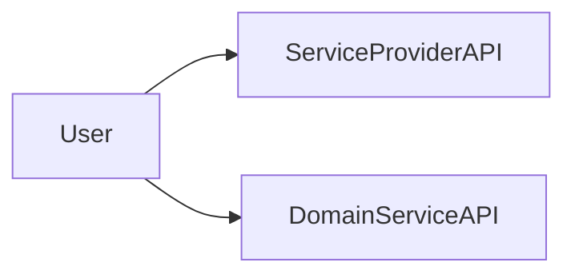
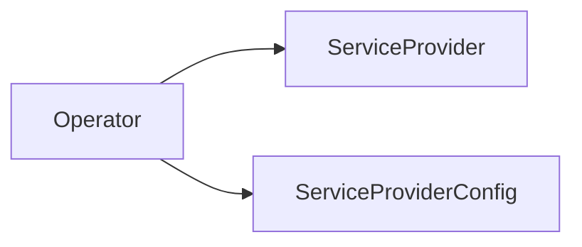
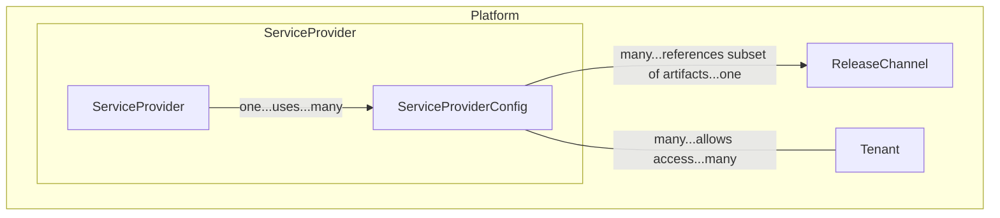
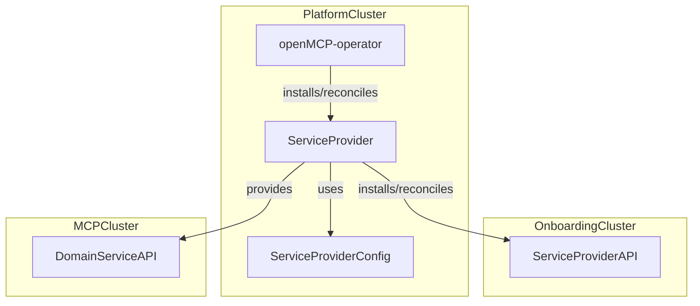
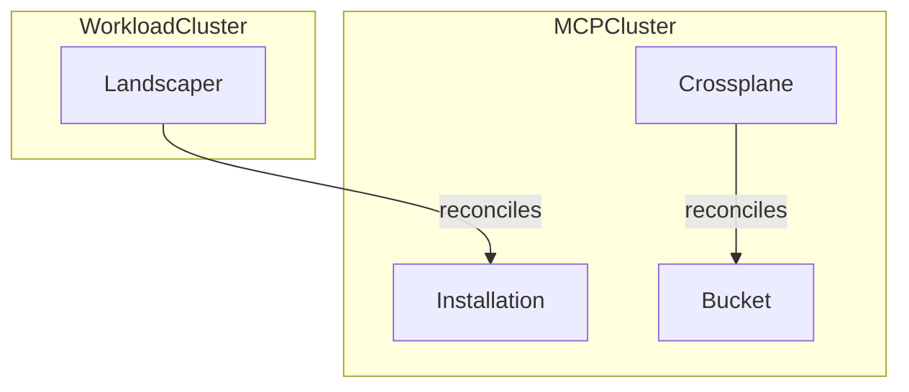
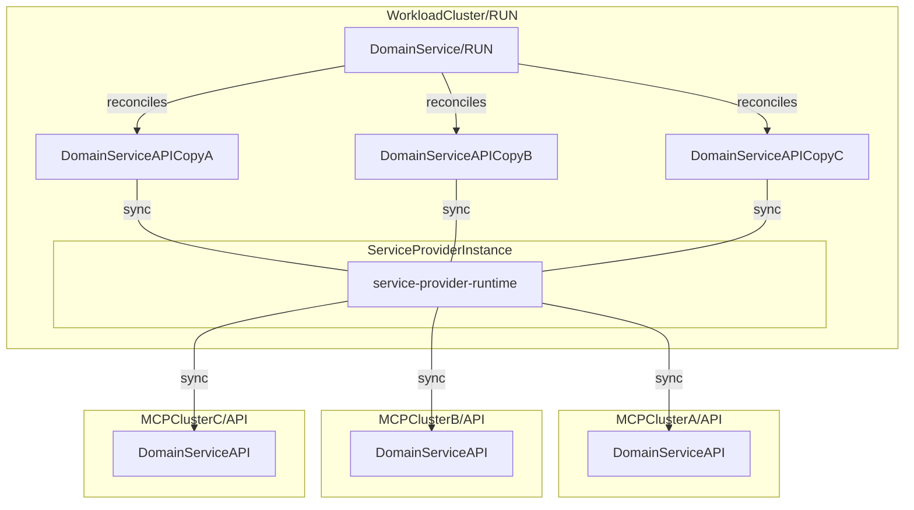

# Service Provider Design

## Goals

- Define clear terminology around `ServiceProvider` in the OpenMCP space
- Define `ServiceProvider` scope: responsibilities and boundaries of a `ServiceProvider`
- Define `ServiceProvider` contract to implement `ServiceProvider` as a loosely coupled component in the openMCP context
- Define how a `ServiceProvider` can be validated
- (MCP) v1 learnings have been addressed

## Non-Goals

- `ServiceProviders` does not need to deploy its `DomainService` on `WorkloadClusters`. For now a `DomainService` can be deployed on both `WorkloadCluster` or `MCPCluster`.
- Define a `ServiceProvider` model that implements a higher level `API`/`Run` platform concept (to allow flexible deployment models, e.g. with `ClusterProvider` kcp)

## Domain

A `ServiceProvider` enables platform users to consume a `DomainServiceAPI` of a third party `DomainService`. A `DomainService` is a third party service that provides its service to end users in terms of a `DomainServiceAPI`.

For example platform users want to use [Crossplane](https://www.crossplane.io/), specifically the `Object` API of [provider-kubernetes](https://github.com/crossplane-contrib/provider-kubernetes) to create Kubernetes objects on Kubernetes clusters they own without having to manage Crossplane themselves. So essentially consume `Crossplane` as a managed service of the `openMCP` platform.

If we map this to the abstract terminology of a `DomainService` and `DomainServiceAPI`, this means users want to consume the `DomainServiceAPI` -> `Object` of a `DomainService` -> `Crossplane`. Note that `provider-kubernetes` depends on a running Crossplane installation to work properly. That is why `provider-kubernetes` itself can't be a `DomainService`.

### Contracts

#### End User Facing

A `ServiceProviders` defines a `ServiceProviderAPI` to expose its managed service offering to end users. It is important to distinguish between `DomainServiceAPI` and `ServiceProviderAPI`. Both are end user facing but the `DomainServiceAPI` is the API that provides end user value while the `ServiceProviderAPI` defines the openMCP flavor of a `DomainService`. As with any other managed service offerings, a `ServiceProvider` in openMCP restricts the usage of `DomainService` to a subset of features. A simple example is a shifting range of platform supported `DomainService` versions that are available at a certain point.

#### Platform Operator Facing

A `ServiceProvider` defines a `ServiceProviderConfig` to enable platform operators to define managed service offerings in terms of the available feature set of a `DomainService`. E.g. tenant 1 can consume `ServiceProviderAPI` `Crossplane` via a `ServiceProviderConfig` `A` that enables the installation of Crossplane versions `v1` and `v2`, while tenant 2 is only able to consume `Crossplane` version `v1` via `ServiceProviderConfig` `B`.

:::info
Unlike a Crossplane `ProviderConfig` that is referenced by a `ManagedResource`, a `ServiceProviderConfig` is not directly referenced in `ServiceProviderAPI` objects. Consistent handling of `ServiceProviderConfig` across different `ServiceProviders` is still a goal we want to achieve to establish a consistent user and developer experience.
:::

### Service Discovery

End users need to be aware of a) the available service offerings and b) valid input values to consume a service offering.

Both points are the responsibility of `PlatformServices` and not the `ServiceProvider` itself.

A) is realized by installing the `ServiceProviderAPI` on the `OnboardingCluster`. Any platform tenant is aware of any available `ServiceProviderAPI`. In other words the platform doesn't hide its end user facing feature set depending on whether a user belongs to a tenant that is able to successfully consume a `ServiceProviderAPI`.

B) is realized by communicating the `ServiceProviderConfig` options that are available to the user. A user of a tenant without a `ServiceProviderConfig` can consume a `ServiceProviderAPI` but `DomainService` deployment will be denied.

One special kind of config information that a `ServiceProvider` needs are the artifact versions he can use to deploy a service. OpenMCP introduces the concept of `ReleaseChannels` that define the available artifacts (container images, helm charts, etc.) in context of an openMCP installation. A `ServiceProvider` indirectly consumes a `ReleaseChannel` via its `ServiceProviderConfig`:

:::info
A `ServiceProviderConfig` may hold configuration parameters other than `ReleaseChannel` information/artifact versions. In that sense it is more than just a 'version pinning' mechanism.
:::

### Deployment Model

A `ServiceProvider` runs on the `PlatformCluster` and reconcile its `ServiceProviderAPI` on the `OnboardingCluster`. A `ServiceProvider` deploys a `DomainService` either on a `WorkloadCluster` or `MCPCluster` that reconciles the `DomainServiceAPI`.

The `DomainServiceAPI` is either reconciled on the `MCPCluster` or a `WorkloadCluster`. The following diagram illustrates two simplified `DomainService` examples `Landscaper` and `Crossplane` with the corresponding `DomainServiceAPIs` `Installation` and `Bucket`.

- The [openmcp-operator](https://github.com/openmcp-project/openmcp-operator) manages the lifecycle of `ServiceProviders`.

## Validation

A `ServiceProvider` is considered healthy if both its `API` and `Run` part have been successfully synced and are ready for consumption.

The following validation flow validates that a `ServiceProvider` is working as expected:

0. SETUP: Create test environment by installing any `ServiceProvider` prerequisite: a) k8s cluster, e.g. kind, b) install `service-provider-operator` -> wait for operator to be available
1. ASSESS: Request `ServiceProvider` -> wait for `API` and `Run` components to be `synced` and `ready`
2. ASSESS: Consume `API` to provision `DomainService` -> wait for DomainService to be `synced` and `ready`
3. ASSESS: (optional) Consume `DomainServiceAPI` depending on the provider/domain context this may or may not be required
4. ASSESS: Delete `ServiceProvider` -> wait for `API`, `Run`, `ServiceProvider` to be successfully removed
5. TEARDOWN: Delete test environment components

## Template

tbd.

## Runtime

A runtime is a collection of abstractions and contracts that provides an environment in which user-defined logic is executed.

The service provider runtime is built on top of controller-runtime and provides a service provider specific reconciliation loop. It gives us as a platform the possibility to implement platform specific feature around service providers that is are not `DomainService` specific. This way we provide a consistent experience to both end users and developers when working with `ServiceProviders`.

The following overview illustrates the layers of a `ServiceProvider` controller a simplified way:

| Layer | Description |
| :--- | :--- |
| Service Provider | defines `ServiceProviderAPI`/`ServiceProviderConfig` and implements service-provider-runtime operations |
| service-provider-runtime | defines ServiceProvider reconciliation semantics |
| multicluster/controller-runtime | defines generic reconciliation semantics |
| Kubernetes API machinery | k8s essentials |

### Abstractions

In contrast to the API [contracts](#contracts)

Main tasks towards MCP/Workload Clusters based on watching the `ServiceProviderAPI`:

- Create Service Deployment (Init Lifecycle)
- Observe Service Deployment (Drift Detection)
- Update Service Deployment (Reconcile Drift)
- Delete Service Deployment (End Lifecycle)

Main tasks towards `PlatformCluster` based on `ServiceProviderConfig`:

- resolve and validate `ServiceProviderConfig` against e.g. available `ReleaseChannel`

Here we define the core interfaces that a consumer (`ServiceProvider` developer) has to implement, e.g. in Crossplane `ExternalConnector` creates `ExternalClient` which implements CRUD operations with `ExternalObservation`, `ExternalCreation`, etc. `Managed` interface defines what makes a k8s object a managed Crossplane resource, e.g. by referencing a `ProviderConfig`, specifying `ManagementPolicies`, `ConnectionSecrets`, etc.

## Out of Scope

The remainder of this document contains topics that are out of scope for now.

### Multicluster Execution Model

Multi-cluster functionality for `ServiceProvider` is a design goal for future iterations and might get integrated into `service-provider-runtime`. This would enable service deployment on shared `WorkloadCluster`.

An approach could be to sync API objects between `API` and `RUN` clusters as a feature of service-provider-runtime.

### Ideas

- `SoftDelete` platform concept. A `managed` service can transition to a `unmanaged` service by soft deleting its corresponding `ServiceProviderConfig` without losing the `DomainService`. This way a tenant could offboard itself partially or entirely from the platform without losing the provisioned infrastructure. This obviously depends on the ownership model of the infrastructure.
- Distinguish between `Run` and `API` artifacts on all platform layers

### Terminology

- `Run` clusters support scheduling workloads. A `Run` cluster may or may not also serve as `API` cluster.
- `API` clusters serve APIs but do not support scheduling workload (note that `API`/`Run` is a higher level platform concept)

### References

Projects with similar concepts:

- [Crossplane](https://www.crossplane.io/)
- [kube-bind](https://github.com/kube-bind/kube-bind)
- [multicluster-runtime](https://github.com/kubernetes-sigs/multicluster-runtime)
