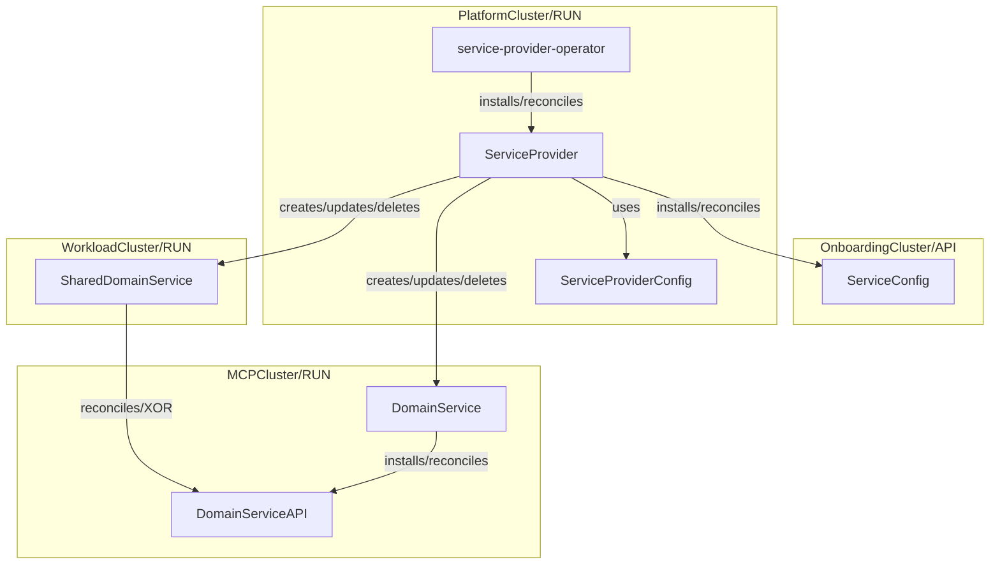

# Service Provider Design

## Goals

- Define clear terminology around `ServiceProvider` in the OpenMCP space
- Define `ServiceProvider` scope: responsibilities and boundaries of a `ServiceProvider`
- Define a `ServiceProvider` model that implements the higher level `API`/`Run` platform concept (to allow flexible deployment models, e.g. with `ClusterProvider` kcp)
- Define `ServiceProvider` contract to implement `ServiceProvider` as a loosely coupled component in the openMCP context
- Define how a `ServiceProvider` can be validated
- (MCP) v1 learnings have been addressed

## Non-Goals

tbd

## Object Model

Open Points:

- Does the `openmcp-operator` manage `ServiceProviders` or do we introduce a new operator for `ServiceProviders`? Benefits of a new component could be clear separation of concerns. The `openmcp-operator` already does a lot and we don't want the next `control-plane-operator`.
- In the above model the `OnboardingCluster` is a continuous `API` cluster. We might want to provision dedicated or shared tenant `API` servers (e.g. with `ClusterProvider` kcp) based on some kind of component discovery that lets the tenant pick its feature/component set. This way the `OnboardingCluster` is only used to onboard new tenants. And we don't run into CRD management hell/bottlenecks.
- Another thought regarding the `OnboardingCluster`. If we introduce tenant `API` clusters, they could be used to create MCPs. This again implies that instead of having the `OnboardingCluster` create `MCPs`, we might want to have the `OnboardingCluster` create `Tenants` as the entry point for users -> start with an identity object like `Tenant` or `Account` instead of a usage artifact like `MCP`.

TODO:

- Illustrate different deployment models with `Run`/`API` concept
- Visually distinguish between `Run` and `API` artifacts

## Terminology

Defines the objects of the [object model](#object-model)

- `ServiceProvider` provides a service in tenant space
- `PlatformService` provides a service in platform space
- `Run` clusters support scheduling workloads. A `Run` cluster may or may not also serve as `API` cluster.
- `API` clusters serve APIs but do not support scheduling workload (note that `API`/`Run` is a higher level platform concept)
- `OnboardingCluster` is part of the platform domain and the config/setup part from a tenant perspective. It serves the `API` of a `ServiceProvider`
- `MCPCluster` is part of the tenant domain and the application/functional part from a tenant perspective. It may or may not run the `Run` of a `ServiceProvider`
- `PlatformCluster` is part of the platform domain and a black box from a tenant perspective. It may or may not run the `Run` of a `ServiceProvider`
- A `ServiceConfig` defines the service provisioning in terms of the `DomainService` `API` and `Run` where e.g. Crossplane could be provisioned for a tenant by installing the `API` on the tenant MCP but the `Run` on a shared worker pool (`WorkloadCluster`) (clarify tenant IAM). A tenant can use this mechanism to decide how to consume a service.
- A `ServiceProviderConfig` defines the config parts that are used in reconcile run, e.g. to define tenant boundaries

## Boundaries

- A `PlatformService` (e.g. `service-provider-operator`) watches platform `API` clusters, e.g. the `OnboardingCluster` and acts on platform `Run` clusters, e.g. itself or shared `WorkloadClusters`. It does not act on tenant clusters, e.g. MCPs
- A `ServiceProvider` watches tenant `API` clusters, e.g. the `OnboardingCluster` and acts on `Run` clusters, e.g. MCPs.

tbc platform space vs tenant space

## Lifecycle

- A `PlatformService` is installed by a platform team and/or bootstrapping mechanism (out of scope)
- A `ServiceProvider` is installed by creating ServiceProvider objects, the `service-provider-operator` manages the lifecycle of `ServiceProviders`... advantages disadvantages

## Validation

A `ServiceProvider` is considered healthy if both its `API` and `Run` part have been successfully synced and are ready for consumption.

The following validation flow validates that a `ServiceProvider` is working as expected:

0. SETUP: Create test environment by installing any `ServiceProvider` prerequisite: a) k8s cluster, e.g. kind, b) install `service-provider-operator` -> wait for operator to be available
1. ASSESS: Request `ServiceProvider` -> wait for `API` and `Run` components to be `synced` and `ready`
2. ASSESS: Consume `API` to provision `DomainService` -> wait for DomainService to be `synced` and `ready`
3. ASSESS: (optional) Consume `DomainServiceAPI` depending on the provider/domain context this may or may not be required
4. ASSESS: Delete `ServiceProvider` -> wait for `API`, `Run`, `ServiceProvider` to be successfully removed
5. TEARDOWN: Delete test environment components

## Runtime

A runtime is a collection of abstractions and contracts that provides an environment in which user-defined logic is executed.

The service provider runtime is built on top of controller-runtime and provides a service provider specific reconciliation loop.

It provides:

- client abstractions (in xp external clients, in openmcp e.g. reuse common juggler reconcilers like flux?)
- lifecycle management abstractions of `ServiceProviderAPI` objects (the reconcile loop)
- platform specific features (in xp e.g. late initialize, external-name and pause annotations), enables us to implement platform features for all service providers (a `ServiceProvider` only needs to update their runtime dependency)
- handling of cross-cutting concerns like event recording, logging, metrics, rate limits

The following overview illustrates the layers in a simplified way:

| Layer | Description |
| :--- | :--- |
| Service Provider | defines `ServiceProviderAPI` and implements service-provider-runtime operations |
| service-provider-runtime | defines ServiceProvider reconciliation semantics |
| multicluster/controller-runtime | defines generic reconciliation semantics |
| Kubernetes API machinery | k8s essentials |
| Go runtime / OS kernel | process/thread execution, memory management |

Multi-cluster functionality will most likely be part of `service-provider-runtime`, e.g. a facade-like layer on top of `multicluster-runtime` to enable service deployment on shared `WorkloadCluster`.

### Execution Model

Here we define what a run/reconcile cycle means, e.g. observe followed by an orchestration of actions like create, update, delete.

This may include special domain semantics similar to `ManagementPolicies` or the `pause` state/mechanism in Crossplane.

### Abstractions and Contracts

Here we define the core interfaces that a consumer (`ServiceProvider` developer) has to implement, e.g. in Crossplane `ExternalConnector` creates `ExternalClient` which implements CRUD operations with `ExternalObservation`, `ExternalCreation`, etc. `Managed` interface defines what makes a k8s object a managed Crossplane resource, e.g. by referencing a `ProviderConfig`, specifying `ManagementPolicies`, `ConnectionSecrets`, etc.

## Domain

The actual domain layer of a `ServiceProvider` (layer on top of the [runtime](#runtime)). The foundation to build a `ServiceProvider` template.

A `ServiceProvider` defines how a `DomainService` can be consumed by a tenant. It has the following responsibilities:

- Manage the lifecycle of the `API` and `Run` of a `DomainService`.
- Provide its platform facing `API` -> `ServiceProviderConfig`
- Provide its tenant facing `API` -> `ServiceConfig`
- Allow multiple `APIClusters` to target the same `RunCluster`, e.g. the Crossplane managed resources on `MCP` A and `MCP` B are reconciled by the same Crossplane installation on a shared `WorkloadCluster` -> we can think of this as a `multicluster-runtime` facade that is part of [service-provider-runtime](#runtime).

## Template / Builder

Do we want a CLI like kubebuilder or a template like crossplane provider template?

## Service Provider Manager

The component that manages the lifecyclee of `ServiceProviders` and provides service discovery to platform `API` clusters, e.g. `OnboardingCluster`.

candidates e.g. `openmcp-operator` or `service-provider-operator`

out of scope?

## Ideas

- `SoftDelete` platform concept. A `managed` service can transition to a `unmanaged` service by soft deleting its corresponding `ServiceProviderAPI` or the `ServiceProvider` entirely without losing the `DomainService`. This way a tenant could offboard itself partially or entirely from the platform without losing the provisioned infrastructure. This obviously depends on the ownership model of the infrastructure.

## References

Projects with similar concepts:

- [Crossplane](https://www.crossplane.io/)
- [kube-bind](https://github.com/kube-bind/kube-bind)
- [multicluster-runtime](https://github.com/kubernetes-sigs/multicluster-runtime)
