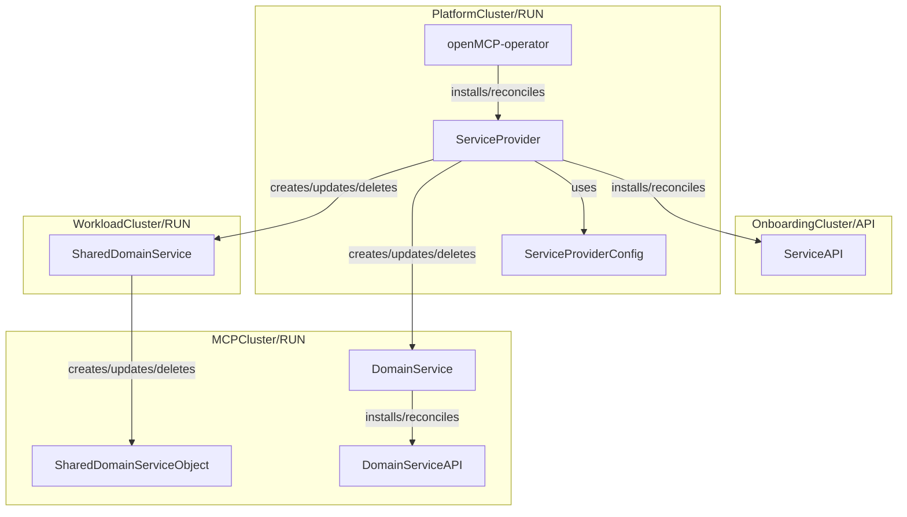
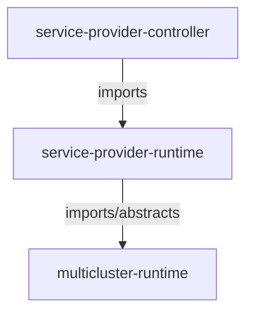
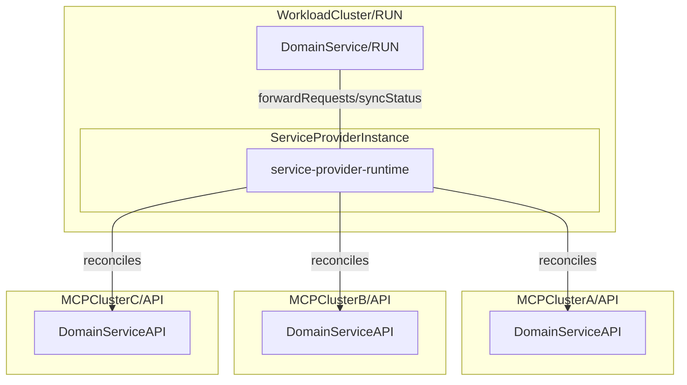
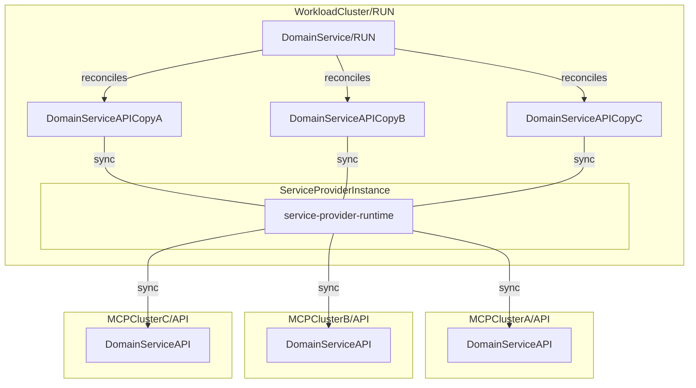

# Service Provider Design

## Goals

- Define clear terminology around `ServiceProvider` in the OpenMCP space
- Define `ServiceProvider` scope: responsibilities and boundaries of a `ServiceProvider`
- Define a `ServiceProvider` model that implements the higher level `API`/`Run` platform concept (to allow flexible deployment models, e.g. with `ClusterProvider` kcp)
- Define `ServiceProvider` contract to implement `ServiceProvider` as a loosely coupled component in the openMCP context
- Define how a `ServiceProvider` can be validated
- (MCP) v1 learnings have been addressed

## Non-Goals

- `ServiceProviders` does not need to deploy its `DomainService` on `WorkloadClusters`. For now a `DomainService` can be deployed on both `WorkloadCluster` or `MCPCluster`.

## Object Model

- The [openmcp-operator](https://github.com/openmcp-project/openmcp-operator) manages the lifecyclee of `ServiceProviders`.
- A `ServiceProvider` provides a third party service in tenant space. It manages the lifecycle of a `DomainService` and provides a `ServiceAPI`.
- The `ServiceProviderConfig` defines the platform facing config that is used in a reconcile run, e.g. to implement multi-tenancy on the `PlatformCluster`.
- The `ServiceAPI` is the tenant facing set of CRDs of a `ServiceProvider`.
- A `DomainService` is a third party service that manages `DomainServiceAPI` objects.
- The `DomainServiceAPI` is the set of CRDs introduced by `DomainService`.
- A `SharedDomainService` is a `DomainService` that can be deployed on a `WorkloadCluster`. A `SharedDomainService` does not expose its `DomainServiceAPI` to end users.
- A `SharedDomainServiceObject` is a Kubernets object managed by the `SharedDomainService`.

## Domain

A `ServiceProvider` defines how a `DomainService` can be consumed by a tenant. It has the following responsibilities:

- Manage the lifecycle of a `DomainService`
- Define platform facing config -> `ServiceProviderConfig`
- Define a tenant facing `API` -> `ServiceConfig`

A `DomainService` has to be treated as an external system where a `ServiceProvider` continuously has to prevent any drift caused by tenant actions on both `MCP` and `OnboardingCluster`.

## Validation

A `ServiceProvider` is considered healthy if both its `API` and `Run` part have been successfully synced and are ready for consumption.

The following validation flow validates that a `ServiceProvider` is working as expected:

0. SETUP: Create test environment by installing any `ServiceProvider` prerequisite: a) k8s cluster, e.g. kind, b) install `service-provider-operator` -> wait for operator to be available
1. ASSESS: Request `ServiceProvider` -> wait for `API` and `Run` components to be `synced` and `ready`
2. ASSESS: Consume `API` to provision `DomainService` -> wait for DomainService to be `synced` and `ready`
3. ASSESS: (optional) Consume `DomainServiceAPI` depending on the provider/domain context this may or may not be required
4. ASSESS: Delete `ServiceProvider` -> wait for `API`, `Run`, `ServiceProvider` to be successfully removed
5. TEARDOWN: Delete test environment components

## Template

tbd.

## Runtime

A runtime is a collection of abstractions and contracts that provides an environment in which user-defined logic is executed.

The service provider runtime is built on top of controller-runtime and provides a service provider specific reconciliation loop.

It provides:

- client abstractions (in xp external clients, in openmcp e.g. reuse common juggler reconcilers like flux?)
- lifecycle management abstractions of `ServiceProviderAPI` objects (the reconcile loop)
- platform specific features (in xp e.g. late initialize, external-name and pause annotations), enables us to implement platform features for all service providers (a `ServiceProvider` only needs to update their runtime dependency)
- handling of cross-cutting concerns like event recording, logging, metrics, rate limits

The following overview illustrates the layers of a `ServiceProvider` controller a simplified way:

| Layer | Description |
| :--- | :--- |
| Service Provider | defines `ServiceProviderAPI` and implements service-provider-runtime operations |
| service-provider-runtime | defines ServiceProvider reconciliation semantics |
| multicluster/controller-runtime | defines generic reconciliation semantics |
| Kubernetes API machinery | k8s essentials |

### Abstractions and Contracts

Here we define the core interfaces that a consumer (`ServiceProvider` developer) has to implement, e.g. in Crossplane `ExternalConnector` creates `ExternalClient` which implements CRUD operations with `ExternalObservation`, `ExternalCreation`, etc. `Managed` interface defines what makes a k8s object a managed Crossplane resource, e.g. by referencing a `ProviderConfig`, specifying `ManagementPolicies`, `ConnectionSecrets`, etc.

## Out of Scope

The remainder of this document contains topics that are out of scope for now.

### Multicluster Execution Model

Multi-cluster functionality for `ServiceProvider` is a design goal for future iterations and might get integrated into `service-provider-runtime`. This would enable service deployment on shared `WorkloadCluster`. The following two diagrams illustrate a `juggler` and `multicluster-runtime` version.

#### Multicluster-runtime Facade

Not feasable because this essentially means replacing/reimplementing existing domain controllers based on controller-runtime with multicluster-runtime.

#### Object Syncer / Juggler

Another approach would be to sync API objects between `API` and `RUN` clusters as a feature of service-provider-runtime.

### Ideas

- `SoftDelete` platform concept. A `managed` service can transition to a `unmanaged` service by soft deleting its corresponding `ServiceProviderAPI` or the `ServiceProvider` entirely without losing the `DomainService`. This way a tenant could offboard itself partially or entirely from the platform without losing the provisioned infrastructure. This obviously depends on the ownership model of the infrastructure.
- In the above model the `OnboardingCluster` is a continuous `API` cluster. We might want to provision dedicated or shared tenant `API` servers (e.g. with `ClusterProvider` kcp) based on some kind of component discovery that lets the tenant pick its feature/component set. This way the `OnboardingCluster` is only used to onboard new tenants. And we don't run into CRD management hell/bottlenecks.
- Another thought regarding the `OnboardingCluster`. If we introduce tenant `API` clusters, they could be used to create MCPs. This again implies that instead of having the `OnboardingCluster` create `MCPs`, we might want to have the `OnboardingCluster` create `Tenants` as the entry point for users -> start with an identity object like `Tenant` or `Account` instead of a usage artifact like `MCP`.
- Distinguish between `Run` and `API` artifacts on all platform layers
- Illustrate different deployment models with `Run`/`API` concept

### Terminology

- `Run` clusters support scheduling workloads. A `Run` cluster may or may not also serve as `API` cluster.
- `API` clusters serve APIs but do not support scheduling workload (note that `API`/`Run` is a higher level platform concept)

### References

Projects with similar concepts:

- [Crossplane](https://www.crossplane.io/)
- [kube-bind](https://github.com/kube-bind/kube-bind)
- [multicluster-runtime](https://github.com/kubernetes-sigs/multicluster-runtime)
