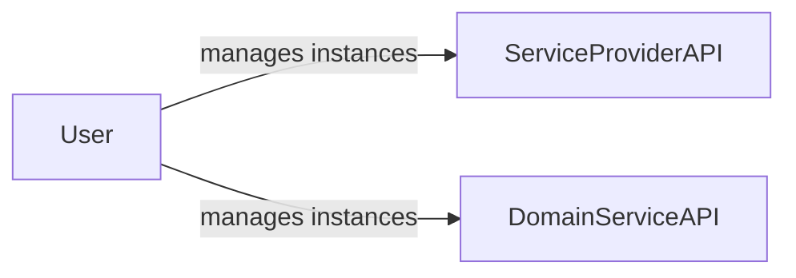
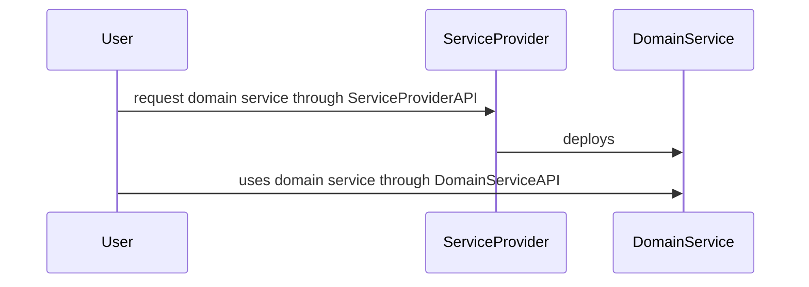
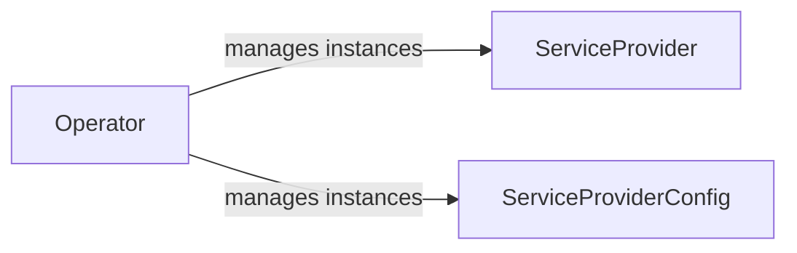
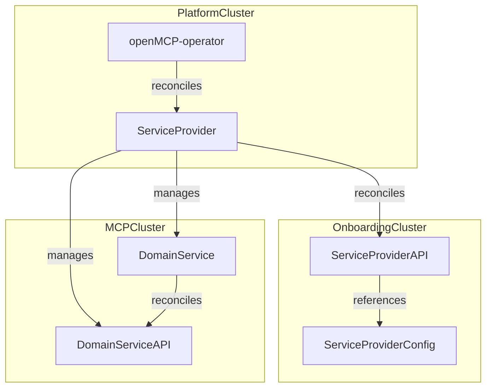
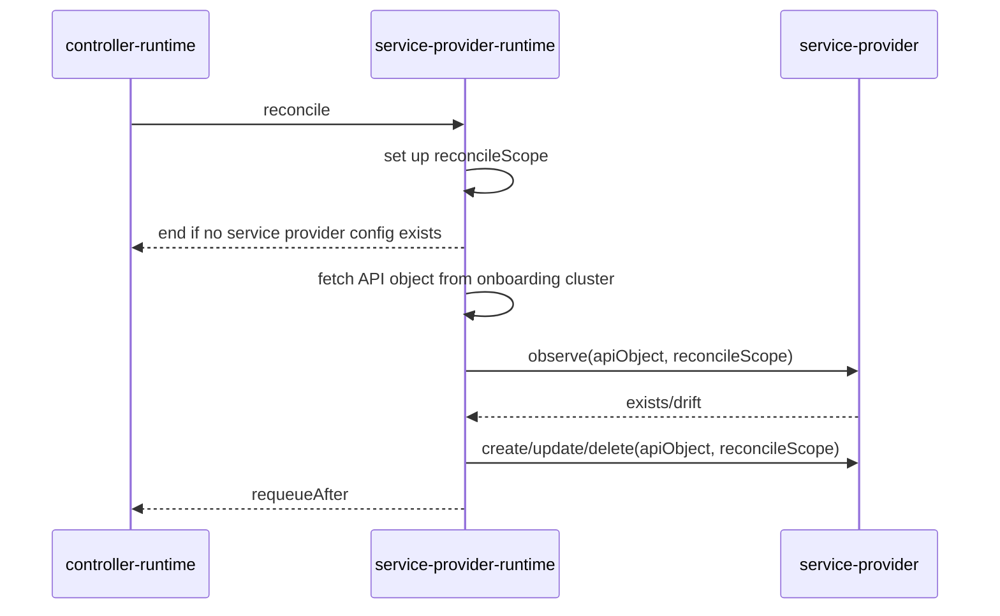

# Service Provider Design

This document outlines the `ServiceProvider` domain and its technical considerations within the context of the [openMCP project](https://github.com/openmcp-project/), providing a foundation for understanding its architecture and operational aspects.

## Goals

- Define clear terminology around `ServiceProvider` within the openMCP project
- Establish the scope of a `ServiceProvider`, including its responsibilities and boundaries
- Define a `ServiceProvider` implementation layer to implement common features and ensure consistency across `ServiceProvider` instances
- Outline how a `ServiceProvider` can be validated

## Non-Goals

- `ServiceProviders` are not required to deploy their `DomainService` on `WorkloadClusters`. For now, a `DomainService` can be deployed on either a `WorkloadCluster` or `MCPCluster`.
- Define a `ServiceProvider` model that implements a higher level `API`/`Run` platform concept (e.g., to allow flexible deployment models, e.g. with `ClusterProvider` [kcp](https://github.com/kcp-dev/kcp))

## Terminology

- `End users`: These are the consumers of services provided by an openMCP platform installation. They operate on the `OnboardingCluster` and `MCPCluster` (see [deployment model](#deployment-model)).
- `Operators`: These are either human users or technical systems that are responsible for managing an openMCP platform installation. While they may operate on any cluster, their primary focus is on the `PlatformCluster` and `WorkloadCluster`.

## Domain

A `ServiceProvider` enables platform operators to offer managed `DomainServices` to end users. A `DomainService` is a third-party service that delivers its functionality to end users through a `DomainServiceAPI`.

For example, consider an openMCP installation that aims to provide [Crossplane](https://www.crossplane.io/) as a managed service to its end user. Let's assume that end users specifically want to use the `Object` API of [provider-kubernetes](https://github.com/crossplane-contrib/provider-kubernetes), to create Kubernetes objects on their own Kubernetes clusters without the need to manage Crossplane themselves.

If we map this to the terminology of a `DomainService` and `DomainServiceAPI`:

- The `DomainService` is `Crossplane`.
- The `DomainServiceAPI` is `Object`.

:::info
Note that `provider-kubernetes` depends on a running Crossplane installation to function properly. Therefore, `provider-kubernetes` itself cannot be considered a `DomainService`.
:::

The following subsections describe the objects that a `ServiceProvider` introduces.

### End User Objects

A `ServiceProvider` defines a `ServiceProviderAPI` to allow end users to request managed service. It is important to distinguish between `ServiceProviderAPI` and `DomainServiceAPI`.

While both are end user facing, they serve different purposes:

- The `ServiceProviderAPI` allows end users to request a `DomainService` and gain access to its `DomainServiceAPI`.
- The `DomainServiceAPI` delivers direct value to end users by providing the functionality a `DomainService`.

### Platform Operator Objects

A `ServiceProvider` defines a `ServiceProviderConfig` that enables platform operators to specify different offerings of a managed `DomainService`. For example, tenant 1 can consume the `ServiceProviderAPI` for `Crossplane` through a `CrossplaneProviderConfig` `A`, which allows the installation of Crossplane versions `v1` and `v2`. In contrast, tenant 2 is restricted to consuming only `Crossplane` version `v1` through `CrossplaneProviderConfig` `B`.

Management of `ServiceProvider` and `ServiceProviderConfig` instances may be partially or fully automated.

:::info
The `ServiceProvider` object itself is a higher level platform concept that is described in the corresponding `PlatformService`, [openmcp-operator](https://github.com/openmcp-project/openmcp-operator).
:::

### Service Discovery and Access Management

End users need to be aware of a) the available service offerings, and b) valid input values to consume a service offering.

A) The available service offerings are made visible by installing the `ServiceProviderAPI` on the `OnboardingCluster` (see [deployment model](#deployment-model)). This ensures that any platform tenant is aware of all available `ServiceProviderAPIs`. In other words, the platform does not hide its end-user-facing feature set, even if a user belongs to a tenant that cannot successfully consume a specific `ServiceProviderAPI`.

B) Valid input values are communicated through `ServiceProviderConfig` objects created on the `OnboardingCluster`. A user from a tenant without an associated `ServiceProviderConfig` can technically still access a `ServiceProviderAPI`, but any attempt to deploy a `DomainService` will be denied. It is important to note that `ServiceProviderConfigs` are owned and managed by the platform operator but are exposed to end users for consumption.

Both objects are managed by the platform operator and not the `ServiceProvider` itself (see [platform operator objects](#platform-operator-objects)).

### Deployment Model

A `ServiceProvider` runs on the `PlatformCluster` and reconcile its `ServiceProviderAPI` on the `OnboardingCluster`. It deploys a `DomainService` on either a `WorkloadCluster` or `MCPCluster`, which then reconciles the `DomainServiceAPI`.

The `DomainServiceAPI` is reconciled either on the `MCPCluster` or a `WorkloadCluster`. The following diagram illustrates two simplified `DomainService` examples, `Landscaper` and `Crossplane`, along with their corresponding `DomainServiceAPIs`, `Installation` and `Bucket`.

- The [openmcp-operator](https://github.com/openmcp-project/openmcp-operator) manages the lifecycle of `ServiceProviders`.

### Release Channel Detour

Technically, a `ServiceProvider` requires configuration information about the artifact versions it can use to deploy a service. To address this, openMCP introduces the concept of `ReleaseChannels`, which define the available artifacts (e.g. container images, helm charts, etc.) within the context of an openMCP installation. A `ServiceProvider` indirectly consumes a `ReleaseChannel` through its `ServiceProviderConfig`:

:::info
A `ServiceProviderConfig` may include configuration parameters beyond just `ReleaseChannel` information or artifact versions. In this sense, it is more than just a 'version pinning' mechanism.
:::

## Validation

A `ServiceProvider` is considered healthy if both its `API` and `Run` components have been successfully synced and are ready for consumption.

The following validation flow validates that a `ServiceProvider` is functioning as expected:

0. SETUP: Create test environment by installing any `ServiceProvider` prerequisite: a) k8s cluster, e.g. kind, b) install `service-provider-operator` and wait for the operator to become available
1. ASSESS: Request `ServiceProvider` and wait for `ServiceProvider` deployment and `ServiceProviderAPI` to become available
2. ASSESS: Consume `ServiceProviderAPI` to provision a `DomainService` and wait for the `DomainService` and `DomainServiceAPI` to become available
3. ASSESS: (optional) Depending on the `DomainService` context, consume the `DomainServiceAPI` and validate that the `DomainService` is functioning as expected
4. ASSESS: Delete the `ServiceProvider` and wait for `ServiceProvider` deployment and `ServiceProviderAPI` to be successfully removed
5. TEARDOWN: Clean up by deleting the test environment components

## Runtime

A runtime is a collection of abstractions and contracts that provides an environment for executing user-defined logic. This establishes a clear separation between `ServiceProvider` the developer domain and the platform developer domain.

The `service-provider-runtime` is built on top of `controller-runtime` and introduces a service provider specific reconciliation loop. The design enables us as a platform to implement platform specific features around service providers, while allowing `ServiceProvider` developers to focus solely on `DomainService` specific logic without needing to understand platform internals. This approach ensures a consistent experience for both end users and developers when working with `ServiceProviders`.

The following table provides a simplified overview of the layers within a `ServiceProvider` controller:

| Layer | Description | Target Audience |
| :--- | :--- | :--- |
| Service Provider | Defines `ServiceProviderAPI`/`ServiceProviderConfig` and implements service-provider-runtime operations | Service provider developers |
| service-provider-runtime | Defines ServiceProvider reconciliation semantics | Platform developers |
| multicluster/controller-runtime | Defines generic reconciliation semantics | Out of scope |
| Kubernetes API machinery | Kubernetes essentials | Out of scope |

### Functionality

This section outlines the main functionality implemented within the runtime. Currently, the focus is on establishing consistency across `ServiceProvider` implementations. However, this section can be extended in the future to include more generic `ServiceProvider` concepts that are handled within the runtime.

Main tasks towards MCP/Workload Clusters (based on watching the `ServiceProviderAPI`):

- Observe Service Deployment (Drift Detection) -> IN: context, apiObject, reconcileScope; OUT: bool[exists, drift], error
- Create Service Deployment (Init Lifecycle) -> IN: context, apiObject, reconcileScope; OUT: error
- Update Service Deployment (Reconcile Drift) -> IN: context, apiObject, reconcileScope; OUT: error
- Delete Service Deployment (End Lifecycle) -> IN: context, apiObject, reconcileScope; OUT: error

In this context, `reconcileScope` holds the `ServiceProviderConfig` and provides clients to access onboarding, mcp and workload clusters.

Main tasks towards `PlatformCluster` (based on `ServiceProviderConfig`):

- resolve and validate `ServiceProviderConfig` against `DomainService` context and available `ReleaseChannel` options

### Reconcile Sequence

:::info
The validation of a `ServiceProviderConfig`, if required, is part of `ServiceProvider` layer and not the runtime layer.
:::

## Related Artifacts

The following artifacts are derived from this document and must be continuously updated to maintain consistency:

- Service Provider Template
- Service Provider Runtime

## Out of Scope

The remainder of this document contains topics that are out of scope for now.

### Multicluster Execution Model

Multi-cluster functionality for `ServiceProvider` is a design goal for future iterations and might get integrated into `service-provider-runtime`. This would generally enable to run any `DomainService` on shared `WorkloadCluster`.

An approach could be to sync API objects between `API` and `RUN` clusters as a feature of service-provider-runtime.

### Ideas

- `SoftDelete` platform concept. A `managed` service can transition to a `unmanaged` service by soft deleting its corresponding `ServiceProviderConfig` without losing the `DomainService`. This way a tenant could offboard itself partially or entirely from the platform without losing the provisioned infrastructure. This obviously depends on the ownership model of the infrastructure.
- Distinguish between `Run` and `API` artifacts on all platform layers

### Terminology

- `Run` clusters support scheduling workloads. A `Run` cluster may or may not also serve as `API` cluster.
- `API` clusters serve APIs but do not support scheduling workload (note that `API`/`Run` is a higher level platform concept)

### References

Projects with similar concepts:

- [Crossplane](https://www.crossplane.io/)
- [kube-bind](https://github.com/kube-bind/kube-bind)
- [multicluster-runtime](https://github.com/kubernetes-sigs/multicluster-runtime)
