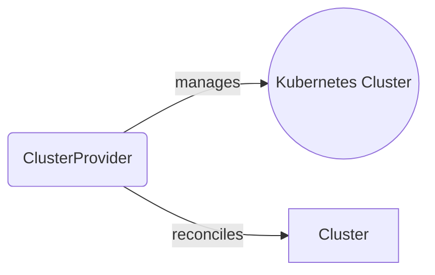
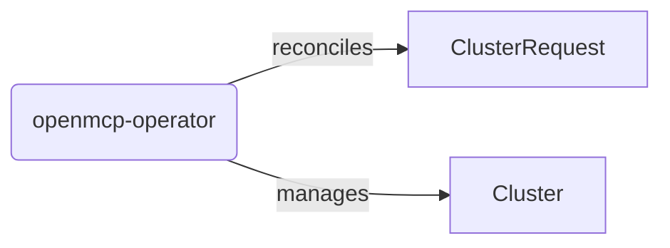
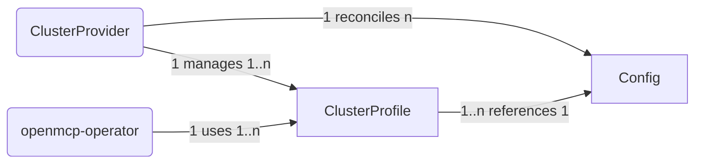
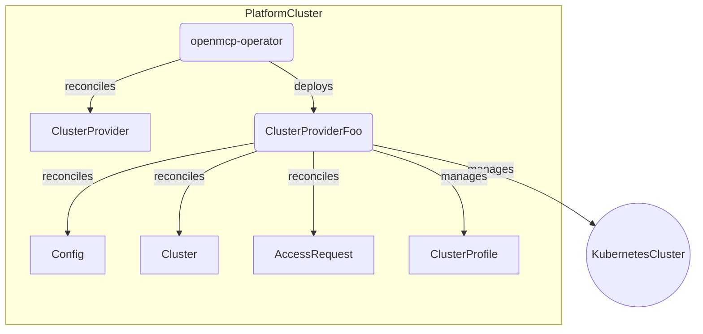
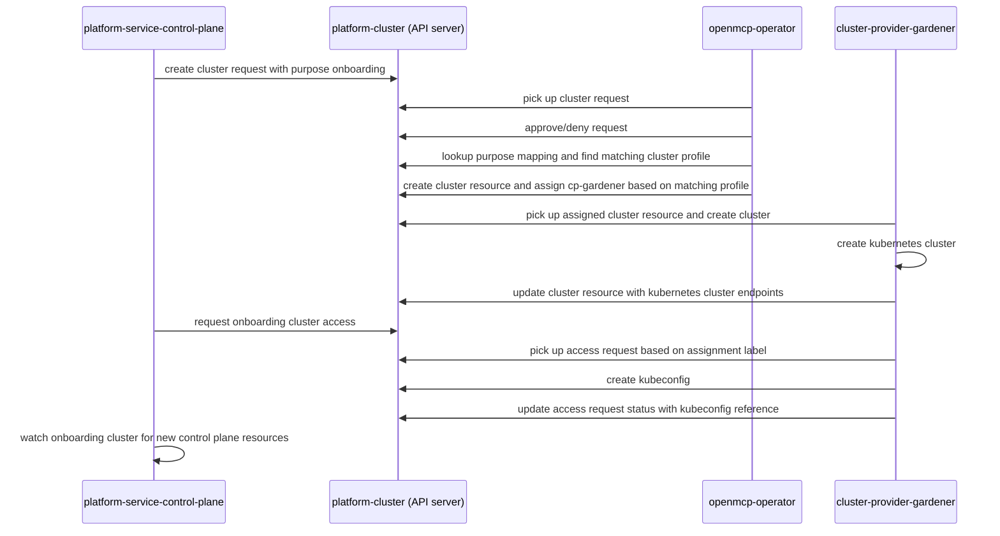
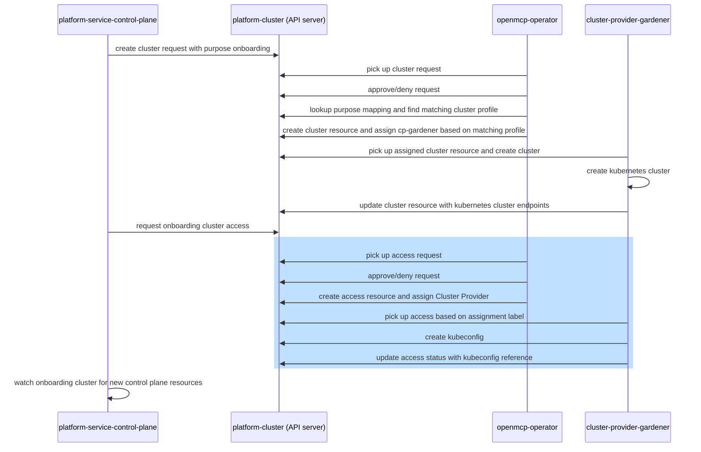

# Design

This document defines the terminology for Cluster Providers within the OpenControlPlane project and clarifies their scope and responsibilities.

Cluster Providers decouple OpenControlPlane from a specific cloud vendor or bare-metal Kubernetes solution, allowing [platform owners](../../operators/overview) to switch providers if needed.

## Domain

Cluster Providers are responsible for managing Kubernetes clusters and providing access to them within the OpenControlPlane ecosystem.

All Cluster Providers use the same set of core cluster APIs provided by the [openmcp-operator](https://github.com/openmcp-project/openmcp-operator):

- ClusterProfile: Defines profiles like small, medium, large, etc.
- Cluster: Represents a Kubernetes cluster in OpenControlPlane.
- AccessRequest: Allows users and controllers to request cluster access.

OpenControlPlane currently distinguishes between platform, onboarding, control plane and workload clusters (see [Clusters Overview](../clusters-and-namespaces#cluster-overview)).
These clusters serve different purposes in the context of OpenControlPlane and are subject to change in future iterations. Therefore, Cluster Providers must be purpose agnostic to allow OpenControlPlane to introduce new cluster kinds or remove existing ones.

### Terminology and Visual Notation

The diagrams in the following sections use the following visual notation:

Edge semantics:
- `reconcile` denotes that a controller reconciles an object by reading and updating its state.
- `manage` denotes that a controller has full lifecycle management of an object (create, read, update and delete).

### Cluster Lifecycle

Clusters are provisioned via cluster requests. Multiple cluster requests may be assigned to the same cluster:

A Cluster Provider is responsible for creating, updating and eventually deleting Kubernetes clusters based on the desired cluster state.

A Cluster Provider is not responsible for accepting or rejecting cluster requests or managing cluster definitions. This is handled by the [openmcp-operator cluster scheduling](https://github.com/openmcp-project/openmcp-operator#cluster-scheduler).

A cluster with no cluster requests is eligible for deletion.

:::info
The initial platform cluster of an OpenControlPlane installation has to be manually [bootstrapped](../../operators/quickstart).
:::

### Cluster Access

Users request cluster access by creating an access request. Multiple users may access the same cluster, resulting in multiple access requests for the same cluster:

A Cluster Provider is responsible for providing access to a cluster.

:::info
Note that a user can be a human operator or any system/controller with the permissions to create access requests.
:::

### Cluster Provider Configuration

A Cluster Provider must create at least one cluster profile to be available for cluster scheduling. Cluster profiles are a config abstraction for the cluster scheduler to work with independent of any Cluster Provider specifics. They enable platform owners to configure a mapping between cluster requests and resulting clusters.

Most Cluster Providers will allow dynamic profile creation based on provider specific configuration. But a Cluster Provider may also provide a set of predefined cluster profiles.

A Cluster Provider can choose the cardinality between config and profiles as long as a profile uniquely identifies the config that produced it.

### Cluster Provider Assignment

Clusters get assigned to a Cluster Provider by the cluster scheduler based on a platform owner defined purpose mapping. Each cluster request specifies a purpose which is mapped to a cluster profile, resulting in the Cluster Provider assignment.

A cluster purpose is a an arbitrary label and not a real object in OpenControlPlane.

## Deployment Model

A Cluster Provider runs on the platform cluster and reconciles its `ProviderConfig` plus `Cluster` and `AccessRequest` resources. It creates and manages Kubernetes clusters.

For more details on cluster types, see [Clusters and Namespaces](../clusters-and-namespaces.md).

## Example

The following diagram shows the onboarding cluster provisioning path through the OpenControlPlane system.

## Access Management (Draft Design)

:::info
Status: Draft - subject to discussion and change.
:::

The previous sections described the current state of OpenControlPlane access management where Cluster Providers are responsible for granting or rejecting access to clusters. 
This approach currently lacks fine-grained access control, such as granting access to only a subset of clusters across several cluster providers.

This section proposes aligning the access request flow to the cluster request flow by introducing an `Access` resource for clear separation of concerns.

### Access Abstraction

This separates authorization from access provisioning using dedicated resources, mirroring the Cluster / ClusterRequest pattern:

Cluster Providers watch access resources instead of access requests.

### Updated Example

The example flow from above changes as follows:

Similar to the Cluster abstraction, this change allows implementing authorization inside a core operator and moving access request handling out of the Cluster Provider scope.