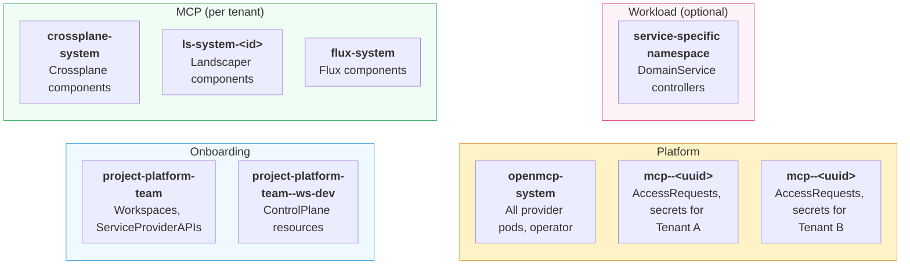

# Clusters and Namespaces

OpenControlPlane spans multiple Kubernetes clusters, each with its own namespace conventions.

## Cluster Overview

OpenControlPlane uses four types of clusters, each with a distinct role:

| Cluster | Purpose | Primary Audience |
|---------|---------|-----------------|
| **Onboarding** | User-facing API surface for managing Projects, Workspaces, and ControlPlanes | End users |
| **Platform** | Runs all operators (openmcp-operator, service providers, cluster providers) and manages per-tenant resources | Platform operators, service provider developers |
| **MCP** | Per-tenant lightweight Kubernetes cluster | End users |
| **Workload** | Per-tenant cluster for running DomainService controllers (optional) | Service provider developers |

## Namespace Model

The following diagram shows how namespaces are organized across all four cluster types:

### Onboarding Cluster

The Onboarding Cluster is the entry point for end users. Namespaces follow a hierarchical pattern:

| Namespace | Created By | Contains |
|-----------|-----------|----------|
| `project-<project-name>` | Creating a `Project` | Workspaces, project-scoped resources |
| `project-<project-name>--ws-<workspace-name>` | Creating a `Workspace` | `ManagedControlPlaneV2` resources, ServiceProviderAPI instances |

For example, a project named `platform-team` with a workspace `dev` results in:
- `project-platform-team` for the project
- `project-platform-team--ws-dev` for the workspace

[Service Providers](../users/concepts/service-provider.md) install CRDs on the Onboarding Cluster so that all tenants can discover available services.

### Platform Cluster

The Platform Cluster runs all operators. Tenant resources are isolated using namespaces:

| Namespace | Purpose |
|-----------|---------|
| `openmcp-system` | System namespace where all provider pods (service providers, cluster providers, platform services) and the openmcp-operator run |
| `mcp--<uuid>` | One per MCP tenant. Auto-generated using a deterministic SHAKE128 hash of the MCP name and namespace. Contains AccessRequests, ClusterRequests, and kubeconfig secrets scoped to that tenant |

The `mcp--<uuid>` namespaces are created and managed automatically by the platform.

:::info
The `POD_NAMESPACE` environment variable, available to all provider pods, refers to the provider's namespace on the Platform Cluster (typically `openmcp-system`). See the [deployment guide](./serviceprovider/01-deployment.mdx) for all available environment variables.
:::

### MCP Cluster

Each tenant gets a dedicated MCP (Managed Control Plane) Cluster — a lightweight Kubernetes cluster with its own API server and data store. This provides the strongest isolation boundary between tenants.

| Namespace | Purpose |
|-----------|---------|
| `crossplane-system` | Crossplane components (installed by service-provider-crossplane) |
| `ls-system-<instance-id>` | Landscaper components (installed by service-provider-landscaper) |
| `flux-system` | Flux components |
| `cert-manager` | cert-manager components |
| `external-secrets` | External Secrets Operator |

Each service provider chooses its own namespace on the MCP cluster — there is no single default namespace convention. For example, Crossplane uses the fixed namespace `crossplane-system`, while Landscaper derives an instance-specific namespace like `ls-system-<id>`. When building a new service provider, you decide which namespace to deploy your resources into.

### Workload Cluster

Workload Clusters are optional per-tenant clusters provisioned on demand when a service provider requests them. They are used for running DomainService controllers outside the MCP cluster.

| Namespace | Purpose |
|-----------|---------|
| Service-specific (e.g., `envoy-gateway-system`, `velero`) | Where DomainService controllers and their resources run |

Each MCP that requests a workload cluster gets its own dedicated cluster, maintaining per-tenant isolation. Service providers choose their own namespace naming conventions on the workload cluster.

:::info
Newly developed services should prioritize deploying their workloads on Workload Clusters rather than MCP Clusters. See the [service provider design](./serviceprovider/design.md#deployment-model) for details.
:::

## Real-World Examples

The following examples show how two production service providers use namespaces across all cluster types.

### service-provider-crossplane (MCP-only, no Workload Cluster)

| Cluster | Namespace | What goes there |
|---------|-----------|-----------------|
| **Platform** | pod namespace (typically `openmcp-system`) | Provider pod; source for image pull secrets |
| **Platform** | `mcp--<uuid>` (tenant namespace) | HelmRelease + OCIRepository for Flux; AccessRequest + kubeconfig secret; chart pull secrets |
| **Onboarding** | `project-
--ws-<w>` | `Crossplane` ServiceProviderAPI objects |
| **MCP** | `crossplane-system` (fixed) | Crossplane pods, provider pods, image pull secrets (copied from platform) |

Image pull secrets are copied from the pod namespace on the Platform Cluster to `crossplane-system` on the MCP cluster.

### service-provider-landscaper (MCP + Workload Cluster)

| Cluster | Namespace | What goes there |
|---------|-----------|-----------------|
| **Platform** | pod namespace (typically `openmcp-system`) | Provider pod; source for image pull secrets |
| **Platform** | `mcp--<uuid>` (tenant namespace) | AccessRequests for MCP and Workload cluster access |
| **Onboarding** | `project-
--ws-<w>` | `Landscaper` ServiceProviderAPI objects |
| **MCP** | `ls-system-<instance-id>` (derived) | Namespace + RBAC resources |
| **Workload** | `ls-system-<instance-id>` (derived) | Landscaper controller, webhooks server, manifest-deployer, helm-deployer; config and kubeconfig Secrets; image pull secrets |

The instance ID is a base32-encoded SHA1 hash of the Landscaper resource's namespace and name, producing a unique namespace per instance. Image pull secrets are synced from the pod namespace on the Platform Cluster to the instance namespace on the Workload Cluster.

:::tip For Service Provider Developers
You access MCP and Workload clusters via the [`ClusterContext`](./serviceprovider/02-service-providers.mdx#createorupdate-operation) provided by the service-provider-runtime. See the [service provider development guide](./serviceprovider/02-service-providers.mdx#cluster-and-namespace-context) for the full mapping.
:::
