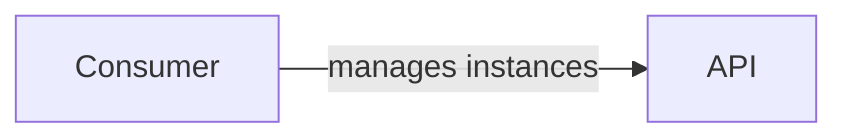
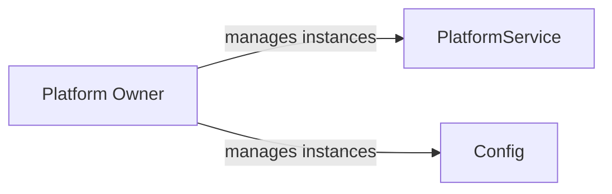
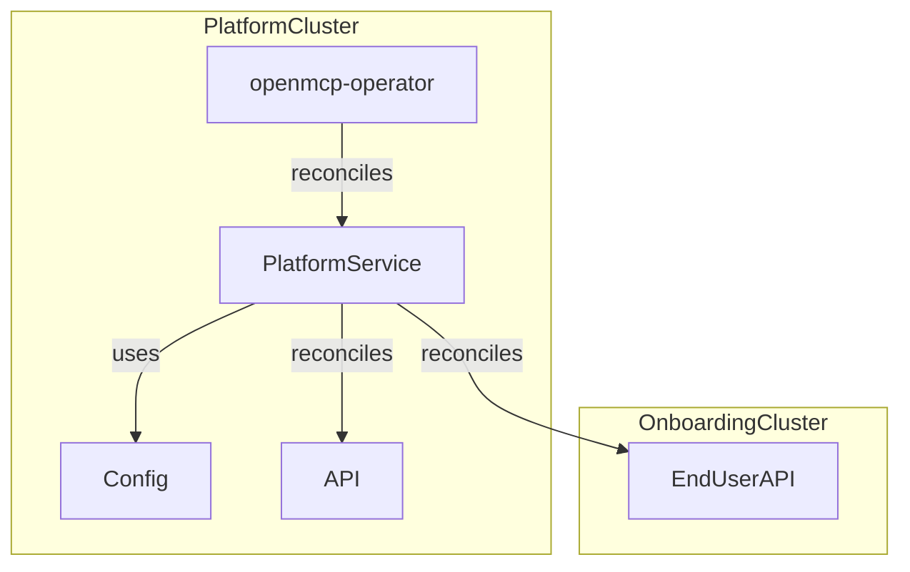

# Design

This document defines the terminology for Platform Services within the OpenControlPlane project and clarifies their scope, responsibilities and boundaries. In particular, it distinguishes Platform Services and Service Providers.

## Domain

Platform services deliver platform capabilities within the OpenControlPlane ecosystem. They follow similar architectural patterns to [Service Providers](../serviceprovider/design) and [Cluster Providers](../clusterprovider/design).

When mapped to a layered architecture using the personas of **Platform Owner**, **Service Provider** and **User**, Platform Services operate in the **Platform Owner** layer. Together with [Cluster Providers](../clusterprovider/design) they build the foundation of OpenControlPlane:

| Persona | OpenControlPlane Concept | Responsibility |
| :------ | :--------------- | :------------------- |
| Platform Owner | Platform Service and [Cluster Provider](../clusterprovider/design) | Provide platform capabilities consumed by the layers below |
| Service Provider | [Service Providers](../serviceprovider/design) | Provide managed services consumed by the layer below |
| User | Not an OpenControlPlane concept but a human end user | Generate value from the services provided by Platform Owners and Service Providers |

Some Platform Services are required to operate OpenControlPlane, such as those included in the [openmcp-operator](https://github.com/openmcp-project/openmcp-operator). Others are optional and extend the platform's capabilities to support specific use cases.

:::info
For more details on platform personas, see [Why Kubernetes Is Inappropriate for Platforms, and How to Make It Better](https://www.youtube.com/watch?v=7op_r9R0fCo).
:::

### API

A Platform Service defines one or more `APIs` that consumers use to interact with its functionality.

A consumer may be a human or another system.

:::info
A Platform Service may introduce a user-facing `API` but is not required to do so. Most Platform Services operate without exposing user-facing APIs and provide their capabilities internally to the Platform Owner and Service Provider layers (see [Domain](#domain) and [Service Provider Comparison](#comparison-to-service-providers)).
:::

### Config

A Platform Service defines a `Config` resource that contains service-specific settings. This allows platform owners to configure the service for different deployment scenarios and to enable or disable features. 

### Deployment Model

A Platform Service runs on the platform cluster and reconciles its platform cluster `API` and/or onboarding cluster `EndUserAPI`. It creates and manages resources on the platform cluster.

For more details on cluster types, see [Clusters and Namespaces](../clusters-and-namespaces.md).

## Comparison to Service Providers

The following table distinguishes Platform Services and Service Providers based on where they introduce new APIs.

| Cluster | Platform Service | Service Provider |
| :------ | :--------------- | :--------------- |
| Platform cluster | ✳️ | ❌ |
| Onboarding cluster | ✳️ | ✅ |
| Control Plane | ❌ | ✅ |

✅ MUST introduce API on that cluster type.  
✳️ MAY introduce API on that cluster type.  
❌ MUST NOT introduce API on that cluster type.

:::info
Note that the Service Provider [Config](../serviceprovider/design#config) is not considered a service.
:::