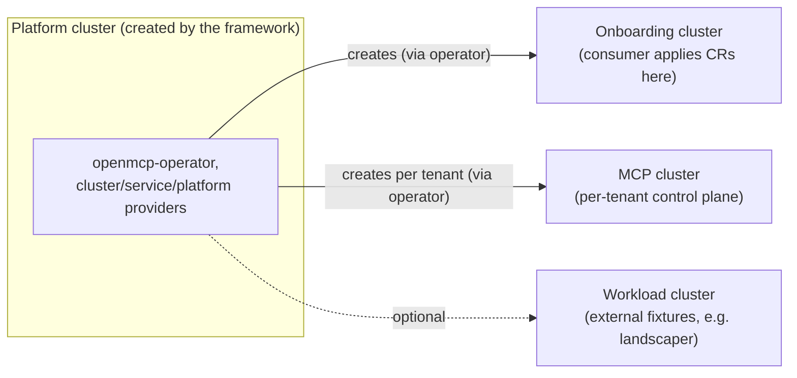

# Test

[`openmcp-testing`](https://github.com/openmcp-project/openmcp-testing) is a testing framework based on [`sigs.k8s.io/e2e-framework`](https://github.com/kubernetes-sigs/e2e-framework). It provisions a kind-based **platform** cluster, installs `openmcp-operator` plus the cluster providers, service providers, and platform services needed to run tests for your service provider. It also provides several helpers to manage the **onboarding** cluster and per-tenant **MCP** clusters to be able to define complex test scenarios.

## Cluster topology




## Starting from the template

Follow the [Service Provider Template Usage](./develop#service-provider-template-usage) section to generate a provider scaffold. The template produces a ready-to-run `test/e2e/` directory (see [Test directory layout](#test-directory-layout) below) along with a `Taskfile.yaml` containing a `test-e2e` target.

Next, you will need to:
- Add your provider's Custom Resources to `test/e2e/onboarding/` — the CRs a user would apply to request your service
- Implement your test as `Assess` steps in `test/e2e/<your_kind>_test.go` (look for `// TODO add assess steps`)

## The test suite skeleton

```go
package e2e

import (
	"fmt"
	"os"
	"testing"

	"sigs.k8s.io/e2e-framework/pkg/env"
	"sigs.k8s.io/e2e-framework/pkg/envconf"

	"github.com/openmcp-project/openmcp-testing/pkg/providers"
	"github.com/openmcp-project/openmcp-testing/pkg/setup"
)

var testenv env.Environment

func TestMain(m *testing.M) {
	initLogging()            // template provides this
	version := mustVersion() // template provides this (reads VERSION via hack/common/get-version.sh)
	openmcp := setup.OpenMCPSetup{
		Namespace: "openmcp-system",
		Operator: setup.OpenMCPOperatorSetup{
			Name:         "openmcp-operator",
			Image:        "ghcr.io/openmcp-project/images/openmcp-operator:v0.18.1",
			Environment:  "debug",
			PlatformName: "platform",
		},
		ClusterProviders: []providers.ClusterProviderSetup{
			{Name: "kind", Image: "ghcr.io/openmcp-project/images/cluster-provider-kind:v0.2.0"},
		},
		ServiceProviders: []providers.ServiceProviderSetup{
			{
				Name:               "foo",
				Image:              fmt.Sprintf("ghcr.io/openmcp-project/images/service-provider-foo:%s", version),
				LoadImageToCluster: true,
			},
		},
	}
	testenv = env.NewWithConfig(envconf.New().WithNamespace(openmcp.Namespace))
	openmcp.Bootstrap(testenv)
	os.Exit(testenv.Run(m))
}
```

:::info
The generated `main_test.go` already calls `setup.OpenMCPSetup{...}.Bootstrap(testenv)` with sane initial defaults. You probably won't need to edit it unless you need to add a different operator/provider image or to add an extension.
:::

:::info
Providers that need FluxCD pre-deployed (e.g. [`service-provider-flux`](https://github.com/openmcp-project/service-provider-flux)) add an extension to the setup struct:

```go
import (
    "github.com/openmcp-project/openmcp-testing/pkg/setup/extensions"
    "github.com/openmcp-project/openmcp-testing/pkg/setup/extensions/fluxcd"
)

// inside OpenMCPSetup:
Extensions: []extensions.Extension{&fluxcd.FluxCD{}},
```
:::

## Test directory layout

- `test/e2e/platform/`: platform-cluster manifests (e.g. `ProviderConfig`, pull secrets)
- `test/e2e/onboarding/`: service CRs the user applies on the onboarding cluster
- `test/e2e/mcp/`: resources deployed on the MCP cluster
- `test/e2e/workload/`: optional, for external workload-cluster test fixtures (e.g. minio for velero)

`resources.CreateObjectsFromDir(ctx, clusterCfg, directoryName)` can be used to read and apply the content of `test/e2e/<directoryName>` and create it on the cluster referenced by `clusterCfg`. 

## Writing a test

Each test is a feature built with the `features.New(...).Setup().Assess().Teardown()` chain from `sigs.k8s.io/e2e-framework`:

```go
basicTest := features.New("my service").
    Setup(providers.CreateMCP("test-mcp")).
    Assess("apply onboarding CRs", func(ctx context.Context, t *testing.T, c *envconf.Config) context.Context {
        onboardingCfg, err := clusterutils.OnboardingConfig()
        if err != nil {
            t.Error(err)
            return ctx
        }
        objList, err := resources.CreateObjectsFromDir(ctx, onboardingCfg, "onboarding")
        if err != nil {
            t.Errorf("failed to create onboarding objects: %v", err)
            return ctx
        }
        for _, obj := range objList.Items {
            if err := wait.For(openmcpconditions.Match(&obj, onboardingCfg, "Ready", corev1.ConditionTrue)); err != nil {
                t.Error(err)
            }
        }
        return ctx
    }).
    Assess("verify resource reconciles", func(ctx context.Context, t *testing.T, c *envconf.Config) context.Context {
        // assert domain-specific results on the MCP or onboarding cluster
        return ctx
    }).
    Teardown(providers.DeleteMCP("test-mcp", wait.WithTimeout(5*time.Minute))).
    Feature()

testenv.Test(t, basicTest)
```

`openmcp-testing` also provides helpers for MCP lifecycle management, cluster access, resource operations, and condition waiting. For the full API, browse the [`pkg/`](https://github.com/openmcp-project/openmcp-testing/tree/main/pkg) directory in the `openmcp-testing` repository.

A typical `Assess` step applies domain objects onto the MCP and waits for them to reconcile:

```go
Assess("domain objects can be created", func(ctx context.Context, t *testing.T, c *envconf.Config) context.Context {
    mcp, err := clusterutils.MCPConfig(ctx, c, mcpName)
    if err != nil {
        t.Error(err)
        return ctx
    }
    objList, err := resources.CreateObjectsFromDir(ctx, mcp, "mcp")
    if err != nil {
        t.Errorf("failed to create mcp cluster objects: %v", err)
        return ctx
    }
    for _, obj := range objList.Items {
        if err := wait.For(openmcpconditions.Match(&obj, mcp, "Ready", corev1.ConditionTrue)); err != nil {
            t.Error(err)
        }
    }
    return ctx
})
```

## Workload cluster fixtures

Some providers use case requires external infrastructure to be available during the tests (e.g. an S3-compatible backend for velero). It's possible to deploy test-runtime resources by placing them in `test/e2e/workload/` and deploying them onto a workload cluster:

```go
Assess("deploy external dependency", func(ctx context.Context, t *testing.T, c *envconf.Config) context.Context {
    workloadConfig, err := clusterutils.ConfigByPrefix("workload", "my-provider")
    if err != nil {
        t.Error(err)
        return ctx
    }
    if _, err := resources.CreateObjectsFromDir(ctx, workloadConfig, "workload"); err != nil {
        t.Error(err)
        return ctx
    }
    // wait for the dependency to be available before continuing
    if err := wait.For(conditions.New(workloadConfig.Client().Resources()).
        DeploymentAvailable("minio", "my-provider")); err != nil {
        t.Error(err)
    }
    return ctx
})
```

## Testing with multiple MCPs

It's also possible to test and verify tenant isolation or per-tenant configuration. This is achieved by creating multiple MCPs and run the same assertions against each one of them:

```go
basicProviderTest := features.New("multi-tenant test").
    Setup(providers.CreateMCP("tenant-a")).
    Setup(providers.CreateMCP("tenant-b")).
    Assess("verify tenant-a", func(ctx context.Context, t *testing.T, c *envconf.Config) context.Context {
        return verifyTenant(ctx, t, c, "tenant-a")
    }).
    Assess("verify tenant-b", func(ctx context.Context, t *testing.T, c *envconf.Config) context.Context {
        return verifyTenant(ctx, t, c, "tenant-b")
    }).
    Teardown(providers.DeleteMCP("tenant-a", wait.WithTimeout(5*time.Minute))).
    Teardown(providers.DeleteMCP("tenant-b", wait.WithTimeout(5*time.Minute)))
```

## Running tests

```bash
task test-e2e
```

`task test-e2e` runs `build:img:build-test` (builds the provider image and re-tags it without the platform suffix) and then `go test -v ./test/e2e/... -count=1`. Because the bootstrap struct sets `LoadImageToCluster: true`, the framework loads that locally built image into the kind cluster — no registry push required.

:::info
Rebuild before re-running. `LoadImageToCluster` only loads the tag named in the bootstrap struct; if you skip `task build:img:build-test` after a code change, and, for example, run the tests using `go test` or the IDE run test feature, the test cluster will keep using the old image. And your changes will not be tested.
:::
