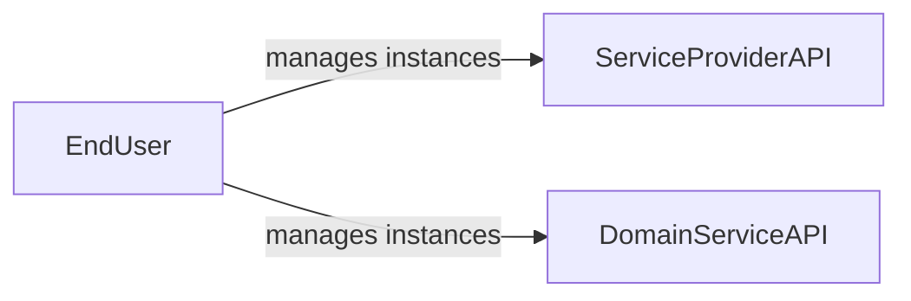
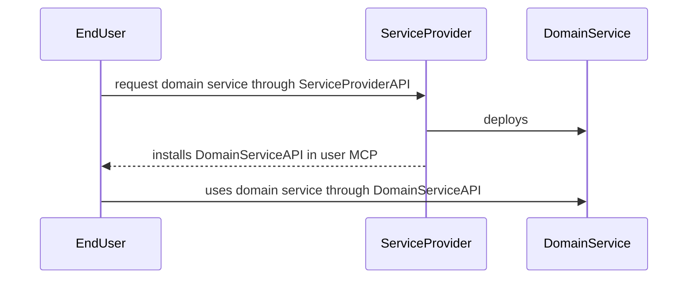
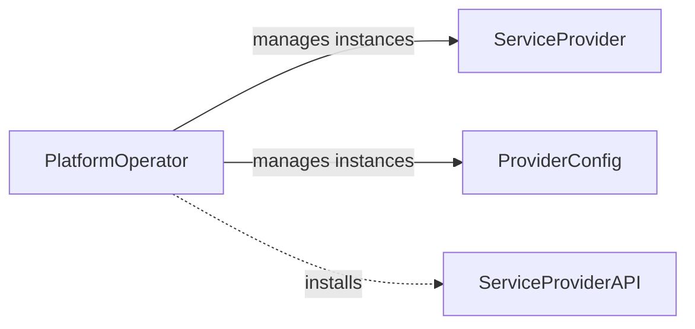
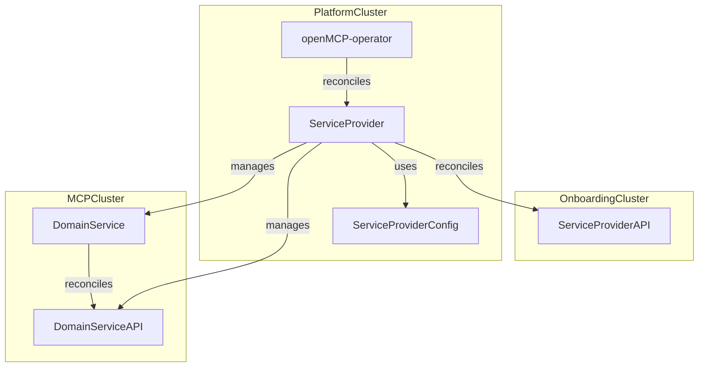
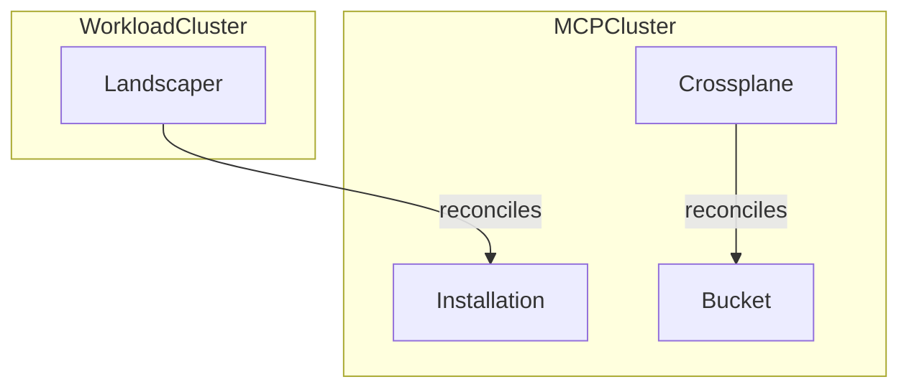
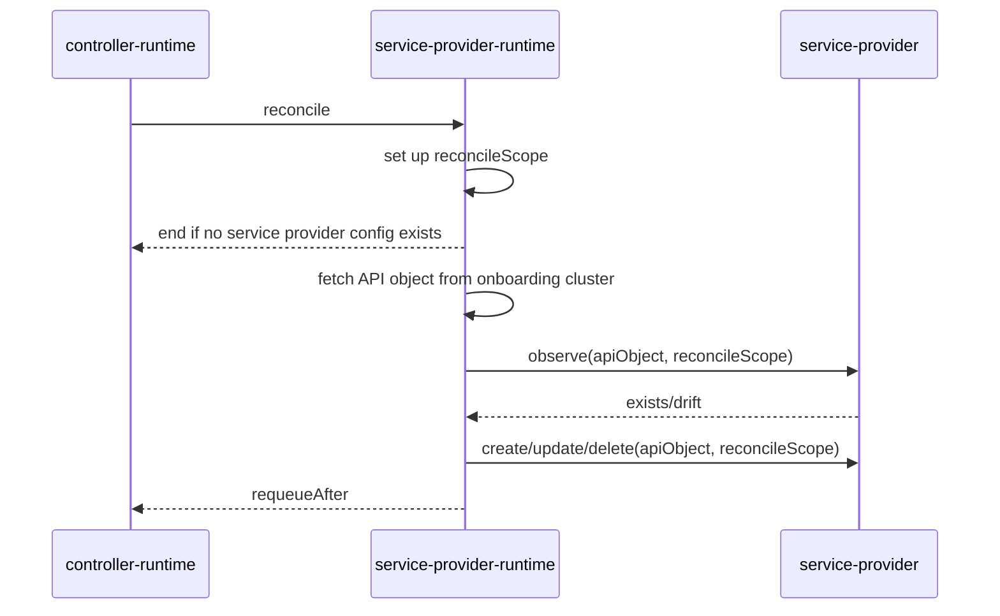
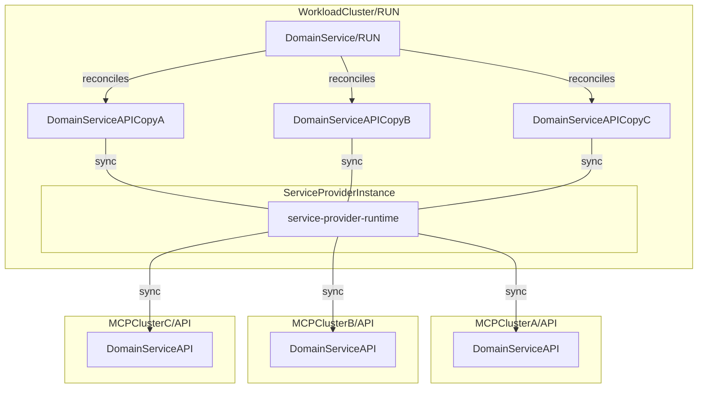

# Design

This document outlines the `ServiceProvider` domain and its technical considerations within the context of the [OpenControlPlane project](https://github.com/openmcp-project/), providing a foundation for understanding its architecture and operational aspects.

## Goals

- Define clear terminology around `ServiceProvider` within the OpenControlPlane project
- Establish the scope of a `ServiceProvider`, including its responsibilities and boundaries
- Define a `ServiceProvider` implementation layer to implement common features and ensure consistency across `ServiceProvider` instances
- Outline how a `ServiceProvider` can be validated

## Non-Goals

- `ServiceProviders` are not required to deploy their `DomainService` on `WorkloadClusters`. For now, a `DomainService` can be deployed on either a `WorkloadCluster` or `MCPCluster`. However, newly developed services should prioritize deploying their workloads on `WorkloadClusters`.
- Define a `ServiceProvider` model that implements a higher level `API`/`Run` platform concept (e.g., to allow flexible deployment models, e.g. with `ClusterProvider` [kcp](https://github.com/kcp-dev/kcp))

## Terminology

- `End Users`: These are the consumers of services provided by an OpenControlPlane platform installation. They operate on the `OnboardingCluster` and `MCPCluster` (see [deployment model](#deployment-model)).
- `Platform Operators`: These are either human users or technical systems that are responsible for managing an OpenControlPlane platform installation. While they may operate on any cluster, their primary focus is on the `PlatformCluster` and `WorkloadCluster`.

## Domain

A `ServiceProvider` enables platform operators to offer managed `DomainServices` to end users. A `DomainService` is a third-party service that delivers its functionality to end users through a `DomainServiceAPI`.

For example, consider an OpenControlPlane installation that aims to provide [Crossplane](https://www.crossplane.io/) as a managed service to its end users. Let's assume that end users specifically want to use the `Object` API of [provider-kubernetes](https://github.com/crossplane-contrib/provider-kubernetes), to create Kubernetes objects on their own Kubernetes clusters without the need to manage Crossplane themselves.

If we map this to the terminology of a `DomainService` and `DomainServiceAPI`:

- The `DomainService` is `Crossplane`.
- The `DomainServiceAPI` is `Object`.

:::info
Note that `provider-kubernetes` depends on a running Crossplane installation to function properly. Therefore, `provider-kubernetes` itself cannot be considered a `DomainService`.
:::

:::info
Note that `DomainServiceAPI` is not an Object or a CRD. It is a name that represents objects or CRDs that a `DomainService` will expose to its users by installing their objects or CRDs into the target cluster.
:::

The following subsections describe the objects that a `ServiceProvider` introduces.

### API

A `ServiceProvider` defines a `ServiceProviderAPI` to allow end users to request managed service. It is important to distinguish between `ServiceProviderAPI` and `DomainServiceAPI`.



While both are end user facing, they serve different purposes:

- The `ServiceProviderAPI` allows end users to request a `DomainService` and gain access to its `DomainServiceAPI`.
- The `DomainServiceAPI` delivers direct value to end users by providing the functionality of a `DomainService`.



### Config

The configuration of a Service Provider involves two distinct resources that serve different purposes:

#### ServiceProvider vs. ProviderConfig

It is important to understand the separation between the `ServiceProvider` CRD and the `ProviderConfig` CRD:

| Resource            | API Group                                   | Purpose                                                 | Managed By        |
| ------------------- | ------------------------------------------- | ------------------------------------------------------- | ----------------- |
| **ServiceProvider** | `openmcp.cloud/v1alpha1`                    | How to deploy the ServiceProvider controller itself     | openmcp-operator  |
| **ProviderConfig**  | `<service>.services.openmcp.cloud/v1alpha1` | How the deployed controller should behave operationally | Platform Operator |

**ServiceProvider** (managed by openmcp-operator) defines the controller deployment:

```yaml
apiVersion: openmcp.cloud/v1alpha1
kind: ServiceProvider
metadata:
  name: external-secrets
spec:
  # Controller image to deploy
  image: .../service-provider-external-secrets:v0.1.0@sha256:...
  # Secrets for pulling the CONTROLLER image
  imagePullSecrets:
    - name: artifactory
  # Controller replicas
  runReplicas: 1
  # Controller log verbosity
  verbosity: debug
```

**ProviderConfig** (managed by Platform Operator) defines controller operational behavior:

```yaml
apiVersion: externalsecrets.services.openmcp.cloud/v1alpha1
kind: ProviderConfig
metadata:
  name: default
spec:
  # How the controller reconciles
  pollInterval: 1m
```



All operator tasks may be partially or fully automated.

:::info
The `ServiceProvider` object itself is a higher level platform concept that is described in the corresponding `PlatformService`, i.e. [openmcp-operator](https://github.com/openmcp-project/openmcp-operator). The `ServiceProvider` handles deployment concerns (image, replicas, pull secrets for the controller), while `ProviderConfig` handles runtime operational concerns (poll intervals, timeouts, controller features).
:::

#### ServiceProviderConfig Guidelines

When designing a `ProviderConfig` for your Service Provider, follow these guidelines to ensure consistency and maintainability across the platform.

##### What SHOULD be in ProviderConfig

ProviderConfig should **only** contain **controller operational configuration** — settings that control how the ServiceProvider controller behaves, not what it deploys or what users/tenants can use.

| Category                       | Description                                | Examples                                                    |
| ------------------------------ | ------------------------------------------ | ----------------------------------------------------------- |
| **Reconciliation Behavior**    | How the controller reconciles resources    | `pollInterval`, `maxConcurrentReconciles`, `requeueAfter`   |
| **Retry & Timeouts**           | Controller retry and timeout configuration | `retryBackoff`, `reconcileTimeout`, `helmReleaseTimeout`    |
| **Observability Settings**     | Controller metrics, logging, and tracing   | `enableMetrics`, `metricsPort`, `logLevel`, `enableTracing` |
| **Controller Feature Toggles** | Enable/disable controller-level features   | `enableDriftDetection`                                      |

##### What SHOULD NOT be in ProviderConfig

:::warning Current State vs. Pure Design
The current `ProviderConfig` implementations across the project mix controller operational configuration with deployment artifacts and tenant constraints. This section clarifies what does NOT belong in ProviderConfig and where it should live instead. Future work tracked in [backlog#384](https://github.com/openmcp-project/backlog/issues/384) will introduce proper separation of concerns.
:::

The following information does **NOT** belong in ProviderConfig:

| Category                                                                                         | Why It Doesn't Belong                                                       | Where It Should Live                            | Current State                                    |
| ------------------------------------------------------------------------------------------------ | --------------------------------------------------------------------------- | ----------------------------------------------- | ------------------------------------------------ |
| **Deployment Artifacts**                                                                         | Controller doesn't need to know about images/charts — just how to reconcile | Future **Registry/ComponentCatalog** API        | Currently embedded in ProviderConfig (incorrect) |
| - Image URLs                                                                                     | Artifact location is deployment concern, not controller behavior            | Registry                                        | `availableImages`, `versions[].image.url`        |
| - Chart URLs                                                                                     | Same as image URLs                                                          | Registry                                        | `chartUrl`, `versions[].chart.url`               |
| - Available Versions                                                                             | Not controller behavior                                                     | Registry + TenantPolicy/ServiceOffering         | Explicit version lists                           |
| **Tenant Constraints**                                                                           | What tenants can or cannot use — not controller operational behavior        | Future **TenantPolicy/ServiceOffering** concept | Currently embedded in ProviderConfig (incorrect) |
| - Allowed domain service specific extensions such as Crossplane Providers or Velero Plugins etc. | Tenant domain constraint, not controller setting                            | TenantPolicy/ServiceOffering                    | `allowedProviders`                               |
| - Version Constraints                                                                            | Business policy, not controller behavior                                    | TenantPolicy/ServiceOffering                    | `minVersion`, `maxVersion`, `versionPolicy`      |
| - Feature Access Control                                                                         | Domain-level tenant restrictions                                            | TenantPolicy/ServiceOffering                    | Various feature flags                            |

##### Design Implications

1. **For Service Provider Contributors**: When creating a new Service Provider today, you will need to temporarily include deployment artifacts (images, charts, versions) and potentially tenant constraints in your `ProviderConfig`. This is a known limitation. Structure your API so these fields can be gracefully deprecated when the Registry API and TenantPolicy/ServiceOffering concepts become available. Clearly document which fields are operational (permanent) vs. artifacts/constraints (temporary).

2. **For Platform Operators**: Current `ProviderConfig` resources mix operational settings with deployment artifacts and tenant constraints. The operational settings (pollInterval, timeouts, retries) configure controller behavior and will remain. The artifacts and constraints will eventually move to separate systems.

3. **For Version Updates**: Adding support for a new service version currently requires updating the `ProviderConfig`. In the future, the Registry will handle artifact discovery, and TenantPolicy/ServiceOffering will handle what tenants can use.

##### Example: Current vs. Pure ProviderConfig

**Current State** (mixed concerns — deployment artifacts + tenant constraints + operational config):

```yaml
apiVersion: crossplane.services.openmcp.cloud/v1alpha1
kind: ProviderConfig
metadata:
  name: default
spec:
  # OPERATIONAL (correct — belongs here)
  pollInterval: 1m
  maxConcurrentReconciles: 5
  helmReleaseTimeout: 10m

  # DEPLOYMENT ARTIFACTS (incorrect — should live in Registry)
  versions:
    - version: "1.18.0"
      chart:
        url: oci://ghcr.io/crossplane/crossplane
        secretRef:
          name: registry-credentials
      image:
        url: crossplane/crossplane:v1.18.0
        secretRef:
          name: registry-credentials

  # TENANT CONSTRAINTS (incorrect — should live in TenantPolicy/ServiceOffering)
  providers:
    allowedProviders:
      - provider-kubernetes
      - provider-helm
```

**Future State** (pure operational configuration only):

```yaml
apiVersion: crossplane.services.openmcp.cloud/v1alpha1
kind: ProviderConfig
metadata:
  name: default
spec:
  # Controller operational settings only
  pollInterval: 1m
  maxConcurrentReconciles: 5
  helmReleaseTimeout: 10m
  retryBackoff:
    initialInterval: 5s
    maxInterval: 5m
  enableMetrics: true
  logLevel: info
```

**Deployment artifacts** move to separate API (backlog#384):

tbd

**Tenant constraints** move to TenantPolicy/ServiceOffering concept:

tbd

##### Related Issues and Future Work

- [backlog#384: Discoverability of Open Control Plane components](https://github.com/openmcp-project/backlog/issues/384) — Will introduce Registry API for deployment artifacts
- Future TenantPolicy/ServiceOffering concept — Will separate tenant constraints from controller configuration

### Service Discovery and Access Management

End users need to be aware of a) the available managed services, and b) valid input values to consume a service offering.

A) The available service offerings are made visible by installing the `ServiceProviderAPI` on the `OnboardingCluster` (see [deployment model](#deployment-model)). This ensures that any platform tenant is aware of all available `ServiceProviderAPIs`. In other words, the platform does not hide its end-user-facing feature set, even if a user belongs to a tenant that cannot successfully consume a specific `ServiceProviderAPI`.

B) Valid input values are communicated through a yet-to-be-defined 'Marketplace'-like API provided by a `PlatformService`. Note: This is still work in progress and outside the scope of this document.

### Deployment Model

A `ServiceProvider` runs on the `PlatformCluster` and reconcile its `ServiceProviderAPI` on the `OnboardingCluster`. It deploys a `DomainService` on either a `WorkloadCluster` or `MCPCluster`, which then reconciles the `DomainServiceAPI`.



The `DomainServiceAPI` is reconciled either on the `MCPCluster` or a `WorkloadCluster`. The following diagram illustrates two simplified `DomainService` examples, `Landscaper` and `Crossplane`, along with their corresponding `DomainServiceAPIs`, `Installation` and `Bucket`.



:::info
In the long term, the goal is to deploy every `DomainService` on `WorkloadClusters`. Newly developed services should prioritize deploying their workloads on `WorkloadClusters` rather than `MCPClusters`.
:::

## Validation

A `ServiceProvider` is considered healthy if both its `API` and `Run` components have been successfully synced and are ready for consumption.

The following validation flow validates that a `ServiceProvider` is functioning as expected:

0. SETUP: Create test environment by installing any `ServiceProvider` prerequisite: a) create `PlatformCluster` with kind, b) install [openmcp-operator](https://github.com/openmcp-project/openmcp-operator) and [cluster-provider-kind](https://github.com/openmcp-project/cluster-provider-kind) and wait for everything to become available
1. ASSESS: Request `ServiceProvider` and wait for `ServiceProvider` deployment and `ServiceProviderAPI` to become available
2. ASSESS: Consume `ServiceProviderAPI` to provision a `DomainService` and wait for the `DomainService` and `DomainServiceAPI` to become available
3. ASSESS: Consume the `DomainServiceAPI` and validate that the `DomainService` is functioning as expected
4. ASSESS: Delete the `ServiceProviderAPI` object and wait for the `DomainService` deployment and `DomainServiceAPI` to be successfully removed
5. TEARDOWN: Delete the `ServiceProvider` and clean up by deleting the test environment components

## Runtime

A runtime is a collection of abstractions and contracts that provides an environment for executing user-defined logic. This establishes a clear separation between `ServiceProvider` the developer domain and the platform developer domain.

The `service-provider-runtime` is built on top of `controller-runtime` and introduces a service provider specific reconciliation loop. The design enables us as a platform to implement platform specific features around service providers, while allowing `ServiceProvider` developers to focus solely on `DomainService` specific logic without needing to understand platform internals. This approach ensures a consistent experience for both end users and developers when working with `ServiceProviders`.

The following table provides a simplified overview of the layers within a `ServiceProvider` controller:

| Layer                           | Description                                                                                             | Target Audience             |
| :------------------------------ | :------------------------------------------------------------------------------------------------------ | :-------------------------- |
| Service Provider                | Defines `ServiceProviderAPI`/`ServiceProviderConfig` and implements service-provider-runtime operations | Service provider developers |
| service-provider-runtime        | Defines ServiceProvider reconciliation semantics                                                        | Platform developers         |
| multicluster/controller-runtime | Defines generic reconciliation semantics                                                                | Out of scope                |
| Kubernetes API machinery        | Kubernetes essentials                                                                                   | Out of scope                |

### Functionality

This section outlines the main functionality implemented within the runtime. Currently, the focus is on establishing consistency across `ServiceProvider` implementations. However, this section can be extended in the future to include more generic `ServiceProvider` concepts that are handled within the runtime.

Main tasks towards MCP/Workload Clusters (based on watching the `ServiceProviderAPI`):

- Observe Service Deployment (Drift Detection) -> IN: context, apiObject, reconcileScope; OUT: bool[exists, drift], error
- Create Service Deployment (Init Lifecycle) -> IN: context, apiObject, reconcileScope; OUT: error
- Update Service Deployment (Reconcile Drift) -> IN: context, apiObject, reconcileScope; OUT: error
- Delete Service Deployment (End Lifecycle) -> IN: context, apiObject, reconcileScope; OUT: error

In this context, `reconcileScope` holds the `ServiceProviderConfig` and provides clients to access onboarding, mcp and workload clusters.

Main tasks towards Platform Cluster:

- Resolve `ServiceProviderConfig`. If no `ServiceProviderConfig` can be resolved, the service request will fail.

### Reconcile Sequence



:::info
The validation of a `ServiceProviderConfig`, if required, is part of `ServiceProvider` layer and not the runtime layer.
:::

## Related Artifacts

The following artifacts are derived from this document and must be continuously updated to maintain consistency:

- Service Provider Template
- Service Provider Runtime
- Service Provider Development Guide

## Out of Scope

The remainder of this document contains topics that are out of scope for now.

### Multicluster Execution Model

Multi-cluster functionality for `ServiceProvider` is a design goal for future iterations and might get integrated into `service-provider-runtime`. This would generally enable to run any `DomainService` on shared `WorkloadCluster`.

An approach could be to sync API objects between `API` and `RUN` clusters as a feature of service-provider-runtime.



### Ideas

- `SoftDelete` platform concept. A `managed` service can transition to a `unmanaged` service by soft deleting its corresponding `ServiceProviderConfig` without losing the `DomainService`. This way a tenant could offboard itself partially or entirely from the platform without losing the provisioned infrastructure. This obviously depends on the ownership model of the infrastructure.
- Distinguish between `Run` and `API` artifacts on all platform layers

### Terminology

- `Run` clusters support scheduling workloads. A `Run` cluster may or may not also serve as `API` cluster.
- `API` clusters serve APIs but do not support scheduling workload (note that `API`/`Run` is a higher level platform concept)

### References

Projects with similar concepts:

- [Crossplane](https://www.crossplane.io/)
- [kube-bind](https://github.com/kube-bind/kube-bind)
- [multicluster-runtime](https://github.com/kubernetes-sigs/multicluster-runtime)
