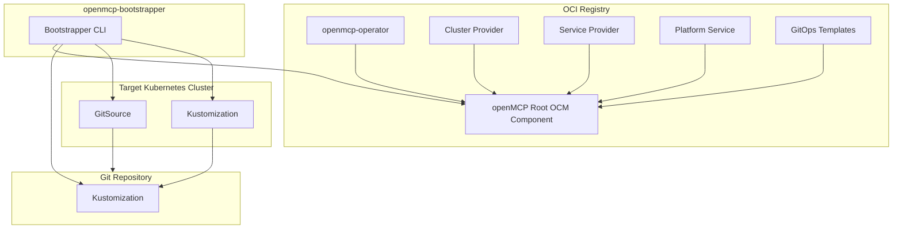

import Tabs from '@theme/Tabs';
import CodeBlock from '@theme/CodeBlock';
import TabItem from '@theme/TabItem';

# Overview

To set up and and manage OpenControlPlane landscapes, a concept named bootstrapping is used.
Bootstrapping works for creating new landscapes as well as updating existing landscapes with new versions of OpenControlPlane.
The bootstrapping involves the creation of a GitOps process where the desired state of the landscape is stored in a Git repository and is being synced to the actual landscape using FluxCD.
The operator of a landscape can configure the bootstrapping to their liking by providing a bootstrapping configuration that controls the configuration of the openmcp-operator including all desired cluster-providers, service-providers, and platform services.
The bootstrapping is performed by the `openmcp-bootstrapper` command line tool (https://github.com/openmcp-project/bootstrapper).

## Provider Types

OpenControlPlane uses three types of providers to deliver infrastructure and services:

- **ServiceProvider** — Adds functionality to Managed Control Planes, such as hyperscaler providers, cloud provider APIs, GitOps, policies, or backup and many more allowing your teams to make their unique cloud landscapes to be replicatable and robust through the power of control planes..
- **PlatformService** — Extends the entire OpenControlPlane environment with system-wide features like network services, audit logs, billing, and policies. Anything you want to make available for all control planes and stakeholders on the platform.
- **ClusterProvider** — Manages the dynamic creation, modification, and deletion of Kubernetes clusters under the hood. This allows our platform to run in any region or datacenter. 

## General Bootstrapping Architecture

The `openMCP Root OCM Component` (github.com/openmcp-project/openmcp) contains references to the `openmcp-operator`, the `gitops-templates` (github.com/openmcp-project/gitops-templates) as well as a list of cluster providers, service providers and platform services that can be deployed.
The `openMCP Root OCM Component` acts as the source of the available versions, image locations and deployment configuration of an openMCP landscape.

The `Git Repository` contains the desired state of the openMCP landscape. The desired state is encoded in a set of Kubernetes manifests that are organized and templated using Kustomize. The `Git Repository` is being updated by the `openmcp-bootstrapper` CLI tool for the information provided in the `openMCP Root OCM Component` as well as the bootstrapping configuration provided by the operator.

The `openmcp-bootstrapper` reads the `openMCP Root OCM Component` from an OCI registry to retrieve the `GitOps Templates` as well as the image locations of the FluxCD tool, the `openmcp-operator`, the cluster providers, the service providers and the platform services. The templated `GitOpsTemplate` is applied to the `Git Repository` and the templated FluxCD deployment is applied to the `Target Kubernetes Cluster`. The `openmcp-bootstrapper` also creates a FluxCD `GitSource` based on the provided Git repository URL and credentials.
The `openmcp-bootstrapper` then creates a FluxCD `Kustomizations` that points to the `Git Repository` and applies it to the `Target Kubernetes Cluster`.
