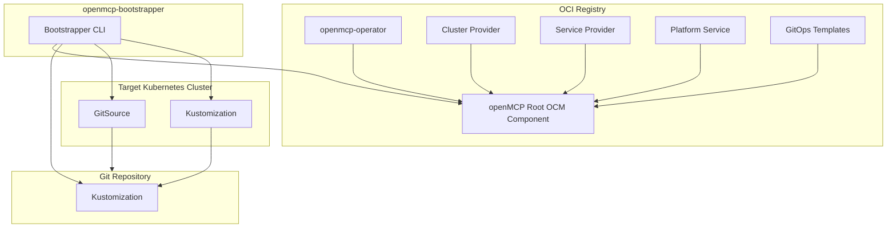

import Tabs from '@theme/Tabs';
import CodeBlock from '@theme/CodeBlock';
import TabItem from '@theme/TabItem';

# Overview and Installation

To set up and and manage OpenControlPlane landscapes, a concept named bootstrapping is used.
Bootstrapping works for creating new landscapes as well as updating existing landscapes with new versions of OpenControlPlane.
The bootstrapping involves the creation of a GitOps process where the desired state of the landscape is stored in a Git repository and is being synced to the actual landscape using FluxCD.
The operator of a landscape can configure the bootstrapping to their liking by providing a bootstrapping configuration that controls the configuration of the openmcp-operator including all desired cluster-providers, service-providers, and platform services.
The bootstrapping is performed by the `openmcp-bootstrapper` command line tool (https://github.com/openmcp-project/bootstrapper).

## General Bootstrapping Architecture



The `openMCP Root OCM Component` (github.com/openmcp-project/openmcp) contains references to the `openmcp-operator`, the `gitops-templates` (github.com/openmcp-project/gitops-templates) as well as a list of cluster providers, service providers and platform services that can be deployed.
The `openMCP Root OCM Component` acts as the source of the available versions, image locations and deployment configuration of an openMCP landscape.

The `Git Repository` contains the desired state of the openMCP landscape. The desired state is encoded in a set of Kubernetes manifests that are organized and templated using Kustomize. The `Git Repository` is being updated by the `openmcp-bootstrapper` CLI tool for the information provided in the `openMCP Root OCM Component` as well as the bootstrapping configuration provided by the operator.

The `openmcp-bootstrapper` reads the `openMCP Root OCM Component` from an OCI registry to retrieve the `GitOps Templates` as well as the image locations of the FluxCD tool, the `openmcp-operator`, the cluster providers, the service providers and the platform services. The templated `GitOpsTemplate` is applied to the `Git Repository` and the templated FluxCD deployment is applied to the `Target Kubernetes Cluster`. The `openmcp-bootstrapper` also creates a FluxCD `GitSource` based on the provided Git repository URL and credentials.
The `openmcp-bootstrapper` then creates a FluxCD `Kustomizations` that points to the `Git Repository` and applies it to the `Target Kubernetes Cluster`.

## Prerequisites

* A target Kubernetes cluster that matches the desired cluster provider being used (e.g. `Kind` for local testing, `Gardener` for Gardener Shoots)
* A Git repository that will be used to store the desired state of the openMCP landscape
* An OCI registry that contains the `openMCP Root OCM Component` (e.g. `ghcr.io/openmcp-project`)

:::info
The Git repository used in the following examples must exist before running the `openmcp-bootstrapper` CLI tool. The `openmcp-bootstrapper` is using the default branch (like `main`) as a source to create the desired branch.
The default branch may not be empty, but it should not contain any files or folders that would conflict with the files and folders created by the `openmcp-bootstrapper`. A recommendation is to create an empty repository with a  `README.md` file.
:::

## Download the `openmcp-bootstrapper` CLI tool

The `openmcp-bootstrapper` CLI tool can be downloaded as an OCI image from an OCI registry (e.g. `ghcr.io/openmcp-project`).
In this example docker will be used to run the `openmcp-bootstrapper` CLI tool. If you don't use docker, adjust the command accordingly.

Retrieve the latest version of the `openmcp-bootstrapper`:

```shell
TAG=$(curl -s "https://api.github.com/repos/openmcp-project/bootstrapper/releases/latest" | grep '"tag_name":' | cut -d'"' -f4)
export OPENMCP_BOOTSTRAPPER_VERSION="${TAG}"
```

Pull the latest version of the `openmcp-bootstrapper`:

```shell
docker pull ghcr.io/openmcp-project/images/openmcp-bootstrapper:${OPENMCP_BOOTSTRAPPER_VERSION}
```

## Next Steps

Choose your cluster provider to continue:
- [Kind Provider](./01-kind-provider.md) - For local testing and development
- [Gardener Provider](./02-gardener-provider.md) - For production Gardener-based landscapes
