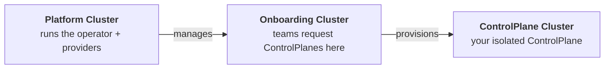

# Quickstart

Get OpenControlPlane running on your local machine in under 10 minutes. By the end, you'll have a platform that hands out managed `ControlPlanes` with Flux to your teams.

:::note
[`ocpctl`](https://github.com/openmcp-project/ocpctl) is the CLI for managing OpenControlPlane environments locally and in production. It is under active development — some commands and flags may change.
:::

## What You'll Build



OpenControlPlane creates three clusters that work together:

| Cluster | Who uses it | Purpose |
|---------|-------------|---------|
| 🟢 **Platform** | Platform operators | Runs the operator, cluster providers, and service providers |
| 🔵 **Onboarding** | End users (teams) | API surface where teams create `ControlPlanes` |
| 🟣 **ControlPlane** | End users (teams) | One per team, isolated workspace with requested services |

The separation ensures end users never touch infrastructure. They interact only with the Onboarding cluster to request resources, and their services appear on their own `ControlPlane` cluster.

---

## Prerequisites

- Docker running (8 GB RAM allocated to it)
- `kubectl` installed
- ~10 minutes

## Install ocpctl

```shell
go install github.com/openmcp-project/ocpctl@v0.1.0-alpha.1
```

Or download a pre-built binary from the [releases page](https://github.com/openmcp-project/ocpctl/releases/latest).

---

## Step 1: Start the platform

```shell
ocpctl env apply local
```

This takes a few minutes. It creates a local Kind-based environment with the full OpenControlPlane stack: `openmcp-operator`, `cluster-provider-kind`, plus an onboarding cluster.

Verify the platform is running:

> 🟢 **Platform Cluster**

```shell
kubectl config use-context kind-local-platform
```

### Install service-provider-flux

```shell
kubectl apply -f - <<EOF
apiVersion: openmcp.cloud/v1alpha1
kind: ServiceProvider
metadata:
  name: flux
  namespace: openmcp-system
spec:
  image: ghcr.io/openmcp-project/images/service-provider-flux:v0.2.0
EOF
```

### Configure allowed Flux versions

Once `sp-flux` is running, apply a `ProviderConfig` to define which Flux versions end users may install:

```shell
kubectl apply -f - <<EOF
apiVersion: flux.services.openmcp.cloud/v1alpha1
kind: ProviderConfig
metadata:
  name: flux
spec:
  versions:
    - version: "2.8.3"
      chartVersion: "2.18.2"
      chartUrl: "oci://ghcr.io/fluxcd-community/charts/flux2"
EOF
```

This controls exactly which versions teams can request in Step 3. Add more entries to the `versions` list to offer additional versions.

### Verify setup

```shell
kubectl get pods -n openmcp-system
```

You should see these pods in `Running` state:

```
NAME                                     READY   STATUS      RESTARTS   AGE
cp-kind-66fbf7d448-wvrnl                 1/1     Running     0          23m
cp-kind-init-qfjmh                       0/1     Completed   0          23m
openmcp-operator-d5c547c75-p4xgh         1/1     Running     0          23m
ps-managedcontrolplane-9c848d7bc-fjq27   1/1     Running     0          22m
ps-managedcontrolplane-init-qqldp        0/1     Completed   0          23m
sp-flux-586bfdbdf4-pkbwr                 1/1     Running     0          9s
sp-flux-init-mkqnl                       0/1     Completed   0          47m
```

---

## Step 2: Create a ManagedControlPlane

Now switch to the **end-user perspective**. A team wants their own `ControlPlane`.

See the [`ManagedControlPlaneV2` reference](/reference/core/managedcontrolplane) for the full API.

Save this as `controlplane.yaml`:

```yaml title="controlplane.yaml"
apiVersion: core.openmcp.cloud/v2alpha1
kind: ManagedControlPlaneV2
metadata:
  name: my-controlplane
  namespace: default
spec:
  iam: {}
```

> 🔵 **Onboarding Cluster**

```shell
kubectl config use-context kind-local-onboarding
kubectl apply -f controlplane.yaml
```

Wait for it to become ready:

```shell
kubectl get managedcontrolplanev2 my-controlplane -w
```

Once provisioning completes, you will see:

```
NAME     PHASE
my-controlplane   Ready
```

The platform has provisioned an isolated `ControlPlane` cluster.

---

## Step 3: Request Flux as a service

The team wants Flux installed on their `ControlPlane`:

> 🔵 **Onboarding Cluster**

Save this as `flux-service.yaml`:

```yaml title="flux-service.yaml"
apiVersion: flux.services.openmcp.cloud/v1alpha1
kind: Flux
metadata:
  name: my-controlplane
  namespace: default
spec:
  version: v2.4.0
```

```shell
kubectl config use-context kind-local-onboarding
kubectl apply -f flux-service.yaml
```

The `service-provider-flux` on the platform cluster detects this request and installs Flux into the `ControlPlane` cluster automatically.

Verify Flux is running on the `ControlPlane` cluster:

> 🟣 **ControlPlane Cluster**

```shell
kubectl config use-context kind-local-my-controlplane
kubectl get pods -n flux-system
```

You should see Flux controllers running:

```
source-controller-...        1/1   Running
kustomize-controller-...     1/1   Running
```

The team now has a fully functional control plane with Flux, provisioned through a simple API request.

---

## Clean up

```shell
ocpctl env delete local
```

Removes all Kind clusters and resources created by `ocpctl env apply local`.

---

## Next Steps

Your platform is running. Here's what to explore next:

- **Add more services** — beyond Flux, you can offer [Crossplane](https://www.crossplane.io/), [External Secrets Operator](https://external-secrets.io/), [Velero](https://velero.io/), and more to your teams. Each service is a ServiceProvider deployed on the platform cluster.
- **Deploy on real infrastructure** — follow the [Production Setup](./production-setup/00-overview.md) guide to run OpenControlPlane on Gardener.
- **Manage team access** — learn how [Projects and Workspaces](/users/concepts/projects-and-workspaces) let you organize teams and `ControlPlanes`.
