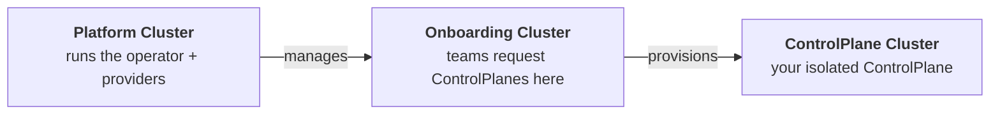

# Quickstart

Get OpenControlPlane running on your local machine in under 10 minutes. By the end, you'll have a platform that hands out managed `ControlPlanes` with Flux to your teams.

:::note
[`ocpctl`](https://github.com/openmcp-project/ocpctl) is the CLI for managing OpenControlPlane environments locally and in production. It is under active development — some commands and flags may change.
:::

## What You'll Build



OpenControlPlane creates three clusters that work together:

| Cluster | Who uses it | Purpose |
|---------|-------------|---------|
| 🟢 **Platform** | Platform operators | Runs the operator, cluster providers, and service providers |
| 🔵 **Onboarding** | End users (teams) | API surface where teams create `ControlPlanes` |
| 🟣 **ControlPlane** | End users (teams) | One per team, isolated workspace with requested services |

The separation ensures end users never touch infrastructure. They interact only with the Onboarding cluster to request resources, and their services appear on their own `ControlPlane` cluster.

---

## Prerequisites

- Docker running (8 GB RAM allocated to it)
- `kubectl` installed
- ~10 minutes

## Install ocpctl

```shell
# macOS / Linux
curl -fsSL https://github.com/openmcp-project/ocpctl/releases/latest/download/ocpctl -o /usr/local/bin/ocpctl
chmod +x /usr/local/bin/ocpctl
```

---

## Step 1: Start the platform

```shell
ocpctl env apply local
```

This takes a few minutes. It creates a local Kind-based environment with the full OpenControlPlane stack: `openmcp-operator`, `cluster-provider-kind`, `service-provider-flux`, plus an onboarding cluster.

Get kubeconfigs for both clusters:

```shell
export PLATFORM=$(ocpctl env kubeconfig local --cluster platform)
export ONBOARDING=$(ocpctl env kubeconfig local --cluster onboarding)
```

Verify the platform is running:

> 🟢 **Platform Cluster**

```shell
kubectl --kubeconfig $PLATFORM get pods -n openmcp-system
```

You should see these pods in `Running` state:

```
openmcp-operator-...         1/1   Running
cp-kind-...                  1/1   Running
sp-flux-...                  1/1   Running
```

---

## Step 2: Create a ManagedControlPlane

Now switch to the end-user perspective. A team wants their own control plane.

See the [ManagedControlPlane reference](/reference/core/managedcontrolplane) for the full API.

Save this as `controlplane.yaml`:

```yaml title="controlplane.yaml"
apiVersion: core.openmcp.cloud/v2alpha1
kind: ManagedControlPlaneV2
metadata:
  name: my-controlplane
  namespace: default
spec:
  iam: {}
```

> 🔵 **Onboarding Cluster**

```shell
kubectl --kubeconfig $ONBOARDING apply -f controlplane.yaml
```

Wait for it to become ready:

```shell
kubectl --kubeconfig $ONBOARDING get managedcontrolplanev2 my-controlplane -w
```

Once provisioning completes, you will see:

```
NAME     PHASE
my-controlplane   Ready
```

The platform has provisioned an isolated cluster for this control plane.

---

## Step 3: Request Flux as a service

The team wants Flux installed on their `ControlPlane`:

> 🔵 **Onboarding Cluster**

Save this as `flux-service.yaml`:

```yaml title="flux-service.yaml"
apiVersion: flux.services.openmcp.cloud/v1alpha1
kind: Flux
metadata:
  name: my-controlplane
  namespace: default
spec:
  version: v2.4.0
```

```shell
kubectl --kubeconfig $ONBOARDING apply -f flux-service.yaml
```

The `service-provider-flux` on the platform cluster detects this request and installs Flux into the `ControlPlane` cluster automatically.

Get the kubeconfig for the `ControlPlane` cluster and verify:

```shell
export MCP=$(ocpctl env kubeconfig local --cluster my-controlplane)
```

> 🟣 **ControlPlane Cluster**

```shell
kubectl --kubeconfig $CONTROLPLANE get pods -n flux-system
```

You should see Flux controllers running:

```
source-controller-...        1/1   Running
kustomize-controller-...     1/1   Running
```

The team now has a fully functional control plane with Flux, provisioned through a simple API request.

---

## Clean up

```shell
ocpctl env delete local
```

Removes all Kind clusters and resources created by `ocpctl env apply local`.

---

## Next Steps

Your platform is running. Here's what to explore next:

- **Add more services** — beyond Flux, you can offer [Crossplane](https://www.crossplane.io/), [External Secrets Operator](https://external-secrets.io/), [Velero](https://velero.io/), and more to your teams. Each service is a ServiceProvider deployed on the platform cluster.
- **Deploy on real infrastructure** — follow the [Production Setup](./production-setup/00-overview.md) guide to run OpenControlPlane on Gardener.
- **Manage team access** — learn how [Projects and Workspaces](/users/concepts/projects-and-workspaces) let you organize teams and `ControlPlanes`.
