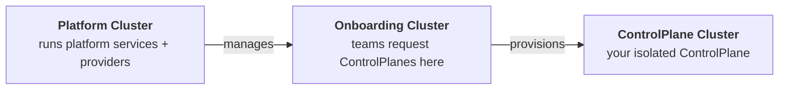

# Quickstart

Get OpenControlPlane running on your local machine in under 10 minutes. By the end, you'll have a platform that hands out managed `ControlPlanes` with the capability for teams to request Flux.

:::note
[`ocpctl`](https://github.com/openmcp-project/ocpctl) is the CLI for managing OpenControlPlane environments locally and in production. It is under active development. Some commands and flags may change.
:::

## What You'll Build



OpenControlPlane creates three clusters that work together:

| Cluster | Who uses it | Purpose |
|---------|-------------|---------|
| 🟢 **Platform** | Platform operators | Runs platform services, cluster providers, and service providers |
| 🔵 **Onboarding** | End users (teams) | API surface where teams create `ControlPlanes` |
| 🟣 **ControlPlane** | End users (teams) | One per team, isolated workspace with requested services |

The separation ensures end users never touch infrastructure. They interact only with the Onboarding cluster to request resources, and their services appear on their own `ControlPlane` cluster.

---

## Prerequisites

- [Docker](https://docs.docker.com/get-started/get-docker/) running (8 GB RAM allocated to it)
- [Go](https://go.dev/doc/install) installed
- [`kubectl`](https://kubernetes.io/docs/tasks/tools/) CLI installed
- [`kind`](https://kind.sigs.k8s.io/docs/user/quick-start/#installation) CLI installed
- [`flux`](https://fluxcd.io/flux/installation/#install-the-flux-cli) CLI installed
- ~10 minutes

:::note Linux: inotify limits
The default Linux inotify limit (`fs.inotify.max_user_instances=128`) is too low when running multiple Kind clusters. If it is exhausted, `containerd` inside the ControlPlane cluster fails to initialize, which significantly delays bootstrap and can cause the `AccessRequest` controller to build up a long exponential backoff before the cluster becomes reachable.

Raise the limit before you start:

```shell
sudo sysctl -w fs.inotify.max_user_instances=512
sudo sysctl -w fs.inotify.max_user_watches=524288
```

To persist across reboots, add both lines to `/etc/sysctl.d/99-kind.conf`.
:::

## Install ocpctl

```shell
go install github.com/openmcp-project/ocpctl@v0.1.0-alpha.1
```

Or download a pre-built binary from the [releases page](https://github.com/openmcp-project/ocpctl/releases/latest).

---

## Step 1: Start the platform

```shell
ocpctl env apply local
```

This takes a few minutes. It creates a local Kind-based environment with the full OpenControlPlane stack: `openmcp-operator`, `cluster-provider-kind`, plus an onboarding cluster.

Verify the platform is running:

:::apply-to-platform

```shell
kubectl config use-context kind-local-platform
kubectl get pods -n openmcp-system
```

You should see these pods in `Running` state:

```
NAME                                     READY   STATUS      RESTARTS   AGE
cp-kind-66fbf7d448-bd5xg                 1/1     Running     0          72s
cp-kind-init-2zl9x                       0/1     Completed   0          83s
openmcp-operator-d5c547c75-w5ngg         1/1     Running     0          2m3s
ps-managedcontrolplane-9c848d7bc-49czl   1/1     Running     0          51s
ps-managedcontrolplane-init-d7v4k        0/1     Completed   0          84s
```

:::

### Install service-provider-flux

This guide uses Flux as an example managed service that teams can request for their `ControlPlane`. Managed service options are added to the platform as [ServiceProviders](/reference/operator/providers/serviceprovider).

:::apply-to-platform

```shell
flux install
kubectl apply -f - <<EOF
apiVersion: openmcp.cloud/v1alpha1
kind: ServiceProvider
metadata:
  name: flux
  namespace: openmcp-system
spec:
  image: ghcr.io/openmcp-project/images/service-provider-flux:v0.2.0
EOF
```

:::

### Configure allowed Flux versions

Once `ServiceProvider` Flux is running, apply a `ProviderConfig` to define which Flux versions end users may install:

:::apply-to-platform

```shell
kubectl apply -f - <<EOF
apiVersion: flux.services.openmcp.cloud/v1alpha1
kind: ProviderConfig
metadata:
  name: flux
spec:
  versions:
    - version: "2.8.3"
      chartVersion: "2.18.2"
      chartUrl: "oci://ghcr.io/fluxcd-community/charts/flux2"
EOF
```

:::

This controls exactly which versions teams can request in Step 3. Add more entries to the `versions` list to offer additional versions.

:::note Error
You might receive the following error message:

```shell
error: resource mapping not found for name: "flux" namespace: "" from "STDIN": no matches for kind "ProviderConfig" in version "flux.services.openmcp.cloud/v1alpha1"
ensure CRDs are installed first
```
Please wait for a couple of seconds and then try again. Continue when the output says: `providerconfig.flux.services.openmcp.cloud/flux created`.
:::

---

## Step 2: Create a ControlPlane

Now switch to the **end-user perspective**. A team wants their own `ControlPlane`.

First, export the onboarding cluster's kubeconfig so `kubectl` can reach it:

```shell
kind export kubeconfig --name local-onboarding
```

See the [`ManagedControlPlaneV2` reference](/reference/core/controlplane) for the full API.

:::apply-to-onboarding-api

```shell
kubectl config use-context kind-local-onboarding
kubectl apply -f - <<EOF
apiVersion: core.openmcp.cloud/v2alpha1
kind: ManagedControlPlaneV2
metadata:
  name: my-controlplane
  namespace: default
spec:
  iam: {}
EOF
```

:::

Wait for it to become ready:

```shell
kubectl config use-context kind-local-onboarding
kubectl get managedcontrolplanev2 my-controlplane -w
```

Once provisioning completes, you will see:

```
NAME              PHASE
my-controlplane   Ready
```

The platform has provisioned an isolated `ControlPlane` cluster. Behind the scenes, OpenControlPlane asked `cluster-provider-kind` to create a new Kind cluster for this `ControlPlane`. The cluster is assigned a generated name of the form `mcp-<hash>.<random>` — for example `mcp-ad2klitc.f52190f9`. The hash is derived from the environment name; the suffix is random per provisioning run. You will need this name in Step 3.

---

## Step 3: Request Flux as a service

The team wants Flux installed on their `ControlPlane`:

:::apply-to-onboarding-api

```shell
kubectl config use-context kind-local-onboarding
kubectl apply -f - <<EOF
apiVersion: flux.services.openmcp.cloud/v1alpha1
kind: Flux
metadata:
  name: my-controlplane
  namespace: default
spec:
  version: 2.8.3
EOF
```

:::

`ServiceProvider` Flux on the platform cluster detects this request and installs Flux into the `ControlPlane` cluster automatically.

### Connect to the ControlPlane cluster

The `ControlPlane` cluster runs as its own Kind cluster with a generated name. Find it:

```shell
kind get clusters
```

```
local-onboarding
local-platform
mcp-ad2klitc.f52190f9     <- your ControlPlane cluster
```

Export its kubeconfig and switch context:

```shell
CONTROLPLANE_CLUSTER=$(kind get clusters | grep '^mcp-')
kind export kubeconfig --name "$CONTROLPLANE_CLUSTER"
kubectl config use-context "kind-$CONTROLPLANE_CLUSTER"
```

### Verify Flux is running

Flux installation can take a few minutes while the `ControlPlane` cluster finishes bootstrapping. Wait for all pods to reach `Running`:

```shell
kubectl get pods -n flux-system -w
```

You should see Flux controllers running:

```
NAME                                           READY   STATUS    RESTARTS   AGE
helm-controller-8564d95f86-6kxlg               1/1     Running   0          2m8s
image-automation-controller-5c484478c6-jj29p   1/1     Running   0          2m8s
image-reflector-controller-5875745f59-b9cp4    1/1     Running   0          2m8s
kustomize-controller-7587bc49f9-m47nv          1/1     Running   0          2m8s
notification-controller-d7d89cdb9-sht7p        1/1     Running   0          2m8s
source-controller-7f6f4dd77d-vmxvv             1/1     Running   0          2m8s
```

The team now has a fully functional control plane with Flux, provisioned through a simple API request.

---

## Clean up

```shell
ocpctl env delete local
```

Removes all Kind clusters and resources created by `ocpctl env apply local`.

---

## Next Steps

Your platform is running. Here's what to explore next:

- **Add more services** — beyond Flux, you can offer [Crossplane](https://www.crossplane.io/), [External Secrets Operator](https://external-secrets.io/), [Velero](https://velero.io/), and more to your teams. Each service is a [`ServiceProvider`](/developers/serviceprovider/deploy) deployed on the platform cluster.
- **Deploy on real infrastructure** — follow the [Production Setup](./production-setup/00-overview.md) guide to run OpenControlPlane on Gardener.
- **Manage team access** — learn how [Projects and Workspaces](/users/concepts/projects-and-workspaces) let you organize teams and `ControlPlanes`.
