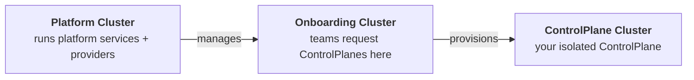

# Quickstart

Get OpenControlPlane running on your local machine in under 10 minutes. By the end, you'll have a platform that hands out managed `ControlPlanes` with the capability for teams to request Flux.

:::note
[`ocpctl`](https://github.com/openmcp-project/ocpctl) is the CLI for managing OpenControlPlane environments locally and in production. It is under active development. Some commands and flags may change.
:::

## What You'll Build


```mermaid
flowchart LR
    A["<b>Platform Cluster</b><br/>runs platform services + providers"] -->|manages| B["<b>Onboarding Cluster</b><br/>teams request ControlPlanes here"]
    B -->|provisions| C["<b>ControlPlane Cluster</b><br/>your isolated ControlPlane"]
```

OpenControlPlane creates three clusters that work together:

| Cluster | Who uses it | Purpose |
|---------|-------------|---------|
| 🟠 **Platform** | [Platform Owners](/operators/overview) | Runs platform services, cluster providers, and service providers |
| 🟢 **Onboarding** | [End users](/users/getting-started) (teams) | API surface where teams create `ControlPlanes` |
| 🟣 **ControlPlane** | [End users](/users/getting-started) (teams) | One per team, isolated workspace with requested services |

The separation ensures end users never touch infrastructure. They interact only with the Onboarding cluster to request resources, and their services appear on their own `ControlPlane` cluster.

---

## Prerequisites

- [Docker](https://docs.docker.com/get-started/get-docker/) running (8 GB RAM allocated to it)
- [Go](https://go.dev/doc/install) installed
- [`kubectl`](https://kubernetes.io/docs/tasks/tools/) CLI installed
- [`kind`](https://kind.sigs.k8s.io/docs/user/quick-start/#installation) CLI installed
- ~10 minutes

## Install ocpctl

```shell
go install github.com/openmcp-project/ocpctl@v0.3.0
```

Or download a pre-built binary from the [releases page](https://github.com/openmcp-project/ocpctl/releases/latest).

---

## Step 1: Start the platform

```shell
ocpctl env apply local
```

This takes a few minutes. It creates a local Kind-based environment with the full OpenControlPlane stack: `openmcp-operator`, `cluster-provider-kind`, plus an onboarding cluster and pre-installed [service providers](/developers/serviceprovider/examples) that you can consume.

Verify the platform is running:

:::apply-to-platform

```shell
kubectl config use-context kind-local-platform
kubectl get pods -n openmcp-system
```

You should see these pods in `Running` state:

```
NAME                                      READY   STATUS      RESTARTS      AGE
cp-kind-5dbd475459-6zgfr                  1/1     Running     0             88s
cp-kind-init-ps7f7                        0/1     Completed   0             96s
openmcp-operator-654568c654-4fhfk         1/1     Running     0             2m10s
ps-gateway-57db9fdb9-68hzz                1/1     Running     2 (73s ago)   74s
ps-gateway-init-wxcjw                     0/1     Completed   0             91s
ps-helmdeployer-689b98cd99-vfvs5          1/1     Running     0             93s
ps-helmdeployer-init-6nmxk                0/1     Completed   0             96s
ps-managedcontrolplane-796ff64877-l2mhx   1/1     Running     0             72s
ps-managedcontrolplane-init-mr7q9         0/1     Completed   0             96s
sp-crossplane-67659f97f5-n5v9m            1/1     Running     0             64s
sp-crossplane-init-hqccq                  0/1     Completed   0             91s
sp-flux-77db5c6cbb-7nnmc                  1/1     Running     0             60s
sp-flux-init-k4knn                        0/1     Completed   0             91s
sp-kro-78b4cbf89b-djrbs                   1/1     Running     0             51s
sp-kro-init-btzww                         0/1     Completed   0             90s
sp-ocm-7f97797fc7-dxq4r                   1/1     Running     0             57s
sp-ocm-init-r9kmx                         0/1     Completed   0             91s
```

:::

In this output we can see that openmcp-operator and multiple other services like cluster-provider-kind (cp-kind) and service providers such as Crossplane, Flux, Kro and OCM are running.


### Configure allowed Flux versions

To enable end users to request Flux for a `ControlPlane`, as Platform Owner, we need to make sure to configure allowed versions of Flux. We can configure them via a `ProviderConfig`:

:::apply-to-platform

```shell
kubectl config use-context kind-local-platform
kubectl apply -f - <<EOF
apiVersion: flux.services.open-control-plane.io/v1alpha1
kind: ProviderConfig
metadata:
  name: flux
spec:
  versions:
    - version: "2.8.3"
      chartVersion: "2.18.2"
      chartUrl: "oci://ghcr.io/fluxcd-community/charts/flux2"
EOF
```

:::

This controls exactly which versions teams can request in Step 3. Add more entries to the `versions` list to offer additional versions.

---

## Step 2: Create a ControlPlane

Now switch to the **end-user perspective**. A team wants their own `ControlPlane`.

First, export the onboarding cluster's kubeconfig so `kubectl` can reach it:

```shell
kind export kubeconfig --name local-onboarding
```

See the [`ControlPlane` reference](/reference/core/controlplane) for the full API.

:::apply-to-onboarding-api

```shell
kubectl config use-context kind-local-onboarding
kubectl apply -f - <<EOF
apiVersion: core.open-control-plane.io/v2alpha1
kind: ControlPlane
metadata:
  name: my-controlplane
  namespace: default
spec:
  iam: {}
EOF
```

Wait for it to become ready:

```shell
kubectl config use-context kind-local-onboarding
kubectl get controlplane my-controlplane -w
```

Once provisioning completes, you will see:

```
NAME              PHASE
my-controlplane   Ready
```
:::

The platform has provisioned an isolated `ControlPlane` cluster. Behind the scenes, OpenControlPlane asked `cluster-provider-kind` to create a new Kind cluster for this `ControlPlane`. The cluster is assigned a generated name of the form `mcp-<hash>.<random>` — for example `mcp-ad2klitc.f52190f9`. The hash is derived from the environment name; the suffix is random per provisioning run. You will need this name in Step 3.

---

## Step 3: Request Flux as a service

The team wants Flux installed on their `ControlPlane`:

:::apply-to-onboarding-api

```shell
kubectl config use-context kind-local-onboarding
kubectl apply -f - <<EOF
apiVersion: flux.services.open-control-plane.io/v1alpha1
kind: Flux
metadata:
  name: my-controlplane
  namespace: default
spec:
  version: 2.8.3
EOF
```

:::

`ServiceProvider` Flux on the platform cluster detects this request and installs Flux into the `ControlPlane` cluster called "my-controlplane" automatically.

You can check the installation status of Flux via the `status` sub-resource of the `Flux` object:

:::apply-to-onboarding-api

```shell
kubectl config use-context kind-local-onboarding
kubectl get flux my-controlplane -n default -o yaml
```

The output looks like this:

```yaml
apiVersion: flux.services.open-control-plane.io/v1alpha1
kind: Flux
metadata:
  ...
  finalizers:
  - flux.services.open-control-plane.io/finalizer
  name: my-controlplane
  namespace: default
spec:
  version: 2.8.3
status:
  conditions:
  - lastTransitionTime: "2026-07-31T14:40:59Z"
    message: Reconcile in progress
    observedGeneration: 1
    reason: Reconciling
    status: "False"
    type: Ready
  observedGeneration: 1
  phase: Progressing # The installation is currently ongoing, "Ready" indicates successful installation
  resources:
  - kind: OCIRepository
    location: PlatformCluster
    message: Resource is not ready
    name: flux
    namespace: mcp--76d5b02a-48a3-8952-8fc9-20577e724f47
    phase: Pending
  - kind: HelmRelease
    location: PlatformCluster
    message: Resource is not ready
    name: flux
    namespace: mcp--76d5b02a-48a3-8952-8fc9-20577e724f47
    phase: Pending
```


:::

### Connect to the ControlPlane cluster

The `ControlPlane` cluster runs as its own Kind cluster with a generated name. Find it:

```shell
kind get clusters
```

```
local-onboarding
local-platform
mcp-ad2klitc.f52190f9     <- your ControlPlane cluster
```

Export its kubeconfig and switch context:

```shell
CONTROLPLANE_CLUSTER=$(kind get clusters | grep '^mcp-')
kind export kubeconfig --name "$CONTROLPLANE_CLUSTER"
kubectl config use-context "kind-$CONTROLPLANE_CLUSTER"
```

### Verify Flux is running

Flux installation can take a few minutes while the `ControlPlane` cluster finishes bootstrapping. Wait for all pods to reach `Running`:

:::apply-to-controlplane

```shell
kubectl get pods -n flux-system
```

```
NAME                                           READY   STATUS    RESTARTS   AGE
helm-controller-8564d95f86-6kxlg               1/1     Running   0          2m8s
image-automation-controller-5c484478c6-jj29p   1/1     Running   0          2m8s
image-reflector-controller-5875745f59-b9cp4    1/1     Running   0          2m8s
kustomize-controller-7587bc49f9-m47nv          1/1     Running   0          2m8s
notification-controller-d7d89cdb9-sht7p        1/1     Running   0          2m8s
source-controller-7f6f4dd77d-vmxvv             1/1     Running   0          2m8s
```

:::

The team now has a fully functional control plane with Flux, provisioned through a simple API request.

---

## Next Steps

### Add more services

Beyond Flux, we can offer [Crossplane](https://www.crossplane.io/), [External Secrets Operator](https://external-secrets.io/), [Velero](https://velero.io/), and more to end users. Each service is a [`ServiceProvider`](/developers/serviceprovider/deploy) deployed on the platform cluster.

Our CLI tool `ocpctl` already pre-installs a lot of these Service Providers. We can look them up via:

:::apply-to-platform

```shell
kubectl config use-context kind-local-platform
kubectl get serviceproviders
```

The output looks like this:

```shell
NAME         PHASE
crossplane   Ready
flux         Ready
kro          Ready
ocm          Ready
```

:::

But we can also apply a new `ServiceProvider` to our platform to offer e.g. External Secrets Operator to end users:

:::apply-to-platform

```shell
kubectl config use-context kind-local-platform
kubectl apply -f - <<EOF
apiVersion: openmcp.cloud/v1alpha1
kind: ServiceProvider
metadata:
  name: externalsecretsoperator
  namespace: openmcp-system
spec:
  image: ghcr.io/openmcp-project/images/service-provider-external-secrets:v1.0.0
EOF
```

We can look up the status of the installation by executing:
```shell
kubectl config use-context kind-local-platform
kubectl get serviceproviders
```

The output looks like this:

```shell
NAME                      PHASE
crossplane                Ready
externalsecretsoperator   Progressing
flux                      Ready
kro                       Ready
ocm                       Ready
```

:::

Next, we need to configure these `ServiceProviders` via their `ProviderConfig` API to rule which versions end users can install.

:::note
More coming soon
:::


### Managed team access
Learn how [Projects and Workspaces](/users/concepts/projects-and-workspaces) let you organize teams and `ControlPlanes`.

:::note
More coming soon
:::

### Configure an Identity Provider
Learn how to set up an IdP to authenticate users against a local OpenControlPlane environment.

:::note
More coming soon
:::

### Deploy on real infrastructure

Follow the [Production Setup](./production-setup/00-overview.md) guide to run OpenControlPlane on Gardener.

---

## Clean up

```shell
ocpctl env delete local
```

Removes all Kind clusters and resources created by `ocpctl env apply local`.

