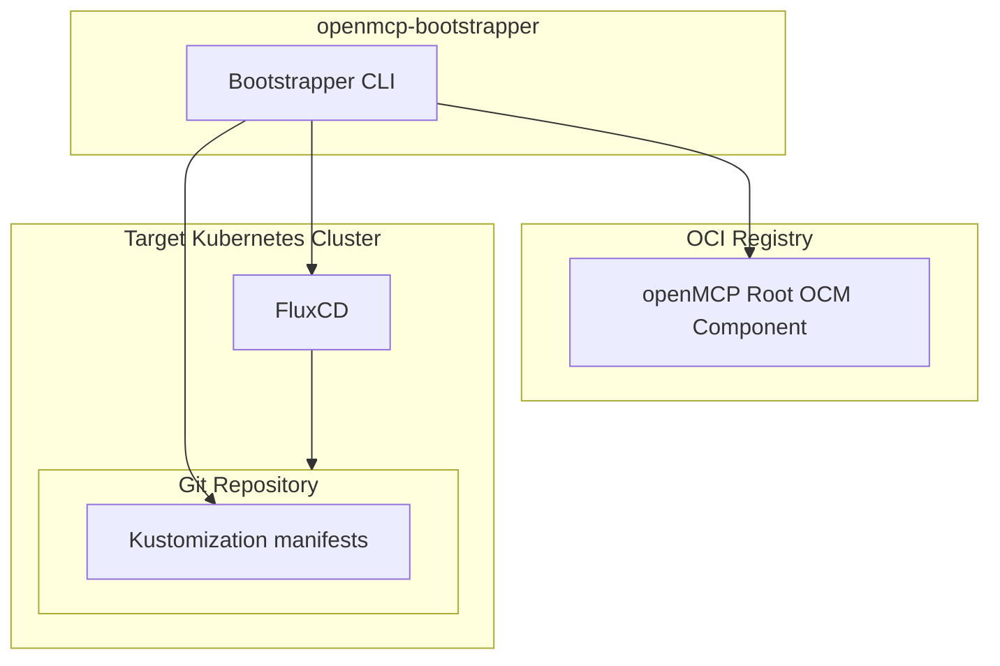

# Overview

This section covers deploying OpenControlPlane on real infrastructure using the [`openmcp-bootstrapper`](https://github.com/openmcp-project/bootstrapper). This is the path for platform engineers setting up production or staging environments.

If you want to try OpenControlPlane locally first, start with the [Quickstart](../quickstart) instead.

## When to Use This

- You're deploying to a managed Kubernetes service (Gardener, etc.)
- You need persistent state across restarts
- You're setting up a shared platform for your organisation

## Prerequisites

- A target Kubernetes cluster matching your cluster provider (e.g., a Gardener Shoot)
- A Git repository for storing landscape state (must not be empty — at least a README)
- Access to the OCI registry containing OpenControlPlane components (`ghcr.io/openmcp-project`)
- The [`openmcp-bootstrapper`](https://github.com/openmcp-project/bootstrapper) CLI tool

## How Bootstrapping Works

The bootstrapper sets up a GitOps process: the desired state of your landscape is stored in a Git repository and continuously synced to your cluster using FluxCD.



1. The bootstrapper reads component versions and templates from an OCI registry
2. It writes the desired state (Kubernetes manifests) to a Git repository
3. It deploys FluxCD to the target cluster, pointing it at that Git repository
4. FluxCD continuously reconciles the cluster state with what's in Git

## Download the Bootstrapper

The `openmcp-bootstrapper` is distributed as a Docker image:

```shell
TAG=$(curl -s "https://api.github.com/repos/openmcp-project/bootstrapper/releases/latest" | grep '"tag_name":' | cut -d'"' -f4)
export OPENMCP_BOOTSTRAPPER_VERSION="${TAG}"
docker pull ghcr.io/openmcp-project/images/openmcp-bootstrapper:${OPENMCP_BOOTSTRAPPER_VERSION}
```

## Next Steps

- [Gardener Provider](./gardener-provider) — Deploy on Gardener-managed infrastructure

## Coming Soon

**User management** via Projects and Workspaces — organize teams and control access to ManagedControlPlanes. This will be documented in this section once the feature is available.
