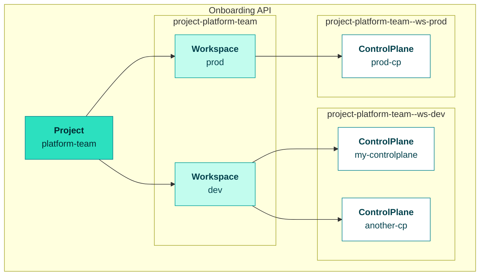

# Getting Started

Welcome to OpenControlPlane! This guide walks you through creating your first Managed Control Plane — a lightweight Kubernetes API server where you can manage infrastructure and services declaratively.

**By the end of this guide, you will have:**

- Created a Project to organize your resources
- Set up a Workspace for environment separation
- Deployed a ControlPlane with authentication configured
- Connected to your ControlPlane using kubectl
- Optionally installed managed services like Crossplane

## Understanding the Hierarchy

OpenControlPlane organizes resources in a three-level hierarchy:



- **Project** — Top-level organization unit (team, department, or org)
- **Workspace** — Environment separation within a project (dev, staging, prod)
- **ControlPlane** — Your actual Kubernetes API endpoint with its own data store

## Prerequisites

Before you begin, ensure you have:

| Requirement | Description |
|-------------|-------------|
| **Onboarding API access** | Your platform operator provides the API endpoint and credentials |
| **kubectl** | Version 1.25 or later ([install guide](https://kubernetes.io/docs/tasks/tools/)) |
| **kubeconfig** | Configured to connect to the Onboarding API |

:::tip Platform Access
If you don't have access to an OpenControlPlane installation, contact your platform operator. Operators can follow the [Bootstrapping Guide](/docs/operators/bootstrapping/bootstrapping-overview) to set up a new environment.
:::

---

## Step 1: Create a Project

A `Project` is the starting point of your ControlPlane journey. It's a logical grouping of `Workspaces` and `ControlPlanes`. Use a Project to represent an organization, department, team, or any other logical grouping.

```yaml
apiVersion: core.openmcp.cloud/v1alpha1
kind: Project
metadata:
  name: platform-team
  annotations:
    openmcp.cloud/display-name: Platform Team
spec:
  members:
    - kind: User
      name: first.user@example.com
      roles:
        - admin
    - kind: User
      name: second.user@example.com
      roles:
        - view
```

Apply it to the Onboarding API:

```bash
kubectl apply -f project.yaml
```

---

## Step 2: Create a Workspace

A `Workspace` is a logical grouping of `ControlPlanes`. Use Workspaces to represent environments (dev, staging, prod) or other organizational boundaries.

```yaml
apiVersion: core.openmcp.cloud/v1alpha1
kind: Workspace
metadata:
  name: dev
  namespace: project-platform-team
  annotations:
    openmcp.cloud/display-name: Platform Team - Dev
spec:
  members:
    - kind: User
      name: first.user@example.com
      roles:
        - admin
    - kind: User
      name: second.user@example.com
      roles:
        - view
```

:::info Namespace Convention
Workspaces live in a namespace named `project-<project-name>`. For example, a Workspace in the `platform-team` Project goes in the `project-platform-team` namespace.
:::

```bash
kubectl apply -f workspace.yaml
```

---

## Step 3: Create a ControlPlane

The `ControlPlane` resource is the heart of OpenControlPlane. Each ControlPlane has its own Kubernetes API endpoint and data store. You can use the `iam` property to define who can access the ControlPlane.

```yaml
apiVersion: core.openmcp.cloud/v2alpha1
kind: ManagedControlPlaneV2
metadata:
  name: my-controlplane
  namespace: project-platform-team--ws-dev
spec:
  iam:
    oidc:
      defaultProvider:
        roleBindings:
        - roleRefs:
          - kind: ClusterRole
            name: cluster-admin
          subjects:
          - kind: User
            name: first.user@example.com
          - kind: User
            name: second.user@example.com
    tokens:
    - name: ci-service-token
      roleRefs:
      - kind: ClusterRole
        name: cluster-admin
```

:::info Namespace Convention
ControlPlanes live in a namespace named `project-<project>--ws-<workspace>`. For example, a ControlPlane in the `dev` Workspace of the `platform-team` Project goes in `project-platform-team--ws-dev`.
:::

### Authentication & Authorization

The `spec.iam` section controls who can access your ControlPlane and what they can do.

#### Human Authentication (OIDC)

For users authenticating through your identity provider:

```yaml
iam:
  oidc:
    defaultProvider:
      roleBindings:
      - roleRefs:
        - kind: ClusterRole
          name: cluster-admin
        subjects:
        - kind: User
          name: alice@example.com
```

OpenControlPlane creates ClusterRoleBindings in your ControlPlane based on these specifications.

#### Machine Authentication (Tokens)

For CI/CD pipelines and service accounts:

```yaml
iam:
  tokens:
  - name: ci-service-token
    roleRefs:
    - kind: ClusterRole
      name: cluster-admin
```

For token-based auth, a ServiceAccount is automatically generated and bound to the specified roles.

```bash
kubectl apply -f controlplane.yaml
```

---

## Step 4: Connect to Your ControlPlane

After creating your ControlPlane, retrieve credentials to access it.

### Check ControlPlane Status

First, verify your ControlPlane is ready:

```bash
kubectl get managedcontrolplanev2 my-controlplane -n project-platform-team--ws-dev
```

Wait until the ControlPlane shows a ready status. The `status.access` field contains references to your credentials.

### Retrieve Your Kubeconfig

The ControlPlane creates secrets containing kubeconfig files for each authentication method you configured.

#### For OIDC Authentication (Human Users)

```bash
# Get the secret name from status
SECRET_NAME=$(kubectl get managedcontrolplanev2 my-controlplane \
  -n project-platform-team--ws-dev \
  -o jsonpath='{.status.access.oidc.secretRef.name}')

# Retrieve and decode the kubeconfig
kubectl get secret $SECRET_NAME -n project-platform-team--ws-dev \
  -o jsonpath='{.data.kubeconfig}' | base64 -d > my-controlplane-oidc.kubeconfig
```

#### For Token Authentication (Machine Users)

```bash
# Get the secret name from status
SECRET_NAME=$(kubectl get managedcontrolplanev2 my-controlplane \
  -n project-platform-team--ws-dev \
  -o jsonpath='{.status.access.tokens[0].secretRef.name}')

# Retrieve and decode the kubeconfig
kubectl get secret $SECRET_NAME -n project-platform-team--ws-dev \
  -o jsonpath='{.data.kubeconfig}' | base64 -d > my-controlplane-token.kubeconfig
```

### Verify Access

Test your connection to the ControlPlane:

```bash
# Using the retrieved kubeconfig
kubectl --kubeconfig=my-controlplane-oidc.kubeconfig get namespaces
```

You should see the default Kubernetes namespaces, confirming your ControlPlane is accessible.

:::tip Set as Default Context
To use your ControlPlane as the default context:
```bash
export KUBECONFIG=my-controlplane-oidc.kubeconfig
kubectl get namespaces
```
:::

---

## Step 5: Install Managed Services

You can install managed services in your ControlPlane to extend its functionality.

### Crossplane

[Crossplane](https://www.crossplane.io/) enables you to manage cloud infrastructure using Kubernetes-style declarative configuration.

To install Crossplane, create a `Crossplane` resource in the same namespace as your ControlPlane:

```yaml
apiVersion: crossplane.services.openmcp.cloud/v1alpha1
kind: Crossplane
metadata:
  name: my-controlplane
  namespace: project-platform-team--ws-dev
spec:
  version: v1.20.0
  providers:
    - name: provider-kubernetes
      version: v0.16.0
```

The `name` must match your ControlPlane name.

### Landscaper

[Landscaper](https://github.com/gardener/landscaper) manages the installation, updates, and uninstallation of cloud-native workloads with complex dependency chains.

To install Landscaper, create a `Landscaper` resource:

```yaml
apiVersion: landscaper.services.openmcp.cloud/v1alpha2
kind: Landscaper
metadata:
  name: my-controlplane
  namespace: project-platform-team--ws-dev
spec:
  version: v0.142.0
```

---

## Next Steps

Congratulations! You have a working ControlPlane. Here's what you can explore next:

- **[What is a Managed Control Plane?](./concepts/managed-control-plane.md)** — Deeper understanding of ControlPlanes
- **[Service Providers](./concepts/service-provider.md)** — How managed services work
- **[Crossplane Service Provider](https://github.com/openmcp-project/service-provider-crossplane)** — Manage cloud infrastructure
- **[Landscaper Service Provider](https://github.com/openmcp-project/service-provider-landscaper)** — Orchestrate complex workloads
