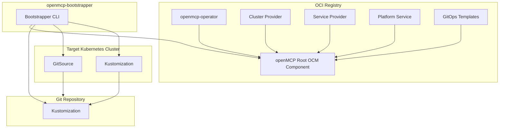

# openMCP Landscape Bootstrapping

To set up and and manage openMCP landscapes, a concept named bootstrapping is used.
Bootstrapping works for creating new landscapes as well as updating existing landscapes with new versions of openMCP.
The bootstrapping involves the creation of a GitOps process where the desired state of the landscape is stored in a Git repository and is being synced to the actual landscape using FluxCD.
The operator of a landscape can configure the bootstrapping to their liking by providing a bootstrapping configuration that controls the configuration of the openmcp-operator including all desired cluster-providers, service-providers, and platform services.
The bootstrapping is performed by the `openmcp-bootstrapper` command line tool (https://github.com/openmcp-project/bootstrapper).

## General Bootstrapping Architecture



The `openMCP Root OCM Component` (github.com/openmcp-project/openmcp) contains references to the `openmcp-operator`, the `gitops-templates` (github.com/openmcp-project/gitops-templates) as well as a list of cluster providers, service providers and platform services that can be deployed.
The `openMCP Root OCM Component` acts as the source of the available versions, image locations and deployment configuration of an openMCP landscape.

The `Git Repository` contains the desired state of the openMCP landscape. The desired state is encoded in a set of Kubernetes manifests that are organized and templated using Kustomize. The `Git Repository` is being updated by the `openmcp-bootstrapper` CLI tool for the information provided in the `openMCP Root OCM Component` as well as the bootstrapping configuration provided by the operator.

The `openmcp-bootstrapper` reads the `openMCP Root OCM Component` from an OCI registry to retrieve the `GitOps Templates` as well as the image locations of the FluxCD tool, the `openmcp-operator`, the cluster providers, the service providers and the platform services. The templated `GitOpsTemplate` is applied to the `Git Repository` and the templated FluxCD deployment is applied to the `Target Kubernetes Cluster`. The `openmcp-bootstrapper` also creates a FluxCD `GitSource` based on the provided Git repository URL and credentials.
The `openmcp-bootstrapper` then creates a FluxCD `Kustomizations` that points to the `Git Repository` and applies it to the `Target Kubernetes Cluster`.

### Prerequisites

* A target Kubernetes cluster that matches the desired cluster provider being used (e.g. `Kind` for local testing, `Gardener` for Gardener Shoots)
* A Git repository that will be used to store the desired state of the openMCP landscape
* An OCI registry that contains the `openMCP Root OCM Component` (e.g. `ghcr.io/openmcp-project`)

## Example using the Kind Cluster Provider

## Requirements

* [Docker](https://docs.docker.com/get-docker/) installed and running. Docker alternatively can be replaced with another OCI runtime (e.g. Podman) that can run the `openmcp-bootstrapper` CLI tool as an OCI image. Make sure that your alternative is correctly setup reg. Docker compatibility. In case of Podman, you should find a corresponding configuration under `Settings` in the Podman UI.
* [Kind](https://kind.sigs.k8s.io/docs/user/quick-start/) installed

### Download the `openmcp-bootstrapper` CLI tool

The `openmcp-bootstrapper` CLI tool can be downloaded as an OCI image from an OCI registry (e.g. `ghcr.io/openmcp-project`).
In this example docker will be used to run the `openmcp-bootstrapper` CLI tool.

```
docker pull ghcr.io/openmcp-project/images/openmcp-bootstrapper:v0.1.1
```

### Create a configuration folder

Create a directory that will be used to store the configuration files and the kubeconfig files.
To keep this example simple, we will use a single directory named `config` in the current working directory.

```shell
mkdir config
```

All following examples will use the `config` directory as the configuration directory. If you use a different directory, replace all occurrences of `config` with your desired directory path.

Create a directory named `kubeconfigs` in the configuration folder to store the kubeconfig files of the created clusters.

```shell
mkdir kubeconfigs
```

### Create the Kind configuration file (kind-config.yaml) in the configuration folder

```yaml
apiVersion: kind.x-k8s.io/v1alpha4
kind: Cluster
nodes:
- role: control-plane
  extraMounts:
  - hostPath: /var/run/docker.sock
    containerPath: /var/run/host-docker.sock
```

### Create the Kind cluster

Create the Kind cluster using the configuration file created in the previous step.
Note: In case you are using Podman instead of Docker, it is currently required to first create a suitable network for the Kind cluster by executing the following command before creating the Kind cluster itself:
```shell
podman network create kind --subnet 172.19.0.0/16
```shell
kind create cluster --name platform --config ./config/kind-config.yaml
```

Export the internal kubeconfig of the Kind cluster to a file named `platform-int.kubeconfig` in the configuration folder.

```shell
kind get kubeconfig --internal --name platform > ./kubeconfigs/platform-int.kubeconfig
```

### Create a bootstrapping configuration file (bootstrapper-config.yaml) in the configuration folder

Replace `<your-org>` and `your-repo` with your Git organization and repository name.
The environment can be set to the logical environment name (e.g. `dev`, `prod`, `live-eu-west`) that will be used in the Git repository to separate different environments.
The branch can be set to the desired branch name in the Git repository that will be used to store the desired state of the openMCP landscape.

```yaml
component:
  location: ghcr.io/openmcp-project/components//github.com/openmcp-project/openmcp:v0.0.20

repository:
  url: https://github.com/<your-org>/<your-repo>
  branch: <branch-name>

environment: <environment-name>

openmcpOperator:
  config: {}
```

### Create a Git configuration file (git-config.yaml) in the configuration folder

For GitHub use a personal access token with `repo` write permissions.
It is also possible to use a fine-grained token. In this case, it requires read and write permissions for `Contents`.
```yaml
auth:
  basic:
    username: "<your-git-username>"
    password: "<your-git-token>"
```

### Run the `openmcp-bootstrapper` CLI tool and deploy FluxCD to the Kind cluster

```shell
docker run --rm --network kind -v ./config:/config -v ./kubeconfigs:/kubeconfigs ghcr.io/openmcp-project/images/openmcp-bootstrapper:v0.1.1 deploy-flux --git-config /config/git-config.yaml --kubeconfig /kubeconfigs/platform-int.kubeconfig /config/bootstrapper-config.yaml
```

You should see output similar to the following:

```shell
Info: Starting deployment of Flux controllers with config file: /config/bootstrapper-config.yaml.
Info: Ensure namespace flux-system exists
Info: Creating/updating git credentials secret flux-system/git
Info: Created/updated git credentials secret flux-system/git
Info: Creating working directory for gitops-templates
Info: Downloading templates
/tmp/openmcp.cloud.bootstrapper-3041773446/download: 9 file(s) with 691073 byte(s) written
Info: Arranging template files
Info: Arranged template files
Info: Applying templates from gitops-templates/fluxcd to deployment repository
Info: Kustomizing files in directory: /tmp/openmcp.cloud.bootstrapper-3041773446/repo/envs/dev/fluxcd
Info: Applying flux deployment objects
Info: Deployment of flux controllers completed
```

### Inspect the deployed FluxCD controllers and Kustomization

Load the kubeconfig of the Kind cluster and check the deployed FluxCD controllers and the created GitRepository and Kustomization.

```shell
kind get kubeconfig --name platform > ./kubeconfigs/platform.kubeconfig
kubectl --kubeconfig ./kubeconfigs/platform.kubeconfig get pods -n flux-system
```

You should see output similar to the following:

```shell
NAME                                           READY   STATUS    RESTARTS   AGE
helm-controller-648cdbf8d8-8jhnf               1/1     Running   0          9m37s
image-automation-controller-56df4c78dc-qwmfm   1/1     Running   0          9m35s
image-reflector-controller-56f69fcdc9-pgcgx    1/1     Running   0          9m35s
kustomize-controller-b4c4dcdc8-g49gc           1/1     Running   0          9m38s
notification-controller-59d754d599-w7fjp       1/1     Running   0          9m36s
source-controller-6b45b6464f-jbgb6             1/1     Running   0          9m38
```

```shell
kubectl --kubeconfig ./kubeconfigs/platform.kubeconfig get gitrepositories.source.toolkit.fluxcd.io -A
````

You should see output similar to the following:

```shell
NAMESPACE     NAME           URL                                         AGE   READY   STATUS
flux-system   environments   https://github.com/<your-org>/<your-repo>   86s   False   failed to checkout and determine revision: unable to clone 'https://github.com/<your-org>/<your-repo>': couldn't find remote ref "refs/heads/<branch-name>"
```

This error is expected as the branch does not exist yet in the Git repository. The `openmcp-bootstrapper` will create the branch in the next step.

```shell
kubectl --kubeconfig ./kubeconfigs/platform.kubeconfig get kustomizations.kustomize.toolkit.fluxcd.io -A
```

You should see output similar to the following:

```shell
NAMESPACE     NAME          AGE     READY   STATUS
flux-system   flux-system   3m15s   False   Source artifact not found, retrying in 30s
```

This error is also expected as the GitRepository does not exist yet. The `openmcp-bootstrapper` will create the GitRepository in the next step.

### Run the `openmcp-bootstrapper` CLI tool to deploy openMCP to the Kind cluster

Update the bootstrapping configuration file (bootstrapper-config.yaml) to include the kind cluster provider and the openmcp-operator configuration.

```yaml
component:
  location: ghcr.io/openmcp-project/components//github.com/openmcp-project/openmcp:v0.0.20

repository:
  url: https://github.com/<your-org>/<your-repo>
  branch: <branch-name>

environment: <environment-name>

providers:
  clusterProviders:
  - name: kind
    config:
      extraVolumeMounts:
        - mountPath: /var/run/docker.sock
          name: docker
      extraVolumes:
        - name: docker
          hostPath:
            path: /var/run/host-docker.sock
            type: Socket

openmcpOperator:
  config:
    managedControlPlane:
      mcpClusterPurpose: mcp-worker
      reconcileMCPEveryXDays: 7
    scheduler:
      scope: Cluster
      purposeMappings:
        mcp:
          template:
            spec:
              profile: kind
              tenancy: Exclusive
        mcp-worker:
          template:
            spec:
              profile: kind
              tenancy: Exclusive
        platform:
          template:
            metadata:
              labels:
                clusters.openmcp.cloud/delete-without-requests: "false"
            spec:
              profile: kind
              tenancy: Shared
        onboarding:
          template:
            metadata:
              labels:
                clusters.openmcp.cloud/delete-without-requests: "false"
            spec:
              profile: kind
              tenancy: Shared
        workload:
          tenancyCount: 20
          template:
            spec:
              profile: kind
              tenancy: Shared
```

```shell
docker run --rm --network kind -v ./config:/config -v ./kubeconfigs:/kubeconfigs ghcr.io/openmcp-project/images/openmcp-bootstrapper:v0.1.1 manage-deployment-repo --git-config /config/git-config.yaml --kubeconfig /kubeconfigs/platform-int.kubeconfig /config/bootstrapper-config.yaml
```

You should see output similar to the following:

```shell
Info: Downloading component ghcr.io/openmcp-project/components//github.com/openmcp-project/openmcp:v0.0.20
Info: Creating template transformer
Info: Downloading template resources
/tmp/openmcp.cloud.bootstrapper-2402093624/transformer/download/fluxcd: 9 file(s) with 691073 byte(s) written
/tmp/openmcp.cloud.bootstrapper-2402093624/transformer/download/openmcp: 8 file(s) with 6625 byte(s) written
Info: Transforming templates into deployment repository structure
Info: Fetching openmcp-operator component version
Info: Cloning deployment repository https://github.com/reshnm/template-test
Info: Checking out or creating branch kind
Info: Applying templates from "gitops-templates/fluxcd"/"gitops-templates/openmcp" to deployment repository
Info: Templating providers: clusterProviders=[{kind [123 34 101 120 116 114 97 86 111 108 117 109 101 77 111 117 110 116 115 34 58 91 123 34 109 111 117 110 116 80 97 116 104 34 58 34 47 118 97 114 47 114 117 110 47 100 111 99 107 101 114 46 115 111 99 107 34 44 34 110 97 109 101 34 58 34 100 111 99 107 101 114 34 125 93 44 34 101 120 116 114 97 86 111 108 117 109 101 115 34 58 91 123 34 104 111 115 116 80 97 116 104 34 58 123 34 112 97 116 104 34 58 34 47 118 97 114 47 114 117 110 47 104 111 115 116 45 100 111 99 107 101 114 46 115 111 99 107 34 44 34 116 121 112 101 34 58 34 83 111 99 107 101 116 34 125 44 34 110 97 109 101 34 58 34 100 111 99 107 101 114 34 125 93 44 34 118 101 114 98 111 115 105 116 121 34 58 34 100 101 98 117 103 34 125] map[extraVolumeMounts:[map[mountPath:/var/run/docker.sock name:docker]] extraVolumes:[map[hostPath:map[path:/var/run/host-docker.sock type:Socket] name:docker]] verbosity:debug]}], serviceProviders=[], platformServices=[], imagePullSecrets=[]
Info: Applying Custom Resource Definitions to deployment repository
/tmp/openmcp.cloud.bootstrapper-2402093624/repo/resources/openmcp/crds: 8 file(s) with 475468 byte(s) written
/tmp/openmcp.cloud.bootstrapper-2402093624/repo/resources/openmcp/crds: 1 file(s) with 1843 byte(s) written
Info: No extra manifest directory specified, skipping
Info: Committing and pushing changes to deployment repository
Info: Created commit: 287f9e88b905371bba412b5d0286ad02db0f4aac
Info: Running kustomize on /tmp/openmcp.cloud.bootstrapper-2402093624/repo/envs/dev
Info: Applying Kustomization manifest: default/bootstrap

```

### Inspect the Git repository

The desired state of the openMCP landscape has now been created in the Git repository and should look similar to the following structure:

```shell
.
├── envs
│   └── dev
│       ├── fluxcd
│       │   ├── flux-kustomization.yaml
│       │   ├── gitrepo.yaml
│       │   └── kustomization.yaml
│       ├── kustomization.yaml
│       ├── openmcp
│       │   ├── config
│       │   │   └── openmcp-operator-config.yaml
│       │   └── kustomization.yaml
│       └── root-kustomization.yaml
└── resources
    ├── fluxcd
    │   ├── components.yaml
    │   ├── flux-kustomization.yaml
    │   ├── gitrepo.yaml
    │   └── kustomization.yaml
    ├── kustomization.yaml
    ├── openmcp
    │   ├── cluster-providers
    │   │   └── kind.yaml
    │   ├── crds
    │   │   ├── clusters.openmcp.cloud_accessrequests.yaml
    │   │   ├── clusters.openmcp.cloud_clusterprofiles.yaml
    │   │   ├── clusters.openmcp.cloud_clusterrequests.yaml
    │   │   ├── clusters.openmcp.cloud_clusters.yaml
    │   │   ├── kind.clusters.openmcp.cloud_providerconfigs.yaml
    │   │   ├── openmcp.cloud_clusterproviders.yaml
    │   │   ├── openmcp.cloud_platformservices.yaml
    │   │   └── openmcp.cloud_serviceproviders.yaml
    │   ├── deployment.yaml
    │   ├── kustomization.yaml
    │   ├── namespace.yaml
    │   └── rbac.yaml
    └── root-kustomization.yaml
```

The `envs/<environment-name>` folder contains the Kustomization files that are used by FluxCD to deploy openMCP to the Kind cluster.
The `resources` folder contains the base resources that are used by the Kustomization files in the `envs/<environment-name>` folder.

## Inspect the Kustomizations in the Kind cluster

Force an update of the GitRepository and Kustomization in the Kind cluster to pick up the changes made in the Git repository.

```shell
kubectl --kubeconfig ./kubeconfigs/platform.kubeconfig -n flux-system annotate gitrepository environments reconcile.fluxcd.io/requestedAt="$(date +%s)"
kubectl --kubeconfig ./kubeconfigs/platform.kubeconfig -n flux-system patch kustomization flux-system --type merge -p '{"spec":{"force":true}}'
```

Get the status of the GitRepository in the Kind cluster.

```shell
kubectl --kubeconfig ./kubeconfigs/platform.kubeconfig get gitrepositories.source.toolkit.fluxcd.io -A
```

You should see output similar to the following:

```shell
NAMESPACE     NAME           URL                                          AGE    READY   STATUS
flux-system   environments   https://github.com/<your-ourg>/<your-repo>   9m6s   True    stored artifact for revision 'docs@sha1:...'
```

Get the status of the Kustomization in the Kind cluster.

```shell
kubectl --kubeconfig ./kubeconfigs/platform.kubeconfig get kustomizations.kustomize.toolkit.fluxcd.io -A
```

You should see output similar to the following:

```shell
NAMESPACE     NAME          AGE   READY   STATUS
default       bootstrap     5m31s   True    Applied revision: docs@sha1:...
flux-system   flux-system   10m     True    Applied revision: docs@sha1:...
```

You can see that there are now two Kustomizations in the Kind cluster.
The `flux-system` Kustomization is used to deploy the FluxCD controllers and the `bootstrap` Kustomization is used to deploy openMCP to the Kind cluster.

### Inspect the deployed openMCP components in the Kind cluster

Now check the deployed openMCP components.

```shell
kubectl --kubeconfig ./kubeconfigs/platform.kubeconfig get pods -n openmcp-system
```

You should see output similar to the following:

```shell
NAME                                      READY   STATUS      RESTARTS   AGE
cp-kind-6b4886b7cf-z54pg                  1/1     Running     0          20s
cp-kind-init-msqg7                        0/1     Completed   0          27s
openmcp-operator-5f784f47d7-nfg65         1/1     Running     0          34s
ps-managedcontrolplane-668c99c97c-9jltx   1/1     Running     0          4s
ps-managedcontrolplane-init-49rx2         0/1     Completed   0          27s
```

You should see that the openmcp-operator, the managedcontrolplane platform service and the cluster provider kind are running.
Now your are ready to create and manage clusters using openMCP.

### Get Access to the Onboarding Cluster

The openmcp-operator should now have created a onboarding `Cluster` resources on the platform cluster that represents the onboarding cluster.
The onboarding cluster is a special cluster that is used to onboard new managed control planes.

```shell
kubectl --kubeconfig ./kubeconfigs/platform.kubeconfig get clusters.clusters.openmcp.cloud -A
```

You should see output similar to the following:

```shell
NAMESPACE        NAME         PURPOSES         PHASE   VERSION   PROVIDER   AGE
openmcp-system   onboarding   ["onboarding"]   Ready                        11m
```

Now you can retrieve the kubeconfig of the onboarding cluster.
Use `kind` to retrieve the list of available clusters.

```shell
kind get clusters
```

You should see output similar to the following:

```shell
onboarding.21959962
platform
```

You can now see the new onboarding cluster.
Get the kubeconfig of the onboarding cluster and save it to a file named `onboarding.kubeconfig` in the configuration folder.
Please replace `onboarding.21959962` with the actual name of your onboarding cluster.

```shell
kind get kubeconfig --name onboarding.21959962 > ./kubeconfigs/onboarding.kubeconfig
```

### Create a Managed Control Plane

Create a file named `my-mcp.yaml` with the following content in the configuration folder:

```yaml
apiVersion: core.openmcp.cloud/v2alpha1
kind: ManagedControlPlaneV2
metadata:
  name: my-mcp
  namespace: default
spec:
    iam: {}
```

Apply the file to onboarding cluster:

```shell
kubectl --kubeconfig ./kubeconfigs/onboarding.kubeconfig apply -f ./config/my-mcp.yaml
```

The Managed Control Plane should now be created and the openmcp-operator should start to create the necessary resources to create the managed control plane.
You can check the status of the Managed Control Plane using the following command:

```shell
kubectl --kubeconfig ./kubeconfigs/onboarding.kubeconfig get managedcontrolplanev2 -n default my-mcp -o yaml
```

You should see output similar to the following:

```yaml
apiVersion: core.openmcp.cloud/v2alpha1
kind: ManagedControlPlaneV2
metadata:
  finalizers:
  - core.openmcp.cloud/mcp
  - request.clusters.openmcp.cloud/sample
  name: sample
  namespace: default
spec:
  iam: {}
status:
  conditions:
  - lastTransitionTime: "2025-09-16T13:03:55Z"
    message: All accesses are ready
    observedGeneration: 1
    reason: AllAccessReady_True
    status: "True"
    type: AllAccessReady
  - lastTransitionTime: "2025-09-16T13:03:55Z"
    message: Cluster conditions have been synced to MCP
    observedGeneration: 1
    reason: ClusterConditionsSynced_True
    status: "True"
    type: ClusterConditionsSynced
  - lastTransitionTime: "2025-09-16T13:03:55Z"
    message: ClusterRequest is ready
    observedGeneration: 1
    reason: ClusterRequestReady_True
    status: "True"
    type: ClusterRequestReady
  - lastTransitionTime: "2025-09-16T13:03:50Z"
    message: ""
    observedGeneration: 1
    reason: Meta_True
    status: "True"
    type: Meta
  observedGeneration: 1
  phase: Ready
```

You should see that the Managed Control Plane is in the `Ready` phase.
The openmcp-operator should now have created a new Kind cluster that represents the managed control plane.
You can check the list of available Kind clusters using the following command:

```shell
kind get clusters
```

You should see output similar to the following:

```shell
mcp-worker-fbmpf.040335d0
onboarding.21959962
platform
```

You can now get the kubeconfig of the managed control plane and save it to a file named `my-mcp.kubeconfig` in the kubeconfigs folder. Please replace `mcp-worker-fbmpf.040335d0` with the actual name of your managed control plane cluster.

```shell
kind get kubeconfig --name mcp-worker-fbmpf.040335d0 > ./kubeconfigs/my-mcp.kubeconfig
```

You can now use the kubeconfig to access the managed control plane cluster.

```shell
kubectl --kubeconfig ./kubeconfigs/my-mcp.kubeconfig get namespaces
```

### Deploy the Crossplane Service Provider

Update the bootstrapping configuration file (bootstrapper-config.yaml) to include the crossplane service provider.

```yaml
component:
  location: ghcr.io/openmcp-project/components//github.com/openmcp-project/openmcp:v0.0.20

repository:
  url: https://github.com/<your-org>/<your-repo>
  branch: <branch-name>

environment: <environment-name>

providers:
  clusterProviders:
  - name: kind
    config:
      extraVolumeMounts:
        - mountPath: /var/run/docker.sock
          name: docker
      extraVolumes:
        - name: docker
          hostPath:
            path: /var/run/host-docker.sock
            type: Socket
  serviceProviders:
  - name: crossplane

openmcpOperator:
  config:
    managedControlPlane:
      mcpClusterPurpose: mcp-worker
      reconcileMCPEveryXDays: 7
    scheduler:
      scope: Cluster
      purposeMappings:
        mcp:
          template:
            spec:
              profile: kind
              tenancy: Exclusive
        mcp-worker:
          template:
            spec:
              profile: kind
              tenancy: Exclusive
        platform:
          template:
            metadata:
              labels:
                clusters.openmcp.cloud/delete-without-requests: "false"
            spec:
              profile: kind
              tenancy: Shared
        onboarding:
          template:
            metadata:
              labels:
                clusters.openmcp.cloud/delete-without-requests: "false"
            spec:
              profile: kind
              tenancy: Shared
        workload:
          tenancyCount: 20
          template:
            spec:
              profile: kind
              tenancy: Shared
```

Create a new folder named `extra-manifests` in the configuration folder. Then create a file named `crossplane-provider.yaml` with the following content, and save it in the new `extra-manifests` folder.

```yaml
apiVersion: crossplane.services.openmcp.cloud/v1alpha1
kind: ProviderConfig
metadata:
  name: default
spec:
  chart:
    repository: "https://charts.crossplane.io/stable"
    name: crossplane
    availableVersions:
      - v1.20.0
      - v1.19.0
  availableProviders:
    - name: provider-kubernetes
      package: xpkg.upbound.io/upbound/provider-kubernetes
      versions:
        - v0.16.0
```

Run the `openmcp-bootstrapper` CLI tool to update the Git repository and deploy the crossplane service provider to the Kind cluster.

```shell
docker run --rm --network kind -v ./config:/config -v ./kubeconfigs:/kubeconfigs ghcr.io/openmcp-project/images/openmcp-bootstrapper:v0.1.1 manage-deployment-repo --git-config /config/git-config.yaml --kubeconfig /kubeconfigs/platform-int.kubeconfig --extra-manifest-dir /config/extra-manifests /config/bootstrapper-config.yaml
```

See the `--extra-manifest-dir` parameter that points to the folder containing the extra manifest file created in the previous step. All manifest files in this folder will be added to the Kustomization used by FluxCD to deploy openMCP to the Kind cluster.

The git repository should now be updated:

```shell
.
├── envs
│   └── dev
│       ├── fluxcd
│       │   ├── flux-kustomization.yaml
│       │   ├── gitrepo.yaml
│       │   └── kustomization.yaml
│       ├── kustomization.yaml
│       ├── openmcp
│       │   ├── config
│       │   │   └── openmcp-operator-config.yaml
│       │   └── kustomization.yaml
│       └── root-kustomization.yaml
└── resources
    ├── fluxcd
    │   ├── components.yaml
    │   ├── flux-kustomization.yaml
    │   ├── gitrepo.yaml
    │   └── kustomization.yaml
    ├── kustomization.yaml
    ├── openmcp
    │   ├── cluster-providers
    │   │   └── kind.yaml
    │   ├── crds
    │   │   ├── clusters.openmcp.cloud_accessrequests.yaml
    │   │   ├── clusters.openmcp.cloud_clusterprofiles.yaml
    │   │   ├── clusters.openmcp.cloud_clusterrequests.yaml
    │   │   ├── clusters.openmcp.cloud_clusters.yaml
    │   │   ├── crossplane.services.openmcp.cloud_providerconfigs.yaml
    │   │   ├── kind.clusters.openmcp.cloud_providerconfigs.yaml
    │   │   ├── openmcp.cloud_clusterproviders.yaml
    │   │   ├── openmcp.cloud_platformservices.yaml
    │   │   └── openmcp.cloud_serviceproviders.yaml
    │   ├── deployment.yaml
    │   ├── extra
    │   │   └── crossplane-providers.yaml
    │   ├── kustomization.yaml
    │   ├── namespace.yaml
    │   ├── rbac.yaml
    │   └── service-providers
    │       └── crossplane.yaml
    └── root-kustomization.yaml
```

After a while, the Kustomization in the Kind cluster should be updated and the crossplane service provider should be deployed:
You can force an update of the Kustomization in the Kind cluster to pick up the changes made in the Git repository.

```shell
kubectl --kubeconfig ./kubeconfigs/platform.kubeconfig -n flux-system annotate gitrepository environments reconcile.fluxcd.io/requestedAt="$(date +%s)"
kubectl --kubeconfig ./kubeconfigs/platform.kubeconfig -n default patch kustomization bootstrap --type merge -p '{"spec":{"force":true}}'
```

List the pods in the `openmcp-system` namespace again:

```shell
kubectl --kubeconfig ./kubeconfigs/platform.kubeconfig get pods -n openmcp-system
````
You should see output similar to the following:

```shell
NAME                                      READY   STATUS      RESTARTS   AGE
cp-kind-6b4886b7cf-z54pg                  1/1     Running     0          18m
cp-kind-init-msqg7                        0/1     Completed   0          18m
openmcp-operator-5f784f47d7-nfg65         1/1     Running     0          18m
ps-managedcontrolplane-668c99c97c-9jltx   1/1     Running     0          18m
ps-managedcontrolplane-init-49rx2         0/1     Completed   0          18m
sp-crossplane-6b8cccc775-9hx98            1/1     Running     0          105s
sp-crossplane-init-6hvf4                  0/1     Completed   0          2m11s
```

You should see that the crossplane service provider is running. This means that from now on, the openMCP is able to provide Crossplane service instances, using the new service provider Crossplane.

### Create a Crossplane service instance on the oboarding cluster

Create a file named `crossplane-instance.yaml` with the following content in the configuration folder:

```yaml
apiVersion: crossplane.services.openmcp.cloud/v1alpha1
kind: Crossplane
metadata:
  name: my-mcp
  namespace: default
spec:
  version: v1.20.0
  providers:
    - name: provider-kubernetes
      version: v0.16.0
```

Apply the file to onboarding cluster:

```shell
kubectl --kubeconfig ./kubeconfigs/onboarding.kubeconfig apply -f ./config/crossplane-instance.yaml
```

The Crossplane service provider should now start to create the necessary resources for the new Crossplane instance. As a result, a new Crossplane service instance should soon be available.
You can check the status of the Crossplane instance using the following command:

```shell
kubectl --kubeconfig ./kubeconfigs/onboarding.kubeconfig get crossplane -n default my-mcp -o yaml
```

After a while, you should see output similar to the following:

```yaml
apiVersion: crossplane.services.openmcp.cloud/v1alpha1
kind: Crossplane
metadata:
  finalizers:
  - openmcp.cloud/finalizers
  generation: 1
  name: sample
  namespace: default
spec:
  providers:
  - name: provider-kubernetes
    version: v0.16.0
  version: v1.20.0
status:
  conditions:
  - lastTransitionTime: "2025-09-16T14:09:56Z"
    message: Crossplane is healthy.
    reason: Healthy
    status: "True"
    type: CrossplaneReady
  - lastTransitionTime: "2025-09-16T14:10:01Z"
    message: ProviderKubernetes is healthy.
    reason: Healthy
    status: "True"
    type: ProviderKubernetesReady
  observedGeneration: 0
  phase: ""
```

Crossplane and the provider Kubernetes should now be available on the mcp cluster.

```shell
kubectl --kubeconfig ./kubeconfigs/my-mcp.kubeconfig api-resources | grep 'crossplane\|kubernetes'
```
