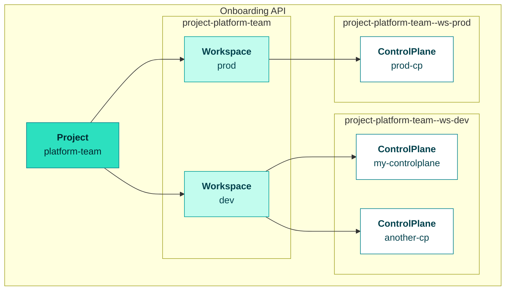

# 1. Onboard

This guide walks you through creating the foundational resources for your OpenControlPlane setup: Project, Workspace, and ControlPlane.

:::info Prerequisites
Requires a deployed OpenControlPlane platform. Operators: see [setup guide](/operators/setup) → [verify setup](/operators/verify-setup).
:::

## Understanding the Hierarchy

OpenControlPlane organizes resources in a three-level hierarchy:



- **Project** — Top-level organization unit (team, department, or org)
- **Workspace** — Environment separation within a project (dev, staging, prod)
- **ControlPlane** — Your actual Kubernetes API endpoint with its own data store

## Prerequisites

Before you begin, ensure you have:

| Requirement | Description |
|-------------|-------------|
| **Onboarding API access** | Your platform operator provides the API endpoint and credentials |
| **kubectl** | Version 1.25 or later ([install guide](https://kubernetes.io/docs/tasks/tools/)) |
| **kubeconfig** | Configured to connect to the Onboarding API |

:::tip Platform Access
If you don't have access to an OpenControlPlane installation, contact your platform operator. Operators can follow the [Bootstrapping Guide](../../operators/00-overview.md) to set up a new environment.
:::

:::note Limited Access
Normally, you will only have limited access to resources in the onboarding cluster.
This means you won't be able to list existing resources of most kinds, but you will be able to create the resources that you actually require.
:::

---

## Step 1: Create a Project

A `Project` is the starting point of your ControlPlane journey. It's a logical grouping of `Workspaces` and `ControlPlanes`. Use a Project to represent an organization, department, team, or any other logical grouping.

```yaml
apiVersion: core.openmcp.cloud/v1alpha1
kind: Project
metadata:
  name: platform-team
  annotations:
    openmcp.cloud/display-name: Platform Team
spec:
  members:
    - kind: User
      name: first.user@example.com
      roles:
        - admin
    - kind: User
      name: second.user@example.com
      roles:
        - view
```

Create it on the Onboarding API:

```bash
kubectl create -f project.yaml
```

:::note
We use `kubectl create` rather than `apply` throughout this guide.
:::

Once the project reconciles, check its status. It should contain a `namespace` that the project generated:

```
kubectl describe project platform-team
```

```
Name:         platform-team
Namespace:
API Version:  core.openmcp.cloud/v1alpha1
Kind:         Project
Metadata:
  Creation Timestamp:  2026-03-10T12:02:37Z
  Finalizers:
    core.openmcp.cloud
  Generation:        1
  Resource Version:  140594720
  UID:               0566ecc4-72f0-4905-904c-cc609fcfc014
Spec:
  Members:
    Kind:  User
    Name:  <your user mail address>
    Roles:
      admin
    Kind:  User
    Name:  <any other user mail address>
    Roles:
      admin
Status:
  Namespace:  project-platform-team
Events:       <none>
```

---

## Step 2: Create a Workspace

A `Workspace` is a logical grouping of `ControlPlanes`. Use Workspaces to represent environments (dev, staging, prod) or other organizational boundaries.

```yaml
apiVersion: core.openmcp.cloud/v1alpha1
kind: Workspace
metadata:
  name: dev
  namespace: project-platform-team
  annotations:
    openmcp.cloud/display-name: Platform Team - Dev
spec:
  members:
    - kind: User
      name: first.user@example.com
      roles:
        - admin
    - kind: User
      name: second.user@example.com
      roles:
        - view
```

:::info Namespace Convention
Workspaces live in a namespace named `project-<project-name>`. For example, a Workspace in the `platform-team` Project goes in the `project-platform-team` namespace. This namespace is retrieved from the Project status above.
:::

```bash
kubectl create -f workspace.yaml
```

The output of this object will also contain a namespace. That namespace is the one to use for your ControlPlane creation. Inspect the resource:

```
kubectl describe workspace dev -n project-platform-team
```

```
Name:         dev
Namespace:    project-platform-team
Labels:       <none>
Annotations:  core.openmcp.cloud/created-by: <your user mail address>
              openmcp.cloud/display-name: Platform Team - Dev
API Version:  core.openmcp.cloud/v1alpha1
Kind:         Workspace
Metadata:
  Creation Timestamp:  2026-03-10T12:02:51Z
  Finalizers:
    core.openmcp.cloud
  Generation:        1
  Resource Version:  140594791
  UID:               9d52be65-0c71-4ab4-85b4-dcf20e12fa7f
Spec:
  Members:
    Kind:  User
    Name:  <your user mail address>
    Roles:
      admin
    Kind:  User
    Name:  <any other user mail address>
    Roles:
      admin
Status:
  Namespace:  project-platform-team--ws-dev
Events:       <none>
```

Grab that namespace and continue with creating the ControlPlane resource.

---

## Step 3: Create a ControlPlane

The `ControlPlane` resource is the heart of OpenControlPlane. Each ControlPlane has its own Kubernetes API endpoint and data store. You can use the `iam` property to define who can access the ControlPlane.

```yaml
apiVersion: core.openmcp.cloud/v2alpha1
kind: ManagedControlPlaneV2
metadata:
  name: my-controlplane
  namespace: project-platform-team--ws-dev
spec:
  iam:
    oidc:
      defaultProvider:
        roleBindings:
        - roleRefs:
          - kind: ClusterRole
            name: cluster-admin
          subjects:
          - kind: User
            name: first.user@example.com
          - kind: User
            name: second.user@example.com
    tokens:
    - name: ci-service-token
      roleRefs:
      - kind: ClusterRole
        name: cluster-admin
```

:::info Namespace Convention
ControlPlanes live in a namespace named `project-<project>--ws-<workspace>`. For example, a ControlPlane in the `dev` Workspace of the `platform-team` Project goes in `project-platform-team--ws-dev`.
:::

### Authentication & Authorization

The `spec.iam` section controls who can access your ControlPlane and what they can do.

#### Human Authentication (OIDC)

For users authenticating through your identity provider:

```yaml
iam:
  oidc:
    defaultProvider:
      roleBindings:
      - roleRefs:
        - kind: ClusterRole
          name: cluster-admin
        subjects:
        - kind: User
          name: alice@example.com
```

OpenControlPlane creates ClusterRoleBindings in your ControlPlane based on these specifications.

#### Machine Authentication (Tokens)

For CI/CD pipelines and service accounts:

```yaml
iam:
  tokens:
  - name: ci-service-token
    roleRefs:
    - kind: ClusterRole
      name: cluster-admin
```

For token-based auth, a ServiceAccount is automatically generated and bound to the specified roles.

:::note
The name of this object is significant and will be used later when installing managed services. Choose carefully.
:::

```bash
kubectl create -f controlplane.yaml
```

Normally, you would only require one of OIDC or token-based auth, so don't worry if one says failed to reconcile while the other is `Ready`.

Once the ControlPlane is successfully reconciled, you should see something like this:

```
kubectl describe mcpv2 my-controlplane -n project-platform-team--ws-dev
```

```
Name:         my-controlplane
Namespace:    project-platform-team--ws-dev
Labels:       <none>
Annotations:  <none>
API Version:  core.openmcp.cloud/v2alpha1
Kind:         ManagedControlPlaneV2
Metadata:
  Creation Timestamp:  2026-03-13T09:36:31Z
  ...
Spec:
  Iam:
    Oidc:
      Default Provider:
        Role Bindings:
          Role Refs:
            Kind:  ClusterRole
            Name:  cluster-admin
          Subjects:
            Kind:  User
            Name:  first.user@example.com
            Kind:  User
            Name:  second.user@example.com
    Tokens:
      Name:  ci-service-token
      Role Refs:
        Kind:  ClusterRole
        Name:  cluster-admin
Status:
  Access:
    oidc_openmcp:
      Name:  oidc-openmcp.my-controlplane.kubeconfig
    token_ci-service-token:
      Name:  token-ci-service-token.my-controlplane.kubeconfig
  Conditions:
    Last Transition Time:  2026-03-13T13:25:00Z
    Message:
    ...
```

Note the `status.access` resource under `oidc_openmcp`. This is the Secret you need to fetch in order to get your kubeconfig for the provisioned ControlPlane.

:::info
If any of the needed resources to install a specific service provider do not exist on your onboarding cluster, ask your cluster administrator to install the required CRDs via a `ServiceProvider` resource.
:::

---

## Next Steps

Continue to [2. Connect](./02-connect.md) to retrieve credentials and access your ControlPlane.
