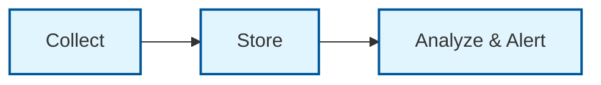

# Observability

Observability helps you understand what's happening inside your ControlPlanes at runtime. It covers four signal types:

- **Metrics** — quantitative measurements of system performance and resource state
- **Logs** — structured event records for debugging, auditing, and operational intelligence
- **Traces** — request flow visualization across distributed systems
- **Alerts** — notifications when signals cross defined thresholds

## How observability fits together

**Collect:** Gather telemetry from Kubernetes resources, controllers, and workloads. Use open standards — [OpenTelemetry](https://opentelemetry.io/) for metrics, logs, and traces.

**Store:** Send telemetry to an OTLP-compatible backend or let Prometheus scrape it. You choose the backend.

**Analyze & Alert:** Build dashboards, set thresholds, and create alerts so failures surface before users notice.

## What to monitor

Start with the signals that have the highest impact:

| Signal | Why it matters |
|---|---|
| **Managed resource health** | Crossplane `Ready` and `Synced` conditions tell you whether provisioned resources are healthy. Without telemetry, errors hide inside cluster objects. |
| **Controller health** | Reconcile error rate, duration, and work queue depth detect throttling or scaling issues before they cascade. |
| **Resource inventory** | Counts by kind and version support upgrade planning and compliance. |
| **Backup status** | Silent backup failures are discovered only when it's too late. |
| **Workload availability** | Deployment and workload conditions show whether services are reachable. |

## Two perspectives

Observability responsibilities differ depending on your role:

| Perspective | Focus | Guide |
|---|---|---|
| **End user** | Monitor the resources you deploy on your ControlPlane — managed resources, workloads, HelmReleases. | [End-user observability](./end-user-observability) |
| **Platform owner** | Monitor the platform itself — controller health, API server availability, fleet-wide resource state. | [Platform-owner observability](./platform-owner-observability) |

## Learn more

- [OpenTelemetry documentation](https://opentelemetry.io/docs/)
- [Metrics Operator](https://github.com/openmcp-project/metrics-operator)
- [Prometheus Operator](https://prometheus-operator.dev/)
